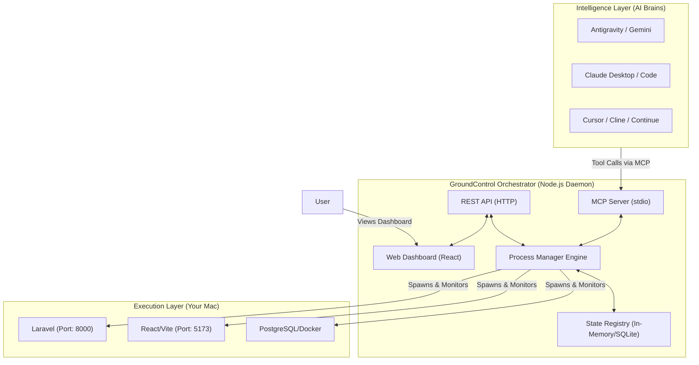

# GroundControl: Comprehensive Product & Implementation Plan

## 1. Executive Summary
**GroundControl** is an AI-independent local development orchestration engine. It separates the "intelligence layer" (AI models like Claude, GPT, Gemini) from the "local execution layer" (your Mac running Node, PHP, Docker). By acting as an intermediary Process Manager that implements the **Model Context Protocol (MCP)**, GroundControl allows any AI to control your local development environment. Crucially, when the AI's quota is exhausted or the session ends, GroundControl keeps your applications running and accessible.

## 2. The Problem & The Solution
**The Problem:** Current AI coding assistants (Claude Code, Gemini CLI, Cursor) couple intelligence with execution. When the AI hits a rate limit or a session is closed, the underlying development servers (e.g., Laravel, Vite) often terminate, or the AI loses context of what is running.
**The Solution:** A dual-layer architecture. 
- **Layer 1 (The Executor):** A persistent background daemon (`GroundControl`) running on your machine that manages processes, databases, and watchers. It exposes a local API and dashboard.
- **Layer 2 (The Intelligence):** Any AI agent connects to `GroundControl` via standard protocols (MCP) to request builds, start servers, or read logs.

## 3. Core Benefits
- **AI Quota Independence:** Your development environment doesn't crash when Claude or ChatGPT runs out of messages.
- **Multi-AI Compatibility:** Because it uses MCP, you can seamlessly switch from Claude to Gemini to GPT; they all read from the same `GroundControl` state.
- **Human-in-the-Loop:** A local web dashboard (e.g., `localhost:9876`) allows you to view logs, restart servers, and run tasks manually without burning AI tokens for basic orchestration.
- **Persistent Context:** The AI can query `GroundControl` to instantly understand what services are currently running, on what ports, and what their recent logs say.

## 4. How GroundControl Differs from Cline, Continue.dev, Cursor, and Claude Desktop
To understand GroundControl, we must distinguish between the **Brain** and the **Hands**:

* **Cline, Continue.dev, Cursor, Claude:** These are the **Brains** (AI Clients). Their job is to read your prompts, generate code, and figure out *what* commands need to be run. 
* **GroundControl:** This is the **Hands** (Infrastructure Engine). Its job is to actually *run* the commands, keep the servers alive in the background, and store the logs. GroundControl does *not* generate code or chat with you.

**The Current Ecosystem (Without GroundControl):**
If you tell Cline (inside VS Code) to start your Laravel server, Cline opens a terminal tab in VS Code and runs `php artisan serve`. 
*Problem:* If you close VS Code, or if Cline crashes, the terminal dies, and your Laravel server goes offline. The intelligence is coupled to the execution.

**The Ecosystem With GroundControl:**
If you tell Cline to start your Laravel server, Cline uses the **MCP protocol** to send a message to GroundControl: *"Hey GroundControl, please start Laravel."*
*Result:* GroundControl starts Laravel in its own persistent background daemon. You can now completely close VS Code and shut down Cline. GroundControl keeps Laravel running. You can open your browser to `localhost:9876` and manage it manually. Later, you can open Antigravity, and it can ask GroundControl: *"What is currently running?"* and instantly take over where Cline left off.

## 5. Operations You Can Perform Without AI (Zero Token Usage)
Because GroundControl has its own CLI and Local Web Dashboard (`localhost:9876`), it operates as a fully functional developer tool on its own. You can perform the following tasks manually, saving your AI tokens for actual coding problems:

1. **Environment Bootstrapping:** Boot up your Laravel API, React frontend, and Dockerized PostgreSQL simultaneously via the UI or by typing `groundcontrol start`. No need to prompt an AI to do this.
2. **Log Monitoring & Diagnostics:** View real-time terminal output (`stdout`/`stderr`), CPU, and memory usage for each service directly in the dashboard.
3. **Routine Task Execution:** Click a button in the UI to run frequent tasks like `php artisan migrate`, `npm run build`, or `phpunit` without wasting tokens asking an AI to type it out.
4. **Zombie Port Management:** Instantly see if a process is blocking port 8000 or 5173, and kill the process with a single click.
5. **Fast Restarts:** If a Node service crashes due to an out-of-memory error, simply click "Restart" in the UI rather than writing an AI prompt saying, *"My server crashed, please restart it."*

## 6. User Stories

### Human Developer Stories
1. **As a developer**, I want to define a `groundcontrol.json` in my project so that a single command starts my Laravel API, Vite frontend, and PostgreSQL database.
2. **As a developer**, I want a local dashboard (`localhost:9876`) to see the CPU/Memory usage and logs of my running services so I don't have to manage multiple terminal tabs.
3. **As a developer**, I want my dev servers to keep running even if I close my AI IDE or my AI CLI tool crashes.

### AI Agent Stories (Via MCP)
4. **As an AI Agent**, I want to call `start_service("frontend")` and receive a success confirmation without blocking my event loop, so I can continue reasoning.
5. **As an AI Agent**, I want to call `get_logs("laravel-api")` to diagnose why an endpoint is returning a 500 error.
6. **As an AI Agent**, I want to call `run_task("php artisan migrate")` and get the standard output and exit code to ensure the database is ready before writing frontend code.

## 7. System Architecture



## 8. Technical Stack
- **Core Runtime:** Node.js (TypeScript)
- **Process Management:** `node:child_process` (with `tree-kill` for clean teardowns) or a lightweight wrapper around PM2.
- **AI Integration Protocol:** `@modelcontextprotocol/sdk` (Official MCP SDK).
- **Local API/Web Server:** Fastify or Express.js.
- **Dashboard UI:** React (Vite) + TailwindCSS (compiled into a single static bundle served by the Node server).
- **CLI Tooling:** Commander.js or Oclif (for the `groundcontrol` terminal command).

## 9. Implementation Roadmap

### Phase 1: The Core Process Engine & CLI (Weeks 1-2)
- Initialize the TypeScript Node.js project.
- Implement the `ProcessManager` class capable of spawning, monitoring, and gracefully killing background tasks.
- Capture `stdout` and `stderr` streams, storing the last 1000 lines in memory for quick retrieval.
- Implement a basic CLI: `groundcontrol start`, `groundcontrol stop`, `groundcontrol status`.
- Support reading a `groundcontrol.json` file in the current working directory to define services.

### Phase 2: AI Integration via MCP Server (Week 3)
- Integrate `@modelcontextprotocol/sdk`.
- Expose the following MCP Tools:
  - `groundcontrol_start_service(name, command, cwd)`
  - `groundcontrol_stop_service(id)`
  - `groundcontrol_get_status()`
  - `groundcontrol_get_logs(id, lines)`
  - `groundcontrol_run_task(command, cwd)` (for blocking, one-off commands like migrations).
- Test integration locally with Claude Desktop and Antigravity.

### Phase 3: REST API & Web Dashboard (Week 4)
- Spin up a local Fastify server on a dedicated port (e.g., `9876`).
- Expose REST endpoints that map directly to the `ProcessManager` methods.
- Build a lightweight React Single Page Application (SPA).
- Provide real-time log streaming to the dashboard using Server-Sent Events (SSE) or WebSockets.

### Phase 4: Advanced Features & Robustness (Week 5)
- **Port Conflict Detection:** Automatically detect if port 8000 is in use before starting Laravel, and optionally prompt to kill the zombie process.
- **Health Checks:** Allow services in `groundcontrol.json` to define a health check URL (e.g., `http://localhost:8000/up`). The engine waits until the health check passes before marking the service as "Ready".
- **Daemonization:** Ensure GroundControl itself can run as a background daemon on Mac (using `launchd` or `pm2`) so it survives terminal closure.

### Phase 5: Packaging & Deployment (Week 6)
- Compile the TypeScript code into a standalone binary using `pkg` or bundle it strictly for `npm`.
- Bundle the compiled React dashboard inside the NPM package so no separate frontend installation is required.
- Publish to the public NPM registry.

## 10. Deployment & Distribution Strategy
Once complete, developers will install GroundControl globally:

```bash
npm install -g groundcontrol-mcp
```

**Using as a Developer (No AI Needed):**
The developer navigates to their project and runs:
```bash
groundcontrol ui
```
This starts the background daemon (if not running), reads `groundcontrol.json`, starts the services, and opens the dashboard in the browser.

**Installing into AI Assistants (Claude, Antigravity, Cline, Cursor):**
To give an AI access to the environment, the user adds the MCP server to their AI config. Because MCP is a universal standard, this works across almost all modern AI tools.

*(Example Claude Desktop `claude_desktop_config.json`)*
```json
{
  "mcpServers": {
    "groundcontrol": {
      "command": "groundcontrol",
      "args": ["mcp-server"]
    }
  }
}
```

From that moment on, whenever the user says *"Build the Laravel application and keep it running"*, the AI routes the command through the MCP server to the persistent GroundControl daemon.
