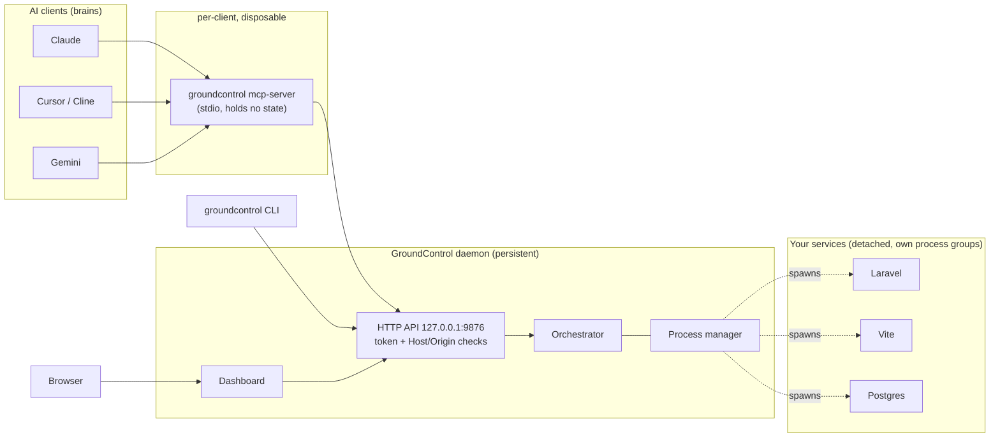

# GroundControl

**GroundControl keeps your dev servers running when your AI session ends.**

It is a small background daemon that owns your local processes (Laravel, Vite, Postgres in Docker, queue workers, ...), plus a CLI, a web dashboard and an [MCP](https://modelcontextprotocol.io) bridge. Any AI client (Claude, Cursor, Cline, Gemini, ...) can start, stop and read logs from the same persistent state, and so can you, without spending a single token.

## The problem

AI coding tools couple *intelligence* with *execution*. When the tool hits a rate limit, crashes, or you close the window, the terminal it opened dies and so do your servers. The next AI session has no idea what was running.

## The solution: brain and hands

| | Brain (AI clients) | Hands (GroundControl) |
|---|---|---|
| Examples | Claude, Cursor, Cline, Continue, Gemini | the GroundControl daemon |
| Job | decide *what* to run, write code | run it, keep it alive, remember its logs |
| Lifetime | one session | until you stop it |



Why this works: the MCP server is only a **thin bridge**. It dies with the AI client, but the daemon and the services do not. Services are started in their own process groups with output written straight to log files, so even the daemon can restart and **re-adopt** them.

## Install

```bash
npm install -g groundcontrol-mcp
```

Requires Node 20+ on macOS or Linux (`lsof` and `ps` must exist).

## Quick start

```bash
cd my-project
groundcontrol init        # writes groundcontrol.json (detects Laravel / Vite / docker compose)
groundcontrol start       # starts services in dependency order, waits until each is ready
groundcontrol ui          # opens the dashboard
```

Close your terminal, your editor and your AI client. Your servers keep running.

### `groundcontrol.json`

```json
{
  "version": 1,
  "project": "my-app",
  "services": {
    "db":  { "command": "docker compose up postgres", "stopCommand": "docker compose stop postgres",
             "health": { "type": "tcp", "port": 5432 } },
    "api": { "command": "php artisan serve --port=8000", "port": 8000, "dependsOn": ["db"],
             "health": { "type": "http", "url": "http://localhost:8000/up" },
             "restart": { "policy": "on-failure", "maxRetries": 5 } },
    "web": { "command": "npm run dev", "cwd": "frontend", "port": 5173, "dependsOn": ["api"],
             "health": { "type": "log", "pattern": "Local:\\s+http" } }
  },
  "tasks": {
    "migrate": { "command": "php artisan migrate --force", "timeoutMs": 120000 },
    "test":    { "command": "vendor/bin/phpunit" }
  },
  "policy": { "allowArbitraryTasks": false }
}
```

Full reference: [docs/config.md](docs/config.md).

## Commands

| Command | What it does |
|---|---|
| `groundcontrol init [--force]` | create a starter `groundcontrol.json` |
| `groundcontrol start [service...] [--kill-zombies]` | start services (plus dependencies) in order |
| `groundcontrol stop [service...]` | stop services (all when none given) |
| `groundcontrol restart <service>` | restart one service |
| `groundcontrol status` | state, pid, port, CPU, memory, uptime |
| `groundcontrol logs <service> [-n 100] [-f]` | recent or live logs |
| `groundcontrol run <task-or-command>` | run a declared task, or any command (you are a human) |
| `groundcontrol ports <port> [--kill]` | who holds a port; free it |
| `groundcontrol ui [--no-open]` | open the dashboard |
| `groundcontrol doctor` | diagnose your environment |
| `groundcontrol daemon start\|stop\|status [--with-services]` | manage the daemon (stopping it leaves services running) |
| `groundcontrol daemon install\|uninstall` | start the daemon at login (macOS launchd) |
| `groundcontrol mcp-server` | the MCP stdio bridge |

Every command accepts `--json`.

## Connect an AI client (MCP)

**Claude Code**

```bash
claude mcp add groundcontrol -- groundcontrol mcp-server
```

**Claude Desktop** (`claude_desktop_config.json`), **Cursor**, **Cline**, and other MCP clients:

```json
{ "mcpServers": { "groundcontrol": { "command": "groundcontrol", "args": ["mcp-server"] } } }
```

If the client cannot find `groundcontrol`, use the absolute path from `which groundcontrol`.

Tools the AI gets: `groundcontrol_get_status`, `groundcontrol_get_logs`, `groundcontrol_start_service`, `groundcontrol_stop_service`, `groundcontrol_restart_service`, `groundcontrol_list_tasks`, `groundcontrol_run_task`. Output is capped at 20,000 characters, log reads are incremental (`since`), and starting a service never blocks.

## Security model

GroundControl can run commands on your machine, so the API is locked down. Summary (details in [docs/security.md](docs/security.md)):

- Listens on `127.0.0.1` only.
- Every API call needs a random token stored in `~/.groundcontrol/token` (mode 0600).
- `Host` and `Origin` headers are checked, which blocks DNS-rebinding and cross-site requests from web pages.
- **AI callers can only run tasks you declared** in `groundcontrol.json`. Arbitrary commands need `policy.allowArbitraryTasks: true`.
- Only humans can kill processes by port.
- Every action is recorded with who did it (human, which AI, or system) in `~/.groundcontrol/audit.log` and shown in the dashboard.

## What survives what

| If this stops... | Your services | The daemon |
|---|---|---|
| AI client / MCP server | keep running | keeps running |
| Terminal / editor | keep running | keeps running |
| The daemon (`daemon stop`, crash, upgrade) | **keep running** | restarts and re-adopts them |
| `groundcontrol stop` | stop | keeps running |
| Reboot | stopped, unless `daemon install` is used and the service has `"autostart": true` | starts at login |

## Development

```bash
npm install && npm --prefix dashboard install
npm run typecheck && npm test      # unit + end-to-end tests (builds first)
npm run build                      # dist/ (cli, daemon, mcp) + dist/dashboard
npm --prefix dashboard test        # dashboard component tests
```

## License

MIT
