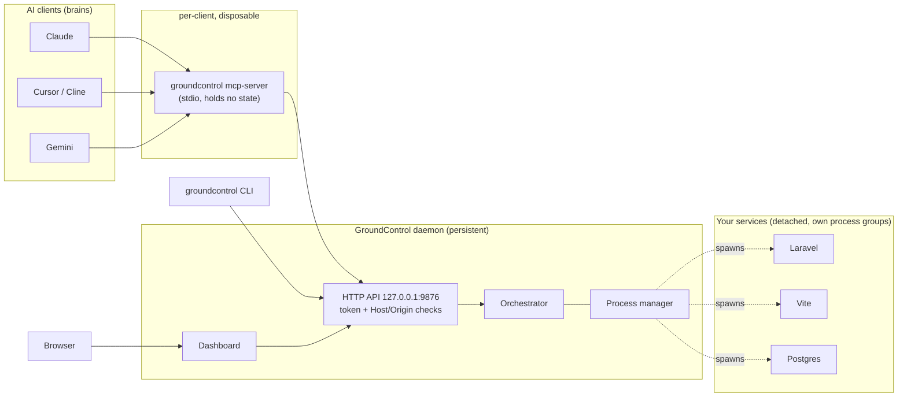
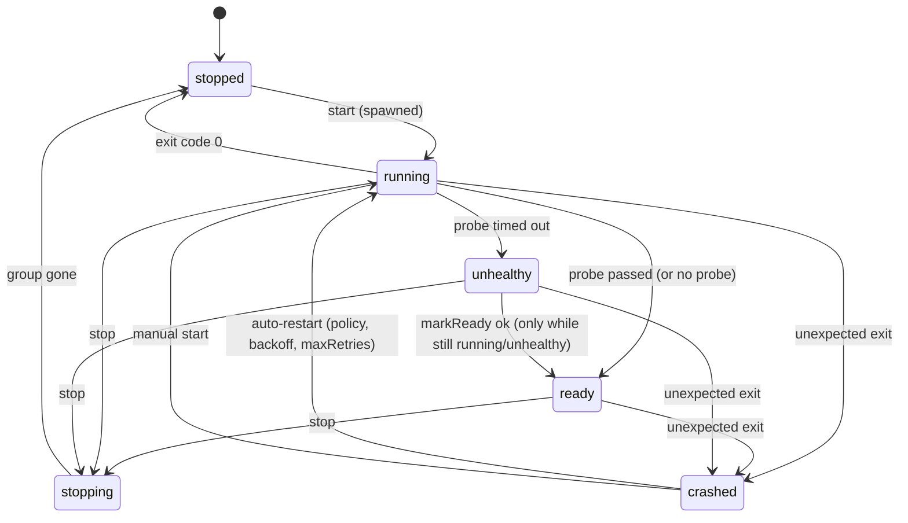

# GroundControl v1 Implementation Plan

> **For agentic workers:** REQUIRED SUB-SKILL: Use superpowers:subagent-driven-development (recommended) or superpowers:executing-plans to implement this plan task-by-task. Steps use checkbox (`- [ ]`) syntax for tracking.

**Goal:** Build a persistent local daemon that owns dev-server processes, plus a CLI, a thin MCP bridge and a web dashboard, so an AI session can end (quota exhausted, window closed, crash) without killing the developer's running services.

**Architecture:** One long-lived **daemon** owns all state and child processes. The CLI, the MCP server and the dashboard are thin **clients** of the daemon's authenticated localhost HTTP API. Services are spawned detached in their own process groups with stdout/stderr written straight to log files, so they survive daemon restarts and are re-adopted when the daemon comes back.

**Tech Stack:** Node >= 20, TypeScript (ESM, strict), Fastify, zod 3, commander, `@modelcontextprotocol/sdk`, vitest, tsup; dashboard: React + Vite + Tailwind.

**Spec:** [README.md](../../../README.md) as it exists *before* Task 19 (product story, user stories, original roadmap). Task 19 preserves it as `docs/original-plan.md` and replaces README.md with user documentation. Where this plan and the original README disagree, this plan wins; the reasons are in "Review Findings".

## How the code in this plan was verified

Every file in this plan was written to a scratch project and executed before being pasted here, on macOS (Darwin 24.6) with Node 24.19.0 and npm 11.17:

- Root project: **150 tests in 20 files, all passing, 3 consecutive full runs**, `tsc --noEmit` clean.
- Dashboard: **12 tests passing**, production build OK, and it was driven in a real browser (login via URL fragment, live logs, start/stop, port-conflict banner with kill-and-start, tasks, activity, phone width, no console errors).
- The packed tarball was installed into an empty directory and `groundcontrol init / start / doctor / daemon stop --with-services` were run from the installed binary; the daemon served the dashboard (`HTTP 200`).
- Not run here (so do them in Task 20): Linux, `launchctl` (`daemon install`), a real Laravel/Vite/Docker project, and Claude Desktop/Cursor connected to the MCP server.

If a command in this plan produces a different result on your machine, stop and use "G. Debugging protocol"; do not improvise around it.

## Global Constraints

- Node `>=20`; the package is ESM (`"type": "module"`); TypeScript `strict: true`; all relative imports end in `.js`.
- Package and binary names (original README §10): npm package `groundcontrol-mcp`, binary `groundcontrol`.
- Dashboard and API default port `9876`, bound to `127.0.0.1` only, never `0.0.0.0`.
- Config file name: `groundcontrol.json` (original README story 1).
- Log lines kept in memory per service: 1000 (original README Phase 1); full logs live in files.
- MCP tool names fixed by the original README Phase 2: `groundcontrol_start_service`, `groundcontrol_stop_service`, `groundcontrol_get_status`, `groundcontrol_get_logs`, `groundcontrol_run_task`. This plan adds `groundcontrol_restart_service` and `groundcontrol_list_tasks`.
- The MCP process must never own child processes or state (Finding 1).
- Platforms for v1: macOS and Linux. Windows is out of scope.
- State directory `~/.groundcontrol/`; override with env `GROUNDCONTROL_HOME` (tests always override it).
- **Pinned dependency versions (verified):** `zod@3.25.76` (NOT zod 4: its `.default({})` semantics break the schema), `fastify@5.12.5`, `@fastify/static@10.1.5`, `commander@15.0.0`, `@modelcontextprotocol/sdk@1.32.1`; dev: `typescript@7.0.2`, `tsup@8.5.1`, `vitest@5.0.3`, `@types/node@26.6.4`. Dashboard: `react@19.3.0`, `react-dom@19.3.0`, `vite@8.3.3`, `@vitejs/plugin-react@6.1.2`, `tailwindcss@4.3.3`, `@tailwindcss/vite@4.3.3`, `vitest@5.0.3`, `jsdom@30.1.2`, `@testing-library/react@16.3.3`, `@testing-library/jest-dom@7.0.1`, `typescript@7.0.2`, `@types/react@19.3.0`, `@types/react-dom@19.3.0`.

---

## How to Work & Execute This Plan (READ FIRST)

This section is the operating manual. The approach, the order, the code, the tests, the commands and the definition of done are all in this one file. No step requires guessing, and no step requires fixing the plan at run time.

### A. Ground rules

1. **One task = at least one commit.** A task is finished only when its tests pass and `npm run typecheck` is clean.
2. **Tests first.** Create the test file, run it, and see it fail because the module does not exist yet (`Cannot find module ...`). Only then add the implementation. A test that never failed proves nothing.
3. **Copy the code exactly as written.** Every code block is verified. If you "improve" it, you leave the verified state. If something seems wrong, write it in Appendix D (Decision Log) and ask before changing it.
4. **Never touch things you did not create.** Tests and code may only kill processes they spawned. Port-kill code must refuse the current process and its parent. Tests never use port `9876` and never use the real `~/.groundcontrol`.
5. **Every test is isolated.** Tests use temp directories, `GROUNDCONTROL_HOME` pointing at a temp directory for e2e, and ports from `getFreePort()` (Task 1). Nothing hard-coded.
6. **No fixed sleeps** except when asserting that something does *not* happen. Use `waitFor(() => condition)` (Task 1 helper).
7. **No stray processes.** After any run that spawns services, `pgrep -fl "echo-server|daemon/main"` must print nothing.
8. **Match surrounding code style:** 2-space indent, single quotes, semicolons, no `any` except where the plan shows it.
9. **Ask before deviating.** If a step is impossible on this machine, stop, record it in Appendix D, and ask.

### B. One-time environment check (do before Task 1)

Run each command; every one must succeed.

```bash
node -v                                   # >= 20 (verified with v24.19.0)
npm -v                                    # verified with 11.17.0
git status --short                        # empty = clean tree
which lsof && which ps                    # both required (port detection, metrics, pid-reuse protection)
ps -o lstart= -p $$                       # prints a date like "Thu Oct  8 08:32:40 2026"
lsof -nP -iTCP:9876 -sTCP:LISTEN || echo "9876 free"   # nothing else should use the default port
which docker || echo "docker is optional (only for the manual database scenario in Task 20)"
```

### C. Branching and commit workflow

```bash
cd /Applications/MAMP/htdocs/GroundControl
git switch -c feat/v1-core           # never work on main
```

- Commit after each task with the message given in the task, in the form `type(scope): summary` (types: `feat`, `fix`, `test`, `docs`, `chore`, `refactor`).
- End every commit message with the required attribution trailer: `Co-Authored-By: Claude Sonnet 5.5 <noreply@anthropic.com>`.
- Do not push or open a PR before Task 20 passes unless asked.
- A bug found later in an earlier task is fixed in a **new** commit `fix(<scope>): ...` that also adds a regression test. Do not rewrite history.

### D. The per-task loop (follow literally)

For every task, in order:

1. **Read** the whole task, including its Interfaces block. Confirm every "Consumes" item exists (`git log --oneline`, `ls src/**`).
2. **RED:** create the test file(s) exactly as given and run only them: `npx vitest run <file>`. Expected: failure with `Cannot find module '../../src/<x>.js'`. A different failure means the test file was copied wrongly.
3. **GREEN:** create the implementation exactly as given. Re-run the same command; the expected pass count is stated in the task.
4. **WIDEN:** `npm run typecheck && npm test`. Everything green, and the cumulative test count in the Progress Table matches.
5. **SELF-REVIEW:** `git diff --stat`, then skim the diff once for leftovers (`console.log`, `.only`, hard-coded ports or absolute paths).
6. **COMMIT** with the given message, tick the checkboxes, update the Progress Table.

### E. Using subagents (recommended mode)

Use `superpowers:subagent-driven-development`. The controller (main session) dispatches and reviews; it does not write feature code.

**Dispatch prompt template** (fill the `<>` parts):

```
You are implementing Task <N> of /Applications/MAMP/htdocs/GroundControl/docs/superpowers/plans/2026-10-08-groundcontrol-v1.md.
Read "How to Work & Execute This Plan" sections A, D and G first, then Task <N> only.
Branch feat/v1-core is checked out. Work in the main checkout unless told otherwise.
Follow the per-task loop exactly and copy code exactly as written in the plan. Do not start any other task.
Do not edit the plan except to tick your own checkboxes.
Interfaces you rely on from earlier tasks are listed in your task; if one is missing or different, stop and report instead of improvising.
When finished reply with: (1) files created/changed, (2) the exact vitest summary line, (3) typecheck result, (4) anything surprising.
```

**Review gate after every task** (controller or a second subagent): re-run `npm run typecheck && npm test` yourself, compare the vitest summary with the Progress Table, skim the diff against Section F. Reject with specific feedback on any failure; after 2 failed re-dispatches the controller fixes it directly.

**Parallelism map.** Tasks in one row may run at the same time in separate worktrees (`superpowers:using-git-worktrees`) and are merged with `git merge --no-ff`; run the full suite after each merge. Rows run strictly in order.

| Row | Tasks | Why it is safe |
|---|---|---|
| 1 | 1 | everything depends on it |
| 2 | 2 | config types are used everywhere |
| 3 | 3, 4 | independent files |
| 4 | 5 | needs 3 and 4 |
| 5 | 6, 7, 8, 9, 10, 11, 12 | leaf modules, no shared files |
| 6 | 13 | needs 5-12 |
| 7 | 14 | needs 13 |
| 8 | 15 | needs 14 |
| 9 | 16, then 17 | 17 imports `src/cli/format.ts` from 16 |
| 10 | 18 | needs only the API from 14 and the daemon from 15; may run in parallel with row 9 |
| 11 | 19 | needs everything |
| 12 | 20 | final verification |

### F. Definition of Done

**Per task**
- [ ] Every test in the task exists, passes, and the cumulative count matches the Progress Table. No `.skip` or `.only`.
- [ ] `npm run typecheck` has zero errors.
- [ ] Code is byte-for-byte what the plan shows (public names, signatures and behaviour unchanged).
- [ ] `pgrep -fl "echo-server|daemon/main"` prints nothing afterwards.
- [ ] Committed with the given message; checkboxes ticked; Progress Table updated.

**Per phase**
- Core engine (Tasks 1-13): `npx vitest run tests/unit` green; the ProcessManager and Orchestrator test files each pass 3 runs in a row.
- Daemon (Tasks 14-15): the HEADLINE e2e (services survive the daemon being killed) passes 3 runs in a row.
- CLI + MCP (Tasks 16-17): the HEADLINE MCP e2e (service survives the MCP process) passes 3 runs in a row.
- Dashboard (Task 18): component tests green and the manual browser checklist ticked.
- Ship (Tasks 19-20): tarball smoke test passes and every item in Task 20 is ticked.

### G. Debugging protocol

When something fails, use `superpowers:systematic-debugging`:
1. Reproduce with the smallest command (`npx vitest run <file> -t "<test name>"`).
2. Read the actual error and the line it points at; do not guess.
3. Check Appendix C (known gotchas) first.
4. Change one thing at a time and re-run.
5. After the fix keep a regression test, and add a line to Appendix C if it cost more than 10 minutes.

A test that passes only sometimes is a bug: run it 20 times (`for i in $(seq 20); do npx vitest run <file> || break; done`), find the race (usually a fixed sleep, an un-awaited promise, or a shared port) and fix it with `waitFor`.

### H. Progress Table (update as you go)

"Tests" is the cumulative number of passing root tests after the task.

| Task | Title | Tests | Status | Commit |
|---|---|---|---|---|
| 1 | Scaffold, paths, types, test helpers | 2 | ☑ | e9f7b5d |
| 2 | Config schema and loader | 14 | ☑ | 243ad52 |
| 3 | LogStore | 21 | ☑ | 6d192c1 |
| 4 | State file | 27 | ☑ | dca33fa |
| 5 | ProcessManager | 41 | ☑ | e3cee03 |
| 6 | Restart policy | 49 | ☑ | e3cee03 |
| 7 | Ports | 54 | ☑ | 7b94a3e |
| 8 | Health probes | 62 | ☑ | 59bcf82 |
| 9 | Task runner | 67 | ☐ | |
| 10 | Metrics | 69 | ☐ | |
| 11 | Audit log | 71 | ☐ | |
| 12 | Security | 82 | ☐ | |
| 13 | Orchestrator | 94 | ☐ | |
| 14 | HTTP server | 111 | ☐ | |
| 15 | Daemon, client, shell PATH | 123 | ☐ | |
| 16 | CLI | 138 | ☐ | |
| 17 | MCP bridge | 150 | ☐ | |
| 18 | Dashboard (separate suite: 12) | 150 + 12 | ☐ | |
| 19 | Packaging, CI, docs | 150 + 12 | ☐ | |
| 20 | Final verification | 150 + 12 | ☐ | |

### I. Time estimate

All code is written; the work is creating files, running tests and verifying. One engineer: about 1 day for Tasks 1-13, 0.5 day for 14-17, 0.5 day for 18, 0.5 day for 19-20, plus the manual scenarios. With parallel subagents: roughly half.

### J. Scope control

Anything not in a task is out of scope. New ideas go to "Deferred" at the bottom. Do not add Windows support, remote access, secrets management, plugin systems or telemetry in v1.

---

## Review Findings (what the original README gets wrong or leaves out)

Findings 1-15 come from analysing the design; 16-26 were found by actually running the code and are already fixed in the code below. Each lists where it is handled.

| # | Finding | Why it matters | Handled in |
|---|---|---|---|
| 1 | The original diagram puts the stdio MCP server inside the daemon. A stdio MCP server is spawned *by the AI client* and dies with it. | The core promise (services outlive the AI) would fail. | Task 17: the MCP server is a thin bridge to the daemon. |
| 2 | Children die with the daemon if they share its stdio and process group. | A daemon crash or upgrade kills the user's servers. | Tasks 3-5: detached spawn, stdio to log files, state file, re-adoption. |
| 3 | An unauthenticated localhost API that runs commands is remote code execution for any website (CSRF, DNS rebinding). | Critical security hole. | Tasks 12, 14: token, Host/Origin checks, no CORS. |
| 4 | `run_task(command)` lets any AI run any shell command. | Prompt-injection amplifier. | Tasks 12, 13: AI callers may run only declared tasks by default. |
| 5 | Logs only live in memory and vanish with the daemon. | "Persistent context" is a headline benefit. | Task 3: file-backed logs plus a memory tail. |
| 6 | `tree-kill` is unreliable for grandchildren (`php artisan serve`, `npm run dev`). | Zombie ports, the problem the product claims to solve. | Task 5: kill the whole process group. |
| 7 | No crash policy. | Crash loops need backoff and a retry cap. | Tasks 6, 13. |
| 8 | No dependency ordering (DB, then API, then frontend). | Original story 1 requires one command to start all three. | Tasks 2, 13. |
| 9 | Health checks are HTTP-only. | Postgres in Docker has no HTTP endpoint. | Task 8: http, tcp and log probes. |
| 10 | Multi-project use is undefined. | Same service names collide. | Ids are `project/service` everywhere. |
| 11 | No audit trail of who did what. | Debuggability and trust. | Task 11, shown in the dashboard. |
| 12 | MCP outputs are unbounded and logs are re-read each time. | Wastes the tokens the product exists to save. | Task 17: 20,000-char cap, incremental `since` offsets. |
| 13 | Docker is mentioned but not defined. | The database is the common case. | Docs: Docker is a service with `stopCommand` and a tcp probe. |
| 14 | Packaging suggests `pkg`, which is deprecated and breaks native modules. | Phase 5 risk. | Task 19: npm package only. |
| 15 | No tests specified. | Process code is bug-prone. | Every task is test-first. |
| 16 | `zod@latest` is v4; `.default({})` on nested objects no longer applies inner defaults. | Config defaults would silently be wrong. | Pin `zod@3.25.76`. |
| 17 | `fs.watchFile` misses writes that happen before its first baseline stat. | Flaky/missing log lines. | Task 3: plain 100 ms polling, idempotent `start()`. |
| 18 | On macOS, `bind(127.0.0.1:p)` succeeds while another process holds `0.0.0.0:p`. | Port conflicts would go undetected. | Task 7: `lsof` is authoritative, bind is a second check. |
| 19 | The child `exit` event and an explicit `stop()` can both report an exit. | Duplicate exit events, wrong restart decisions. | Task 5: `exited` guard (tested). |
| 20 | `tsup --clean` deletes `dist/dashboard`. | Dashboard vanishes after a rebuild. | `tsup.config.ts` `clean:false`; `npm run build` does `rm -rf dist` itself. |
| 21 | Tests run TypeScript source, so `../daemon/main.js` does not exist relative to `ensure-daemon.ts`. | E2E could not start a daemon. | Task 15: `GROUNDCONTROL_DAEMON_ENTRY` override. |
| 22 | `app.close()` waits for open SSE streams. | The daemon would hang on shutdown. | Task 15: `Promise.race` with a 1.5 s cap. |
| 23 | A daemon started from a GUI AI client inherits a minimal PATH (no `php`, `npm`, `docker`). | Services fail to start only when started via MCP. | Task 15: login-shell PATH resolver. |
| 24 | The user's shell startup can take about 5 s (nvm). | Daemon start would stall or time out. | Task 15: PATH cached on disk, refreshed in the background. |
| 25 | A short `stableMs` in a test reset the retry counter while the service was still crash-looping. | Misleading test failures. | Task 13: stability gets its own dedicated test. |
| 26 | `launchd` `KeepAlive: true` would restart the daemon right after `daemon stop`. | `stop` would not stop. | Task 16: `KeepAlive.SuccessfulExit=false`. |

---

## Final file structure

```
package.json  tsconfig.json  vitest.config.ts  tsup.config.ts  .gitignore  README.md
.github/workflows/ci.yml
docs/{original-plan.md, config.md, security.md, superpowers/plans/<this file>}
src/
  paths.ts                    ~/.groundcontrol path helpers (GROUNDCONTROL_HOME aware)
  types.ts                    ServiceState, Actor, ServiceStatus, TaskResult
  config/schema.ts            zod schema of groundcontrol.json
  config/load.ts              parse, find, validate, dependency order
  core/log-store.ts           file-backed log: memory tail, subscribers, since(), rotate()
  core/state-file.ts          pid registry + pid-reuse protection
  core/process-manager.ts     spawn / stop / adopt services
  core/restart-policy.ts      backoff decision (pure)
  core/ports.ts               port owner lookup, free check, kill
  core/health.ts              http / tcp / log readiness probes
  core/tasks.ts               one-off blocking task runner
  core/metrics.ts             cpu / memory per process group
  core/audit.ts               append-only audit log
  core/orchestrator.ts        projects, ordered up/down, readiness, auto-restart, tasks
  core/shell-env.ts           login-shell PATH resolution and cache
  daemon/security.ts          token, Host/Origin checks, AI task policy
  daemon/server.ts            Fastify REST + SSE + static dashboard
  daemon/main.ts              daemon entrypoint
  client/http-client.ts       typed API client (CLI + MCP)
  client/ensure-daemon.ts     start the daemon on demand
  cli/{format,init,launchd,doctor,index}.ts
  mcp/{format,server}.ts
dashboard/                    Vite + React + Tailwind app (builds to dist/dashboard)
tests/
  helpers.ts  global-setup.ts
  fixtures/{echo-server.mjs, spawns-child.mjs}
  unit/*.test.ts              (17 files)
  e2e/{daemon,cli,mcp}.e2e.test.ts
```

---

## Tasks

### Task 1: Project scaffold, paths, shared types, test helpers

**Files:**
- Create: `package.json` (via commands), `tsconfig.json`, `vitest.config.ts` (replaced in Task 15), `.gitignore`, `src/paths.ts`, `src/types.ts`, `tests/helpers.ts`, `tests/fixtures/echo-server.mjs`, `tests/fixtures/spawns-child.mjs`
- Test: `tests/unit/paths.test.ts`

**Interfaces:**
- Produces:
  - `getHome(): string`
  - `paths(): { home, state, token, daemonPid, daemonLog, projects, shellPath, logsDir, audit }` (all absolute strings)
  - `type ServiceState`, `type Actor`, `interface ServiceStatus`, `interface TaskResult` (see `src/types.ts`)
  - Test helpers `wait(ms)`, `waitFor(cond, timeoutMs?, stepMs?)`, `getFreePort()`
  - Fixtures: `echo-server.mjs` (logs `listening <port>` and a `tick` every 200 ms, serves `ok`, exits 0 on SIGTERM, honours env `PORT`) and `spawns-child.mjs` (spawns a grandchild and prints `child <pid>`)

- [ ] **Step 1: Create the project and install pinned dependencies**

```bash
cd /Applications/MAMP/htdocs/GroundControl
git switch -c feat/v1-core
npm init -y
npm pkg set name=groundcontrol-mcp version=0.1.0 type=module license=MIT engines.node=">=20" bin.groundcontrol=dist/cli/index.js
npm pkg set description="Persistent local dev-server orchestrator with an MCP bridge"
npm pkg delete main
npm pkg set files[0]=dist
npm pkg set scripts.test="vitest run" scripts.typecheck="tsc --noEmit" scripts.build="rm -rf dist && tsup"
npm i zod@3.25.76 fastify@5.12.5 @fastify/static@10.1.5 commander@15.0.0 @modelcontextprotocol/sdk@1.32.1
npm i -D typescript@7.0.2 tsup@8.5.1 vitest@5.0.3 @types/node@26.6.4
mkdir -p src/{config,core,daemon,client,cli,mcp} tests/{unit,e2e,fixtures}
```
Expected: no errors; `node_modules/zod/package.json` reports version `3.25.76`. (npm may print an `allow-scripts` warning; ignore it.)

- [ ] **Step 2: Create the config files**

`tsconfig.json`:
```json
{
  "compilerOptions": {
    "target": "ES2022", "module": "NodeNext", "moduleResolution": "NodeNext",
    "strict": true, "noUncheckedIndexedAccess": true, "esModuleInterop": true,
    "skipLibCheck": true, "noEmit": true, "types": ["node"]
  },
  "include": ["src", "tests", "tsup.config.ts", "vitest.config.ts"]
}
```

`vitest.config.ts` (a temporary version; Task 15 replaces it with the final one):
```ts
import { defineConfig } from 'vitest/config';

export default defineConfig({ test: { include: ['tests/**/*.test.ts'], testTimeout: 20000, hookTimeout: 120000 } });
```

`.gitignore`:
```
node_modules
dist
.DS_Store
```

- [ ] **Step 3: Create the test helpers and fixtures**

`tests/helpers.ts`:
```ts
import net from 'node:net';

export const wait = (ms: number) => new Promise<void>(r => setTimeout(r, ms));

export async function waitFor(cond: () => boolean | Promise<boolean>, timeoutMs = 10000, stepMs = 25) {
  const t0 = Date.now();
  while (Date.now() - t0 < timeoutMs) {
    if (await cond()) return;
    await wait(stepMs);
  }
  throw new Error(`waitFor timed out after ${timeoutMs}ms`);
}

export function getFreePort(): Promise<number> {
  return new Promise((res, rej) => {
    const s = net.createServer();
    s.once('error', rej);
    s.listen(0, '127.0.0.1', () => {
      const p = (s.address() as net.AddressInfo).port;
      s.close(() => res(p));
    });
  });
}
```

`tests/fixtures/echo-server.mjs`:
```js
// Fake service: logs a tick every 200ms, serves "ok" over HTTP, exits cleanly on SIGTERM.
import http from 'node:http';
const port = Number(process.env.PORT ?? 0);
http.createServer((_, res) => res.end('ok')).listen(port, '127.0.0.1', () => console.log('listening ' + port));
setInterval(() => console.log('tick'), 200);
process.on('SIGTERM', () => { console.log('bye'); process.exit(0); });
```

`tests/fixtures/spawns-child.mjs`:
```js
// Fake service that spawns a grandchild, to prove process-group kill works.
import { spawn } from 'node:child_process';
const c = spawn(process.execPath, ['-e', 'setInterval(()=>{},1000)'], { stdio: 'inherit' });
console.log('child ' + c.pid);
setInterval(() => {}, 1000);
```

- [ ] **Step 4: RED. Create the test**

`tests/unit/paths.test.ts`:
```ts
import { describe, it, expect, afterEach } from 'vitest';
import { paths, getHome } from '../../src/paths.js';

describe('paths', () => {
  afterEach(() => { delete process.env.GROUNDCONTROL_HOME; });
  it('honours GROUNDCONTROL_HOME', () => {
    process.env.GROUNDCONTROL_HOME = '/tmp/gc-x';
    expect(getHome()).toBe('/tmp/gc-x');
    expect(paths().state).toBe('/tmp/gc-x/state.json');
    expect(paths().logsDir).toBe('/tmp/gc-x/logs');
  });
  it('defaults to ~/.groundcontrol', () => {
    expect(getHome().endsWith('/.groundcontrol')).toBe(true);
  });
});
```

Run: `npx vitest run tests/unit/paths.test.ts`
Expected: FAIL with `Cannot find module '../../src/paths.js'`.

- [ ] **Step 5: GREEN. Create the implementation**

`src/paths.ts`:
```ts
import { homedir } from 'node:os';
import { join } from 'node:path';

export const getHome = () => process.env.GROUNDCONTROL_HOME ?? join(homedir(), '.groundcontrol');

export const paths = () => {
  const home = getHome();
  return {
    home,
    state: join(home, 'state.json'),
    token: join(home, 'token'),
    daemonPid: join(home, 'daemon.pid'),
    daemonLog: join(home, 'daemon.log'),
    projects: join(home, 'projects.json'),
    shellPath: join(home, 'shell-path'),
    logsDir: join(home, 'logs'),
    audit: join(home, 'audit.log'),
  };
};
```

`src/types.ts`:
```ts
export type ServiceState =
  | 'stopped' | 'starting' | 'running' | 'ready' | 'unhealthy' | 'crashed' | 'stopping';

export type Actor = { kind: 'human' | 'ai' | 'system'; name: string };

export interface ServiceStatus {
  id: string;            // "project/service"
  project: string;
  name: string;
  state: ServiceState;
  pid?: number;
  port?: number;
  startedAt?: number;    // epoch ms
  exitCode?: number | null;
  restarts: number;
  cpuPercent?: number;
  memoryMb?: number;
  lastError?: string;
}

export interface TaskResult {
  exitCode: number | null; signal: string | null; stdout: string; stderr: string;
  truncated: boolean; timedOut: boolean; durationMs: number;
}
```

- [ ] **Step 6: Verify**

Run: `npx vitest run && npm run typecheck`
Expected: `Tests  2 passed (2)`; typecheck prints nothing.

- [ ] **Step 7: Commit**

```bash
git add -A && git commit -m "chore: scaffold TypeScript project, paths, shared types and test helpers

Co-Authored-By: Claude Sonnet 5.5 <noreply@anthropic.com>"
```

---

### Task 2: Config schema and loader (`groundcontrol.json`)

**Files:**
- Create: `src/config/schema.ts`, `src/config/load.ts`
- Test: `tests/unit/config.test.ts`

**Interfaces:**
- Produces:
  - `parseConfig(raw: unknown, file: string): ProjectConfig` (throws `ConfigError` with a message like `/r/g.json: services.a.command: Required`)
  - `loadConfig(file: string): ProjectConfig` (also turns unreadable files and invalid JSON into `ConfigError`)
  - `findConfig(startDir: string): string | null` (walks up to the filesystem root)
  - `startOrder(cfg: ProjectConfig): string[]` (dependencies first; throws `ConfigError` on cycles and unknown dependencies)
  - `class ConfigError extends Error`
  - `ProjectConfig = { project; root; file; services: Record<string, ServiceConfig>; tasks: Record<string, TaskConfig>; policy: { allowArbitraryTasks: boolean } }`; `ServiceConfig` has every field resolved with defaults and an absolute `cwd`.

Config format (documented for users in Task 19, `docs/config.md`):
```json
{
  "version": 1, "project": "my-app",
  "services": {
    "db":  { "command": "docker compose up postgres", "stopCommand": "docker compose stop postgres", "health": { "type": "tcp", "port": 5432 } },
    "api": { "command": "php artisan serve --port=8000", "port": 8000, "dependsOn": ["db"], "health": { "type": "http", "url": "http://localhost:8000/up" }, "restart": { "policy": "on-failure", "maxRetries": 5 } },
    "web": { "command": "npm run dev", "cwd": "frontend", "port": 5173, "dependsOn": ["api"], "health": { "type": "log", "pattern": "Local:\\s+http" } }
  },
  "tasks": { "migrate": { "command": "php artisan migrate --force", "timeoutMs": 120000 } },
  "policy": { "allowArbitraryTasks": false }
}
```

- [ ] **Step 1: RED. Create the test**

`tests/unit/config.test.ts`:
```ts
import { describe, it, expect } from 'vitest';
import { mkdtempSync, writeFileSync, mkdirSync } from 'node:fs';
import { tmpdir } from 'node:os';
import { join } from 'node:path';
import { parseConfig, startOrder, loadConfig, findConfig, ConfigError } from '../../src/config/load.js';

const base = (services: unknown) => ({ version: 1, project: 'p', services });

describe('parseConfig', () => {
  it('applies defaults', () => {
    const c = parseConfig(base({ a: { command: 'echo hi' } }), '/r/groundcontrol.json');
    const a = c.services.a!;
    expect(a.cwd).toBe('/r');
    expect(a.restart).toEqual({ policy: 'never', maxRetries: 3, backoffMs: 1000 });
    expect(a.stopTimeoutMs).toBe(10000);
    expect(a.dependsOn).toEqual([]);
    expect(a.autostart).toBe(true);
    expect(c.policy.allowArbitraryTasks).toBe(false);
    expect(c.tasks).toEqual({});
  });
  it('resolves relative cwd against the config directory', () => {
    const c = parseConfig(base({ a: { command: 'x', cwd: 'web' } }), '/r/groundcontrol.json');
    expect(c.services.a!.cwd).toBe('/r/web');
  });
  it('fills health defaults', () => {
    const c = parseConfig(base({ a: { command: 'x', health: { type: 'http', url: 'http://localhost:1/up' } } }), '/r/g.json');
    expect(c.services.a!.health).toMatchObject({ expectStatus: 200, intervalMs: 2000, timeoutMs: 60000 });
  });
  it('rejects project names containing a slash (they appear in ids)', () => {
    expect(() => parseConfig({ version: 1, project: 'a/b', services: {} }, '/r/g.json')).toThrow(/project/);
  });
  it('rejects a missing command with a readable path', () => {
    expect(() => parseConfig(base({ a: {} }), '/r/g.json')).toThrow(/services\.a\.command/);
  });
  it('rejects unknown version', () => {
    expect(() => parseConfig({ version: 2, project: 'p', services: {} }, '/r/g.json')).toThrow(ConfigError);
  });
});

describe('startOrder', () => {
  it('orders dependencies first', () => {
    const c = parseConfig(base({
      web: { command: 'x', dependsOn: ['api'] },
      api: { command: 'x', dependsOn: ['db'] },
      db: { command: 'x' },
    }), '/r/g.json');
    expect(startOrder(c)).toEqual(['db', 'api', 'web']);
  });
  it('throws on a cycle', () => {
    const c = parseConfig(base({ a: { command: 'x', dependsOn: ['b'] }, b: { command: 'x', dependsOn: ['a'] } }), '/r/g.json');
    expect(() => startOrder(c)).toThrow(/cycle/i);
  });
  it('throws on an unknown dependency', () => {
    const c = parseConfig(base({ a: { command: 'x', dependsOn: ['zzz'] } }), '/r/g.json');
    expect(() => startOrder(c)).toThrow(/unknown.*zzz/i);
  });
});

describe('loadConfig / findConfig', () => {
  it('reports invalid JSON as ConfigError', () => {
    const d = mkdtempSync(join(tmpdir(), 'gc-')); const f = join(d, 'groundcontrol.json');
    writeFileSync(f, '{ nope');
    expect(() => loadConfig(f)).toThrow(ConfigError);
  });
  it('finds the config walking upward', () => {
    const d = mkdtempSync(join(tmpdir(), 'gc-')); const f = join(d, 'groundcontrol.json');
    writeFileSync(f, '{}'); mkdirSync(join(d, 'a/b'), { recursive: true });
    expect(findConfig(join(d, 'a/b'))).toBe(f);
  });
  it('returns null when there is none', () => {
    expect(findConfig(mkdtempSync(join(tmpdir(), 'gc-none-')))).toBeNull();
  });
});
```

Run: `npx vitest run tests/unit/config.test.ts` → FAIL `Cannot find module '../../src/config/load.js'`.

- [ ] **Step 2: GREEN. Create the implementation**

`src/config/schema.ts`:
```ts
import { z } from 'zod';

export const HealthSchema = z.discriminatedUnion('type', [
  z.object({
    type: z.literal('http'), url: z.string().url(), expectStatus: z.number().int().default(200),
    intervalMs: z.number().int().default(2000), timeoutMs: z.number().int().default(60000),
  }),
  z.object({
    type: z.literal('tcp'), port: z.number().int().min(1).max(65535), host: z.string().default('127.0.0.1'),
    intervalMs: z.number().int().default(1000), timeoutMs: z.number().int().default(60000),
  }),
  z.object({
    type: z.literal('log'), pattern: z.string(), timeoutMs: z.number().int().default(60000),
  }),
]);

export const RestartSchema = z.object({
  policy: z.enum(['never', 'on-failure', 'always']).default('never'),
  maxRetries: z.number().int().min(0).default(3),
  backoffMs: z.number().int().min(10).default(1000),
});

const NAME = /^[A-Za-z0-9._-]+$/;

export const ServiceSchema = z.object({
  command: z.string().min(1),
  stopCommand: z.string().optional(),
  cwd: z.string().optional(),
  env: z.record(z.string(), z.string()).default({}),
  port: z.number().int().min(1).max(65535).optional(),
  dependsOn: z.array(z.string()).default([]),
  health: HealthSchema.optional(),
  restart: RestartSchema.default({}),
  stopTimeoutMs: z.number().int().min(100).default(10000),
  autostart: z.boolean().default(true),
});

export const TaskSchema = z.object({
  command: z.string().min(1),
  cwd: z.string().optional(),
  timeoutMs: z.number().int().min(100).default(300000),
});

export const ConfigSchema = z.object({
  version: z.literal(1),
  project: z.string().regex(NAME, 'project must match [A-Za-z0-9._-]+'),
  services: z.record(z.string().regex(NAME, 'service name must match [A-Za-z0-9._-]+'), ServiceSchema),
  tasks: z.record(z.string(), TaskSchema).default({}),
  policy: z.object({ allowArbitraryTasks: z.boolean().default(false) }).default({}),
});
```

`src/config/load.ts`:
```ts
import { dirname, resolve, join } from 'node:path';
import { existsSync, readFileSync } from 'node:fs';
import type { z } from 'zod';
import { ConfigSchema } from './schema.js';

export class ConfigError extends Error {}

type Parsed = z.infer<typeof ConfigSchema>;
export type ServiceConfig = Parsed['services'][string] & { cwd: string };
export type TaskConfig = Parsed['tasks'][string] & { cwd: string };
export interface ProjectConfig {
  project: string;
  root: string;
  file: string;
  services: Record<string, ServiceConfig>;
  tasks: Record<string, TaskConfig>;
  policy: Parsed['policy'];
}

export function parseConfig(raw: unknown, file: string): ProjectConfig {
  const r = ConfigSchema.safeParse(raw);
  if (!r.success) {
    const msg = r.error.issues.map(i => `${i.path.join('.') || '(root)'}: ${i.message}`).join('; ');
    throw new ConfigError(`${file}: ${msg}`);
  }
  const root = dirname(file);
  const services = Object.fromEntries(
    Object.entries(r.data.services).map(([k, v]) => [k, { ...v, cwd: resolve(root, v.cwd ?? '.') }]));
  const tasks = Object.fromEntries(
    Object.entries(r.data.tasks).map(([k, v]) => [k, { ...v, cwd: resolve(root, v.cwd ?? '.') }]));
  return { project: r.data.project, root, file, services, tasks, policy: r.data.policy };
}

export function loadConfig(file: string): ProjectConfig {
  let raw: unknown;
  try { raw = JSON.parse(readFileSync(file, 'utf8')); }
  catch (e) { throw new ConfigError(`${file}: cannot read config: ${(e as Error).message}`); }
  return parseConfig(raw, file);
}

export function findConfig(startDir: string): string | null {
  let dir = resolve(startDir);
  for (;;) {
    const f = join(dir, 'groundcontrol.json');
    if (existsSync(f)) return f;
    const up = dirname(dir);
    if (up === dir) return null;
    dir = up;
  }
}

/** Topological start order (dependencies first). Throws ConfigError on unknown deps or cycles. */
export function startOrder(cfg: ProjectConfig): string[] {
  const out: string[] = [];
  const mark = new Map<string, 1 | 2>();
  const visit = (n: string, chain: string[]) => {
    if (!cfg.services[n]) throw new ConfigError(`unknown dependency "${n}" (needed by ${chain.at(-1)})`);
    if (mark.get(n) === 2) return;
    if (mark.get(n) === 1) throw new ConfigError(`dependency cycle: ${[...chain, n].join(' -> ')}`);
    mark.set(n, 1);
    for (const d of cfg.services[n]!.dependsOn) visit(d, [...chain, n]);
    mark.set(n, 2);
    out.push(n);
  };
  for (const n of Object.keys(cfg.services)) visit(n, []);
  return out;
}
```

- [ ] **Step 3: Verify** — `npx vitest run && npm run typecheck` → `Tests  14 passed (14)` (2 + 12).
- [ ] **Step 4: Commit** — `feat(config): groundcontrol.json schema, loader and dependency ordering`

---

### Task 3: File-backed LogStore

**Files:**
- Create: `src/core/log-store.ts`
- Test: `tests/unit/log-store.test.ts`

**Interfaces:**
- Produces: `class LogStore`
  - `constructor(file: string, opts?: { memoryLines?: number /*1000*/; maxFileBytes?: number /*5 MiB*/ })`
  - `fd(): number` — an append-mode file descriptor to give `child_process.spawn` as stdout/stderr, so the child writes directly into the file
  - `start(): void` — idempotent; loads up to the last 256 KiB of an existing file, then polls every 100 ms
  - `stop(): void`, `size(): number`
  - `tail(n: number): string[]` — last n complete lines (memory)
  - `since(offset: number): { lines: string[]; offset: number }` — complete lines after a byte offset; pass the returned offset next time
  - `subscribe(fn): () => void`
  - `rotate(): void` — moves a file larger than `maxFileBytes` to `<file>.1`; only call it while nothing is writing

Why a file: the daemon is never in the data path, so logs and children survive daemon restarts (Finding 2, 5).

- [ ] **Step 1: RED. Create the test**

`tests/unit/log-store.test.ts`:
```ts
import { describe, it, expect, afterEach } from 'vitest';
import { mkdtempSync, writeSync, existsSync } from 'node:fs';
import { tmpdir } from 'node:os';
import { join } from 'node:path';
import { LogStore } from '../../src/core/log-store.js';
import { waitFor } from '../helpers.js';

const stores: LogStore[] = [];
function mk(opts = {}) {
  const file = join(mkdtempSync(join(tmpdir(), 'gc-')), 'a.log');
  const s = new LogStore(file, opts); stores.push(s); return { s, file };
}
afterEach(() => { for (const s of stores.splice(0)) s.stop(); });

describe('LogStore', () => {
  it('tails written lines and caps memory', async () => {
    const { s } = mk({ memoryLines: 3 }); const fd = s.fd(); s.start();
    for (const l of ['1', '2', '3', '4']) writeSync(fd, l + '\n');
    await waitFor(() => s.tail(10).length === 3);
    expect(s.tail(10)).toEqual(['2', '3', '4']);
  });
  it('notifies subscribers once per line and joins partial writes', async () => {
    const { s } = mk(); const fd = s.fd(); s.start();
    const got: string[] = []; s.subscribe(l => got.push(l));
    writeSync(fd, 'hel'); await new Promise(r => setTimeout(r, 450));
    expect(got).toEqual([]);
    writeSync(fd, 'lo\n'); await waitFor(() => got.length === 1);
    expect(got).toEqual(['hello']);
  });
  it('unsubscribe stops notifications', async () => {
    const { s } = mk(); const fd = s.fd(); s.start();
    const got: string[] = []; const off = s.subscribe(l => got.push(l)); off();
    writeSync(fd, 'x\n'); await waitFor(() => s.tail(1).length === 1);
    expect(got).toEqual([]);
  });
  it('start() is idempotent (no duplicate lines)', async () => {
    const { s } = mk(); const fd = s.fd(); s.start(); s.start();
    writeSync(fd, 'once\n'); await waitFor(() => s.tail(5).length >= 1);
    await new Promise(r => setTimeout(r, 500));
    expect(s.tail(5)).toEqual(['once']);
  });
  it('since() returns only new complete lines', async () => {
    const { s } = mk(); const fd = s.fd(); s.start();
    writeSync(fd, 'a\nb\n'); await waitFor(() => s.tail(5).length === 2);
    const first = s.since(0); expect(first.lines).toEqual(['a', 'b']);
    writeSync(fd, 'c\npartial'); await waitFor(() => s.tail(5).length === 3);
    const second = s.since(first.offset); expect(second.lines).toEqual(['c']);
    expect(s.since(second.offset).lines).toEqual([]);
  });
  it('rotate() moves an oversized file aside and keeps working', async () => {
    const { s, file } = mk({ maxFileBytes: 50 }); const fd = s.fd(); s.start();
    writeSync(fd, 'x'.repeat(100) + '\n'); await waitFor(() => s.tail(5).length === 1);
    s.rotate();
    expect(existsSync(file + '.1')).toBe(true);
    writeSync(s.fd(), 'after\n'); await waitFor(() => s.tail(5).includes('after'));
  });
  it('loads existing file content on start (adoption case)', async () => {
    const { s } = mk(); writeSync(s.fd(), 'old1\nold2\n'); s.stop();
    const file = (s as any).file as string; const s2 = new LogStore(file); stores.push(s2); s2.start();
    expect(s2.tail(5)).toEqual(['old1', 'old2']);
  });
});
```

Run: `npx vitest run tests/unit/log-store.test.ts` → FAIL `Cannot find module '../../src/core/log-store.js'`.

- [ ] **Step 2: GREEN. Create the implementation**

`src/core/log-store.ts`:
```ts
import { openSync, closeSync, statSync, readSync, renameSync, mkdirSync, existsSync } from 'node:fs';
import { dirname } from 'node:path';

/**
 * File-backed log. Child processes write straight into the file (we hand them `fd()`),
 * so the daemon is never in the data path and logs survive daemon restarts.
 * The store tails the file to keep the last N lines in memory and to notify subscribers.
 */
export class LogStore {
  private fdNum: number | null = null;
  private readPos = 0;
  private partial = '';
  private mem: string[] = [];
  private subs = new Set<(line: string) => void>();
  private timer: NodeJS.Timeout | null = null;
  private readonly memoryLines: number;
  private readonly maxFileBytes: number;

  constructor(private file: string, opts: { memoryLines?: number; maxFileBytes?: number } = {}) {
    this.memoryLines = opts.memoryLines ?? 1000;
    this.maxFileBytes = opts.maxFileBytes ?? 5 * 1024 * 1024;
    mkdirSync(dirname(file), { recursive: true });
  }

  /** Append-mode fd to hand to child_process.spawn as stdout/stderr. */
  fd(): number {
    if (this.fdNum === null) this.fdNum = openSync(this.file, 'a');
    return this.fdNum;
  }

  /** Begin tailing. Idempotent. Loads up to the last 256 KiB of an existing file into memory. */
  start() {
    if (this.timer) return;
    this.fd();
    this.readPos = Math.max(0, this.size() - 256 * 1024);
    this.drain();
    // Plain polling: fs.watchFile misses writes that happen before its first baseline stat.
    this.timer = setInterval(() => this.drain(), 100);
    this.timer.unref();
  }

  stop() {
    if (this.timer) { clearInterval(this.timer); this.timer = null; this.drain(); }
    if (this.fdNum !== null) { closeSync(this.fdNum); this.fdNum = null; }
  }

  size(): number {
    try { return statSync(this.file).size; } catch { return 0; }
  }

  private drain() {
    const size = this.size();
    if (size < this.readPos) { this.readPos = 0; this.partial = ''; }   // rotated or truncated
    if (size === this.readPos) return;
    let fd: number;
    try { fd = openSync(this.file, 'r'); } catch { return; }
    try {
      const buf = Buffer.alloc(size - this.readPos);
      readSync(fd, buf, 0, buf.length, this.readPos);
      this.readPos = size;
      const parts = (this.partial + buf.toString('utf8')).split('\n');
      this.partial = parts.pop() ?? '';
      for (const line of parts) {
        this.mem.push(line);
        if (this.mem.length > this.memoryLines) this.mem.shift();
        for (const s of this.subs) s(line);
      }
    } finally { closeSync(fd); }
  }

  /** Last n complete lines (from memory). */
  tail(n: number): string[] { return this.mem.slice(-n); }

  /** Complete lines written after byte `offset`; returns the next offset to pass back in. */
  since(offset: number): { lines: string[]; offset: number } {
    const size = this.size();
    if (offset >= size) return { lines: [], offset: size };
    const fd = openSync(this.file, 'r');
    try {
      const buf = Buffer.alloc(Math.min(size - offset, 1024 * 1024));
      readSync(fd, buf, 0, buf.length, offset);
      const text = buf.toString('utf8');
      const end = text.lastIndexOf('\n') + 1;                       // only complete lines
      const lines = text.slice(0, end).split('\n').slice(0, -1);
      return { lines, offset: offset + Buffer.byteLength(text.slice(0, end)) };
    } finally { closeSync(fd); }
  }

  subscribe(fn: (line: string) => void): () => void {
    this.subs.add(fn);
    return () => { this.subs.delete(fn); };
  }

  /**
   * Move an oversized file to `<file>.1`. ONLY call this while no child is writing
   * (ProcessManager calls it right before a start): a running child keeps its old fd
   * and would keep writing into the rotated file.
   */
  rotate() {
    if (!existsSync(this.file) || this.size() <= this.maxFileBytes) return;
    this.drain();
    if (this.fdNum !== null) { closeSync(this.fdNum); this.fdNum = null; }
    renameSync(this.file, this.file + '.1');
    this.readPos = 0; this.partial = '';
    this.fd();
  }
}
```

- [ ] **Step 3: Verify** — `npx vitest run tests/unit/log-store.test.ts` → `7 passed`. Run the whole file 3 times (`for i in 1 2 3; do npx vitest run tests/unit/log-store.test.ts || break; done`); it must never flake. Then `npx vitest run && npm run typecheck` → `Tests  21 passed (21)`.
- [ ] **Step 4: Commit** — `feat(core): file-backed LogStore with memory tail, subscribers and rotation`

---

### Task 4: Persisted state file (for re-adoption)

**Files:**
- Create: `src/core/state-file.ts`
- Test: `tests/unit/state-file.test.ts`

**Interfaces:**
- Produces:
  - `interface PersistedService { id; pid; pgid; startedAt; command; cwd; logFile }`
  - `class StateFile { constructor(file); load(): Record<string, PersistedService>; save(all): void }` — atomic (temp file then rename), tolerant of a missing or corrupt file (returns `{}`)
  - `isAlive(pid: number): boolean` (`EPERM` counts as alive)
  - `processStartTime(pid: number): number | null` — epoch ms from `ps -o lstart=` (1 s resolution). A persisted service is adopted only if `|processStartTime - startedAt| <= 5000`, which defeats pid reuse.

- [ ] **Step 1: RED.** `tests/unit/state-file.test.ts`:
```ts
import { describe, it, expect } from 'vitest';
import { mkdtempSync, writeFileSync } from 'node:fs';
import { tmpdir } from 'node:os';
import { join } from 'node:path';
import { StateFile, isAlive, processStartTime } from '../../src/core/state-file.js';

const entry = { id: 'p/s', pid: 1, pgid: 1, startedAt: 5, command: 'x', cwd: '/', logFile: '/l' };

describe('StateFile', () => {
  it('round-trips', () => {
    const f = new StateFile(join(mkdtempSync(join(tmpdir(), 'gc-')), 's.json'));
    f.save({ 'p/s': entry }); expect(f.load()).toEqual({ 'p/s': entry });
  });
  it('returns {} for a missing file', () => {
    expect(new StateFile(join(mkdtempSync(join(tmpdir(), 'gc-')), 'none.json')).load()).toEqual({});
  });
  it('returns {} for a corrupt file', () => {
    const p = join(mkdtempSync(join(tmpdir(), 'gc-')), 's.json'); writeFileSync(p, '{{{');
    expect(new StateFile(p).load()).toEqual({});
  });
});
describe('process probes', () => {
  it('isAlive', () => { expect(isAlive(process.pid)).toBe(true); expect(isAlive(999999)).toBe(false); });
  it('processStartTime is close to our own start', () => {
    const t = processStartTime(process.pid)!;
    expect(Math.abs(t - (Date.now() - process.uptime() * 1000))).toBeLessThan(5000);
  });
  it('processStartTime is null for a dead pid', () => { expect(processStartTime(999999)).toBeNull(); });
});
```

Run: `npx vitest run tests/unit/state-file.test.ts` → FAIL `Cannot find module`.

- [ ] **Step 2: GREEN.** `src/core/state-file.ts`:
```ts
import { readFileSync, writeFileSync, renameSync, mkdirSync } from 'node:fs';
import { dirname } from 'node:path';
import { execFileSync } from 'node:child_process';

export interface PersistedService {
  id: string; pid: number; pgid: number; startedAt: number;
  command: string; cwd: string; logFile: string;
}

export class StateFile {
  constructor(private file: string) {}

  load(): Record<string, PersistedService> {
    try { return JSON.parse(readFileSync(this.file, 'utf8')); } catch { return {}; }
  }

  /** Atomic write: temp file in the same directory, then rename. */
  save(all: Record<string, PersistedService>) {
    mkdirSync(dirname(this.file), { recursive: true });
    const tmp = `${this.file}.${process.pid}.tmp`;
    writeFileSync(tmp, JSON.stringify(all, null, 2), { mode: 0o600 });
    renameSync(tmp, this.file);
  }
}

export function isAlive(pid: number): boolean {
  try { process.kill(pid, 0); return true; } catch (e) { return (e as NodeJS.ErrnoException).code === 'EPERM'; }
}

/** Process start time in epoch ms (1 s resolution), or null if the process does not exist. Used to reject pid reuse. */
export function processStartTime(pid: number): number | null {
  try {
    const out = execFileSync('ps', ['-o', 'lstart=', '-p', String(pid)], { encoding: 'utf8' }).trim();
    const t = Date.parse(out.replace(/\s+/g, ' '));
    return Number.isNaN(t) ? null : t;
  } catch { return null; }
}
```

- [ ] **Step 3: Verify** — `npx vitest run && npm run typecheck` → `Tests  27 passed (27)`.
- [ ] **Step 4: Commit** — `feat(core): persisted state file with pid-reuse protection`

---

### Task 5: ProcessManager (spawn, stop, adopt)

**Files:**
- Create: `src/core/process-manager.ts`
- Test: `tests/unit/process-manager.test.ts`

**Interfaces:**
- Consumes: `LogStore` (3), `StateFile`/`isAlive`/`processStartTime` (4), `ServiceConfig` (2), `ServiceStatus` (1), fixtures (1)
- Produces: `class ProcessManager extends EventEmitter`
  - `constructor(opts: { stateFile: StateFile; logsDir: string })`
  - `start(id, project, name, cfg): Promise<ServiceStatus>` — resolves right after spawn with state `running`; throws `"<id> is already running (pid N)"`. Starts the child with `/bin/sh -c`, `detached: true`, stdio to the log file, env `PORT` set when `cfg.port` exists.
  - `stop(id): Promise<void>` — `stopCommand`, then SIGTERM to the **process group**, wait `stopTimeoutMs`, then SIGKILL the group
  - `status(id?): ServiceStatus[]`, `logs(id): LogStore | undefined`
  - `adoptAll(): void` — on daemon boot re-attach to services still alive per the state file
  - `attachConfig(id, cfg): void` — give an adopted entry its real config
  - `markReady(id, {ok, reason?}): void` — `running|unhealthy` → `ready` or `unhealthy`; ignored in any other state
  - `setRestarts(id, n): void`
  - `shutdown({ killChildren: boolean }): Promise<void>` — `false` leaves services running (daemon exit)
  - Events: `'state'` with a `ServiceStatus` on every transition; `'exit'` with `ServiceStatus & { expected: boolean }` exactly once per run

- [ ] **Step 1: RED.** `tests/unit/process-manager.test.ts`:
```ts
import { describe, it, expect, afterEach } from 'vitest';
import { mkdtempSync } from 'node:fs';
import { tmpdir } from 'node:os';
import { join, resolve } from 'node:path';
import { ProcessManager } from '../../src/core/process-manager.js';
import { StateFile, isAlive } from '../../src/core/state-file.js';
import { parseConfig } from '../../src/config/load.js';
import { waitFor } from '../helpers.js';

const fx = (n: string) => resolve('tests/fixtures', n);
function setup(command: string, extra: Record<string, unknown> = {}) {
  const dir = mkdtempSync(join(tmpdir(), 'gc-'));
  const cfg = parseConfig({ version: 1, project: 'p', services: { s: { command, ...extra } } }, join(dir, 'groundcontrol.json'));
  const pm = new ProcessManager({ stateFile: new StateFile(join(dir, 'state.json')), logsDir: join(dir, 'logs') });
  return { dir, cfg: cfg.services.s!, pm };
}
let pms: ProcessManager[] = [];
afterEach(async () => { for (const p of pms.splice(0)) await p.shutdown({ killChildren: true }); });

describe('ProcessManager', () => {
  it('starts, captures logs, stops', async () => {
    const { cfg, pm } = setup(`node ${fx('echo-server.mjs')}`); pms.push(pm);
    const st = await pm.start('p/s', 'p', 's', cfg);
    expect(st.state).toBe('running'); expect(st.pid).toBeGreaterThan(0);
    await waitFor(() => pm.logs('p/s')!.tail(10).join('\n').includes('tick'));
    await pm.stop('p/s');
    expect(pm.status('p/s')[0]!.state).toBe('stopped');
    expect(isAlive(st.pid!)).toBe(false);
  });
  it('emits state events in order', async () => {
    const { cfg, pm } = setup(`node ${fx('echo-server.mjs')}`); pms.push(pm);
    const seen: string[] = []; pm.on('state', s => seen.push(s.state));
    await pm.start('p/s', 'p', 's', cfg); await pm.stop('p/s');
    expect(seen[0]).toBe('running'); expect(seen).toContain('stopping'); expect(seen.at(-1)).toBe('stopped');
  });
  it('kills grandchildren via the process group', async () => {
    const { cfg, pm } = setup(`node ${fx('spawns-child.mjs')}`); pms.push(pm);
    await pm.start('p/s', 'p', 's', cfg);
    await waitFor(() => /child \d+/.test(pm.logs('p/s')!.tail(5).join('\n')));
    const gc = Number(pm.logs('p/s')!.tail(5).join('\n').match(/child (\d+)/)![1]);
    expect(isAlive(gc)).toBe(true);
    await pm.stop('p/s');
    expect(isAlive(gc)).toBe(false);
  });
  it('escalates to SIGKILL when SIGTERM is ignored', async () => {
    const { cfg, pm } = setup(`node -e "process.on('SIGTERM',()=>{});setInterval(()=>{},1000)"`, { stopTimeoutMs: 500 }); pms.push(pm);
    const st = await pm.start('p/s', 'p', 's', cfg);
    await new Promise(r => setTimeout(r, 300));
    await pm.stop('p/s');
    expect(isAlive(st.pid!)).toBe(false);
  });
  it('marks a non-zero exit as crashed with the exit code', async () => {
    const { cfg, pm } = setup(`node -e "process.exit(3)"`); pms.push(pm);
    await pm.start('p/s', 'p', 's', cfg);
    await waitFor(() => pm.status('p/s')[0]!.state === 'crashed');
    expect(pm.status('p/s')[0]!.exitCode).toBe(3);
  });
  it('marks a clean exit as stopped', async () => {
    const { cfg, pm } = setup(`node -e "process.exit(0)"`); pms.push(pm);
    await pm.start('p/s', 'p', 's', cfg);
    await waitFor(() => pm.status('p/s')[0]!.state === 'stopped');
  });
  it('emits exactly one exit event per run', async () => {
    const { cfg, pm } = setup(`node ${fx('echo-server.mjs')}`); pms.push(pm);
    let n = 0; pm.on('exit', () => n++);
    await pm.start('p/s', 'p', 's', cfg); await pm.stop('p/s');
    await new Promise(r => setTimeout(r, 300));
    expect(n).toBe(1);
  });
  it('refuses to start a service twice', async () => {
    const { cfg, pm } = setup(`node ${fx('echo-server.mjs')}`); pms.push(pm);
    await pm.start('p/s', 'p', 's', cfg);
    await expect(pm.start('p/s', 'p', 's', cfg)).rejects.toThrow(/already running/);
  });
  it('can start again after a stop and keeps the restart counter', async () => {
    const { cfg, pm } = setup(`node ${fx('echo-server.mjs')}`); pms.push(pm);
    await pm.start('p/s', 'p', 's', cfg); pm.setRestarts('p/s', 2); await pm.stop('p/s');
    const again = await pm.start('p/s', 'p', 's', cfg);
    expect(again.state).toBe('running'); expect(again.restarts).toBe(2);
  });
  it('passes PORT and env to the child', async () => {
    const { cfg, pm } = setup(`node -e "console.log('P='+process.env.PORT+' X='+process.env.X)"`, { port: 4321, env: { X: 'y' } }); pms.push(pm);
    await pm.start('p/s', 'p', 's', cfg);
    await waitFor(() => pm.logs('p/s')!.tail(5).join('').includes('P=4321 X=y'));
  });
  it('markReady only transitions a running service', async () => {
    const { cfg, pm } = setup(`node ${fx('echo-server.mjs')}`); pms.push(pm);
    await pm.start('p/s', 'p', 's', cfg);
    pm.markReady('p/s', { ok: true }); expect(pm.status('p/s')[0]!.state).toBe('ready');
    pm.markReady('p/s', { ok: false, reason: 'later failure' }); expect(pm.status('p/s')[0]!.state).toBe('ready');
    await pm.stop('p/s'); pm.markReady('p/s', { ok: true }); expect(pm.status('p/s')[0]!.state).toBe('stopped');
  });
  it('re-adopts a live service after a new manager boots (daemon restart)', async () => {
    const { dir, cfg, pm } = setup(`node ${fx('echo-server.mjs')}`);
    const st = await pm.start('p/s', 'p', 's', cfg);
    await pm.shutdown({ killChildren: false });                                   // simulate daemon exit
    const pm2 = new ProcessManager({ stateFile: new StateFile(join(dir, 'state.json')), logsDir: join(dir, 'logs') });
    pms.push(pm2); pm2.adoptAll();
    const s = pm2.status('p/s')[0]!;
    expect(s.pid).toBe(st.pid); expect(s.state).toBe('running');
    await waitFor(() => pm2.logs('p/s')!.tail(5).length > 0);                      // log history is available
    await pm2.stop('p/s');
    expect(isAlive(st.pid!)).toBe(false);
    expect(pm2.status('p/s')[0]!.state).toBe('stopped');
  });
  it('does not adopt a dead service', async () => {
    const { dir, cfg, pm } = setup(`node ${fx('echo-server.mjs')}`);
    await pm.start('p/s', 'p', 's', cfg); await pm.stop('p/s');
    const pm2 = new ProcessManager({ stateFile: new StateFile(join(dir, 'state.json')), logsDir: join(dir, 'logs') });
    pms.push(pm2); pm2.adoptAll();
    expect(pm2.status()).toEqual([]);
  });
  it('detects an adopted service dying on its own', async () => {
    const { dir, cfg, pm } = setup(`node -e "setInterval(()=>{},1000)"`);
    const st = await pm.start('p/s', 'p', 's', cfg);
    await pm.shutdown({ killChildren: false });
    const pm2 = new ProcessManager({ stateFile: new StateFile(join(dir, 'state.json')), logsDir: join(dir, 'logs') });
    pms.push(pm2); pm2.adoptAll();
    process.kill(-st.pid!, 'SIGKILL');
    await waitFor(() => pm2.status('p/s')[0]!.state === 'crashed', 5000);
  });
});
```

Run: `npx vitest run tests/unit/process-manager.test.ts` → FAIL `Cannot find module`.

- [ ] **Step 2: GREEN.** `src/core/process-manager.ts`:
```ts
import { spawn, exec } from 'node:child_process';
import { EventEmitter } from 'node:events';
import { join } from 'node:path';
import { LogStore } from './log-store.js';
import { StateFile, isAlive, processStartTime, type PersistedService } from './state-file.js';
import type { ServiceConfig } from '../config/load.js';
import type { ServiceStatus } from '../types.js';

interface Entry {
  status: ServiceStatus;
  cfg: ServiceConfig;
  log: LogStore;
  persisted?: PersistedService;
  exitWatcher?: NodeJS.Timeout;
  stopping?: boolean;
  exited?: boolean;
}

const LIVE = ['starting', 'running', 'ready', 'unhealthy'];
const sleep = (ms: number) => new Promise<void>(r => setTimeout(r, ms));
const groupAlive = (pgid: number) => {
  try { process.kill(-pgid, 0); return true; } catch (e) { return (e as NodeJS.ErrnoException).code === 'EPERM'; }
};

export class ProcessManager extends EventEmitter {
  private entries = new Map<string, Entry>();

  constructor(private opts: { stateFile: StateFile; logsDir: string }) { super(); }

  private logFile(id: string) { return join(this.opts.logsDir, id.replace('/', '__') + '.log'); }

  private persist() {
    const all: Record<string, PersistedService> = {};
    for (const [id, e] of this.entries) if (e.persisted && groupAlive(e.persisted.pgid)) all[id] = e.persisted;
    this.opts.stateFile.save(all);
  }

  private set(e: Entry, patch: Partial<ServiceStatus>) {
    Object.assign(e.status, patch);
    this.emit('state', { ...e.status });
  }

  /** Spawn a service in its own process group with stdout/stderr going straight to its log file. */
  async start(id: string, project: string, name: string, cfg: ServiceConfig): Promise<ServiceStatus> {
    const existing = this.entries.get(id);
    if (existing && LIVE.includes(existing.status.state)) {
      throw new Error(`${id} is already running (pid ${existing.status.pid})`);
    }
    const log = existing?.log ?? new LogStore(this.logFile(id));
    log.rotate();                       // safe: nothing is writing right now
    const fd = log.fd();
    log.start();
    const child = spawn('/bin/sh', ['-c', cfg.command], {
      cwd: cfg.cwd,
      env: { ...process.env, ...cfg.env, ...(cfg.port ? { PORT: String(cfg.port) } : {}) },
      detached: true,                   // new session + process group: survives the daemon, killable as a group
      stdio: ['ignore', fd, fd],
    });
    child.unref();
    const pid = child.pid;
    if (!pid) throw new Error(`failed to spawn ${id}`);
    const startedAt = Date.now();
    const e: Entry = {
      cfg, log,
      status: { id, project, name, state: 'running', pid, port: cfg.port, startedAt, restarts: existing?.status.restarts ?? 0 },
      persisted: { id, pid, pgid: pid, startedAt, command: cfg.command, cwd: cfg.cwd, logFile: this.logFile(id) },
    };
    this.entries.set(id, e);
    this.persist();
    child.on('exit', (code, signal) => this.onExit(e, code, signal));
    child.on('error', err => { this.set(e, { state: 'crashed', lastError: err.message, pid: undefined }); });
    this.set(e, {});
    return { ...e.status };
  }

  private onExit(e: Entry, code: number | null, signal: NodeJS.Signals | null) {
    if (e.exited) return;               // 'exit' event and explicit stop() can both arrive; handle once
    e.exited = true;
    if (e.exitWatcher) clearInterval(e.exitWatcher);
    const clean = !!e.stopping || code === 0;
    const reason = code === null && signal === null ? 'exited (code unknown)' : `exited with ${signal ?? code}`;
    this.set(e, {
      state: clean ? 'stopped' : 'crashed', exitCode: code, pid: undefined,
      lastError: clean ? undefined : reason,
    });
    e.persisted = undefined;
    this.persist();
    this.emit('exit', { ...e.status, expected: !!e.stopping });
  }

  /** Graceful stop of the whole process group: stopCommand, SIGTERM, wait, SIGKILL. */
  async stop(id: string): Promise<void> {
    const e = this.entries.get(id);
    if (!e || !e.persisted || e.exited) return;
    e.stopping = true;
    this.set(e, { state: 'stopping' });
    if (e.cfg.stopCommand) {
      await new Promise<void>(r => exec(e.cfg.stopCommand!, { cwd: e.cfg.cwd, timeout: 30_000 }, () => r()));
    }
    const pgid = e.persisted.pgid;
    try { process.kill(-pgid, 'SIGTERM'); } catch { /* group already gone */ }
    const deadline = Date.now() + e.cfg.stopTimeoutMs;
    while (Date.now() < deadline && groupAlive(pgid)) await sleep(50);
    if (groupAlive(pgid)) { try { process.kill(-pgid, 'SIGKILL'); } catch { /* gone meanwhile */ } }
    while (groupAlive(pgid)) await sleep(25);
    this.onExit(e, null, 'SIGTERM');    // no-op if the real 'exit' event already ran
  }

  status(id?: string): ServiceStatus[] {
    return [...this.entries.values()].map(e => ({ ...e.status })).filter(s => !id || s.id === id);
  }

  logs(id: string): LogStore | undefined { return this.entries.get(id)?.log; }

  /** On daemon boot: re-attach to services that are still alive according to the state file. */
  adoptAll() {
    for (const [id, p] of Object.entries(this.opts.stateFile.load())) {
      const started = processStartTime(p.pid);
      if (!isAlive(p.pid) || started === null || Math.abs(started - p.startedAt) > 5000) continue;   // dead, or pid reused
      const [project, name] = id.split('/') as [string, string];
      const log = new LogStore(p.logFile);
      log.start();
      const e: Entry = {
        cfg: { command: p.command, cwd: p.cwd, stopTimeoutMs: 10_000 } as ServiceConfig,
        log, persisted: p,
        status: { id, project, name, state: 'running', pid: p.pid, startedAt: p.startedAt, restarts: 0 },
      };
      this.entries.set(id, e);
      e.exitWatcher = setInterval(() => { if (!groupAlive(p.pgid)) this.onExit(e, null, null); }, 1000);
      e.exitWatcher.unref();
      this.set(e, {});
    }
  }

  /** Give an adopted entry its real config (stopCommand, timeouts, port). */
  attachConfig(id: string, cfg: ServiceConfig) {
    const e = this.entries.get(id);
    if (e) { e.cfg = cfg; e.status.port = cfg.port; }
  }

  /** Orchestrator calls this when the readiness probe finishes. Ignored unless still starting/running. */
  markReady(id: string, r: { ok: boolean; reason?: string }) {
    const e = this.entries.get(id);
    if (!e || !['running', 'unhealthy'].includes(e.status.state)) return;
    this.set(e, r.ok ? { state: 'ready', lastError: undefined } : { state: 'unhealthy', lastError: r.reason });
  }

  setRestarts(id: string, n: number) {
    const e = this.entries.get(id);
    if (e) e.status.restarts = n;
  }

  async shutdown(opts: { killChildren: boolean }) {
    if (opts.killChildren) for (const id of [...this.entries.keys()]) await this.stop(id);
    for (const e of this.entries.values()) {
      if (e.exitWatcher) clearInterval(e.exitWatcher);
      e.log.stop();
    }
  }
}
```

- [ ] **Step 3: Verify** — `npx vitest run tests/unit/process-manager.test.ts` → `14 passed`. Run it 3 times in a row (`for i in 1 2 3; do npx vitest run tests/unit/process-manager.test.ts || break; done`) — the adoption tests must be stable. `pgrep -fl "echo-server|spawns-child"` must print nothing. Then `npx vitest run && npm run typecheck` → `Tests  41 passed (41)`.
- [ ] **Step 4: Commit** — `feat(core): ProcessManager with process-group kill and daemon-restart adoption`

---

### Task 6: Restart policy with backoff

**Files:** Create `src/core/restart-policy.ts`; Test `tests/unit/restart-policy.test.ts`

**Interfaces:**
- Produces: `type RestartPolicy = 'never'|'on-failure'|'always'`; `nextRestart(policy, attempt, maxRetries, backoffMs, expected, exitCode): { restart: boolean; delayMs: number }`
  - never when `expected` (the user asked to stop), never when policy is `never`, never when `attempt >= maxRetries`
  - `on-failure` ignores exit code 0 (a `null` exit code counts as failure)
  - delay = `min(backoffMs * 2^attempt, 30000)`

- [ ] **Step 1: RED.** `tests/unit/restart-policy.test.ts`:
```ts
import { it, expect } from 'vitest';
import { nextRestart as n } from '../../src/core/restart-policy.js';

it('never restarts an expected stop', () => expect(n('always', 0, 3, 1000, true, 0).restart).toBe(false));
it('policy never', () => expect(n('never', 0, 3, 1000, false, 1).restart).toBe(false));
it('on-failure ignores a clean exit', () => expect(n('on-failure', 0, 3, 1000, false, 0).restart).toBe(false));
it('on-failure restarts on crash with exponential delay', () => {
  expect(n('on-failure', 0, 3, 1000, false, 1)).toEqual({ restart: true, delayMs: 1000 });
  expect(n('on-failure', 2, 3, 1000, false, 1)).toEqual({ restart: true, delayMs: 4000 });
});
it('on-failure treats unknown exit code (null) as failure', () => expect(n('on-failure', 0, 3, 1000, false, null).restart).toBe(true));
it('always restarts even a clean exit', () => expect(n('always', 0, 3, 1000, false, 0).restart).toBe(true));
it('stops after maxRetries', () => expect(n('always', 3, 3, 1000, false, 1).restart).toBe(false));
it('caps the delay at 30 s', () => expect(n('always', 10, 99, 1000, false, 1).delayMs).toBe(30_000));
```
Run → FAIL `Cannot find module`.
- [ ] **Step 2: GREEN.** `src/core/restart-policy.ts`:
```ts
export type RestartPolicy = 'never' | 'on-failure' | 'always';

/** Decide whether to auto-restart after an exit. Delay doubles each attempt, capped at 30 s. */
export function nextRestart(
  policy: RestartPolicy, attempt: number, maxRetries: number, backoffMs: number,
  expected: boolean, exitCode: number | null,
): { restart: boolean; delayMs: number } {
  const no = { restart: false, delayMs: 0 };
  if (expected || policy === 'never' || attempt >= maxRetries) return no;
  if (policy === 'on-failure' && exitCode === 0) return no;
  return { restart: true, delayMs: Math.min(backoffMs * 2 ** attempt, 30_000) };
}
```
- [ ] **Step 3: Verify** — `npx vitest run && npm run typecheck` → `Tests  49 passed (49)`.
- [ ] **Step 4: Commit** — `feat(core): restart policy with capped exponential backoff`

---

### Task 7: Port detection and zombie killing

**Files:** Create `src/core/ports.ts`; Test `tests/unit/ports.test.ts`

**Interfaces:**
- Produces:
  - `portOwner(port): Promise<{ pid; command } | null>` — `lsof -nP -iTCP:<port> -sTCP:LISTEN -Fpc`
  - `isPortFree(port): Promise<boolean>` — **`lsof` first** (on macOS a plain bind to `127.0.0.1` succeeds even when another process holds `0.0.0.0` on that port: Finding 18), then a bind test
  - `killPortOwner(port): Promise<boolean>` — SIGTERM, wait up to 3 s, SIGKILL; **refuses** to kill `process.pid` or `process.ppid`

- [ ] **Step 1: RED.** `tests/unit/ports.test.ts`:
```ts
import { describe, it, expect } from 'vitest';
import net from 'node:net';
import { spawn } from 'node:child_process';
import { isPortFree, portOwner, killPortOwner } from '../../src/core/ports.js';
import { getFreePort, waitFor } from '../helpers.js';

const listen = (port: number, host: string) => new Promise<net.Server>(res => { const s = net.createServer(); s.listen(port, host, () => res(s)); });
const close = (s: net.Server) => new Promise<void>(r => s.close(() => r()));

describe('ports', () => {
  it('detects a busy and then free port on 127.0.0.1', async () => {
    const port = await getFreePort(); const s = await listen(port, '127.0.0.1');
    expect(await isPortFree(port)).toBe(false);
    expect((await portOwner(port))!.pid).toBe(process.pid);
    await close(s); expect(await isPortFree(port)).toBe(true);
  });
  it('detects a wildcard (0.0.0.0) listener too', async () => {
    const port = await getFreePort(); const s = await listen(port, '0.0.0.0');
    expect(await isPortFree(port)).toBe(false); await close(s);
  });
  it('kills a foreign listener and frees the port', async () => {
    const port = await getFreePort();
    const child = spawn(process.execPath, ['-e', `require('net').createServer().listen(${port},'127.0.0.1');setInterval(()=>{},1000)`], { stdio: 'ignore' });
    await waitFor(async () => !(await isPortFree(port)));
    expect(await killPortOwner(port)).toBe(true);
    expect(await isPortFree(port)).toBe(true); child.kill();
  });
  it('refuses to kill its own process', async () => {
    const port = await getFreePort(); const s = await listen(port, '127.0.0.1');
    expect(await killPortOwner(port)).toBe(false); await close(s);
  });
  it('returns false when nobody listens', async () => {
    expect(await killPortOwner(await getFreePort())).toBe(false);
  });
});
```
Run → FAIL `Cannot find module`.
- [ ] **Step 2: GREEN.** `src/core/ports.ts`:
```ts
import net from 'node:net';
import { execFile } from 'node:child_process';

const run = (cmd: string, args: string[]) =>
  new Promise<string>(resolve => execFile(cmd, args, (_err, out) => resolve(out ?? '')));

const canBind = (port: number, host: string) => new Promise<boolean>(resolve => {
  const s = net.createServer();
  s.once('error', () => resolve(false));
  s.once('listening', () => s.close(() => resolve(true)));
  s.listen(port, host);
});

/** Who is LISTENing on this TCP port (any interface), or null. */
export async function portOwner(port: number): Promise<{ pid: number; command: string } | null> {
  const out = await run('lsof', ['-nP', `-iTCP:${port}`, '-sTCP:LISTEN', '-Fpc']);
  const pid = out.match(/^p(\d+)/m)?.[1];
  const command = out.match(/^c(.+)$/m)?.[1];
  return pid ? { pid: Number(pid), command: command ?? '?' } : null;
}

/**
 * Free = nobody listens (lsof, authoritative: a bind() test alone is wrong on macOS, where binding
 * 127.0.0.1:p succeeds while another process holds 0.0.0.0:p) AND we can actually bind it.
 */
export async function isPortFree(port: number): Promise<boolean> {
  if (await portOwner(port)) return false;
  return canBind(port, '127.0.0.1');
}

/** SIGTERM the listener, wait up to 3 s, then SIGKILL. Refuses to kill this process or its parent. */
export async function killPortOwner(port: number): Promise<boolean> {
  const o = await portOwner(port);
  if (!o || o.pid === process.pid || o.pid === process.ppid) return false;
  try { process.kill(o.pid, 'SIGTERM'); } catch { return false; }
  for (let i = 0; i < 30; i++) {
    if (await isPortFree(port)) return true;
    await new Promise(r => setTimeout(r, 100));
  }
  try { process.kill(o.pid, 'SIGKILL'); } catch { /* already gone */ }
  await new Promise(r => setTimeout(r, 200));
  return isPortFree(port);
}
```
- [ ] **Step 3: Verify** — `npx vitest run && npm run typecheck` → `Tests  54 passed (54)`.
- [ ] **Step 4: Commit** — `feat(core): port conflict detection and zombie owner kill`

---

### Task 8: Health probes and readiness

**Files:** Create `src/core/health.ts`; Test `tests/unit/health.test.ts`

**Interfaces:**
- Consumes: `LogStore` (3), `ServiceConfig['health']` (2)
- Produces: `waitUntilReady(health | undefined, { log: LogStore; isAlive: () => boolean }): Promise<{ ok: boolean; reason?: string }>`; `probeHttp(url, status)`, `probeTcp(host, port)`; `type HealthConfig`
  - No health config → `{ ok: true }` immediately
  - `http`/`tcp` poll every `intervalMs` until `timeoutMs`; `log` matches the regex against existing lines and new lines
  - Returns `{ ok:false, reason:'process exited' }` as soon as `isAlive()` is false

- [ ] **Step 1: RED.** `tests/unit/health.test.ts`:
```ts
import { describe, it, expect, afterEach } from 'vitest';
import http from 'node:http';
import net from 'node:net';
import { mkdtempSync, writeSync } from 'node:fs';
import { tmpdir } from 'node:os';
import { join } from 'node:path';
import { waitUntilReady } from '../../src/core/health.js';
import { LogStore } from '../../src/core/log-store.js';
import { getFreePort } from '../helpers.js';

const alive = { isAlive: () => true };
const mkLog = () => { const l = new LogStore(join(mkdtempSync(join(tmpdir(), 'gc-')), 'l.log')); l.start(); return l; };
const logs: LogStore[] = []; const servers: { close(): void }[] = [];
afterEach(() => { logs.splice(0).forEach(l => l.stop()); servers.splice(0).forEach(s => s.close()); });

describe('waitUntilReady', () => {
  it('is ready immediately without a health config', async () => {
    expect(await waitUntilReady(undefined, { log: mkLog(), ...alive })).toEqual({ ok: true });
  });
  it('http: waits through 503s until 200', async () => {
    let n = 0; const port = await getFreePort();
    const s = http.createServer((_, r) => { r.statusCode = ++n <= 2 ? 503 : 200; r.end(); }).listen(port, '127.0.0.1'); servers.push(s);
    const r = await waitUntilReady({ type: 'http', url: `http://127.0.0.1:${port}/`, expectStatus: 200, intervalMs: 30, timeoutMs: 3000 }, { log: mkLog(), ...alive });
    expect(r.ok).toBe(true); expect(n).toBeGreaterThanOrEqual(3);
  });
  it('tcp: ok when listening', async () => {
    const port = await getFreePort(); const s = net.createServer().listen(port, '127.0.0.1'); servers.push(s);
    expect((await waitUntilReady({ type: 'tcp', host: '127.0.0.1', port, intervalMs: 30, timeoutMs: 2000 }, { log: mkLog(), ...alive })).ok).toBe(true);
  });
  it('tcp: times out on a closed port', async () => {
    const port = await getFreePort();
    const r = await waitUntilReady({ type: 'tcp', host: '127.0.0.1', port, intervalMs: 30, timeoutMs: 300 }, { log: mkLog(), ...alive });
    expect(r.ok).toBe(false); expect(r.reason).toMatch(/timed out/);
  });
  it('log: matches a line that appears later', async () => {
    const log = mkLog(); logs.push(log); setTimeout(() => writeSync(log.fd(), 'Server ready on 5173\n'), 250);
    expect((await waitUntilReady({ type: 'log', pattern: 'ready on \\d+', timeoutMs: 3000 }, { log, ...alive })).ok).toBe(true);
  });
  it('log: matches a line that already exists', async () => {
    const log = mkLog(); logs.push(log); writeSync(log.fd(), 'already ready\n'); log.stop(); log.start();
    expect((await waitUntilReady({ type: 'log', pattern: 'already ready', timeoutMs: 1000 }, { log, ...alive })).ok).toBe(true);
  });
  it('log: times out', async () => {
    const log = mkLog(); logs.push(log);
    const r = await waitUntilReady({ type: 'log', pattern: 'never', timeoutMs: 300 }, { log, ...alive });
    expect(r.ok).toBe(false); expect(r.reason).toMatch(/never/);
  });
  it('aborts early when the process exits', async () => {
    const port = await getFreePort();
    const r = await waitUntilReady({ type: 'tcp', host: '127.0.0.1', port, intervalMs: 30, timeoutMs: 5000 }, { log: mkLog(), isAlive: () => false });
    expect(r).toEqual({ ok: false, reason: 'process exited' });
  });
});
```
Run → FAIL `Cannot find module`.
- [ ] **Step 2: GREEN.** `src/core/health.ts`:
```ts
import net from 'node:net';
import type { LogStore } from './log-store.js';
import type { ServiceConfig } from '../config/load.js';

export type HealthConfig = NonNullable<ServiceConfig['health']>;
export interface ReadyResult { ok: boolean; reason?: string }
const sleep = (ms: number) => new Promise<void>(r => setTimeout(r, ms));

export async function probeHttp(url: string, status: number): Promise<boolean> {
  try { return (await fetch(url, { signal: AbortSignal.timeout(2000) })).status === status; } catch { return false; }
}
export const probeTcp = (host: string, port: number) => new Promise<boolean>(resolve => {
  const s = net.connect({ host, port });
  s.setTimeout(1500);
  s.once('connect', () => { s.destroy(); resolve(true); });
  s.once('error', () => resolve(false));
  s.once('timeout', () => { s.destroy(); resolve(false); });
});

/** Resolve when the service is ready, the timeout passes, or the process dies. No health config = ready now. */
export async function waitUntilReady(
  h: HealthConfig | undefined, ctx: { log: LogStore; isAlive: () => boolean },
): Promise<ReadyResult> {
  if (!h) return { ok: true };
  const deadline = Date.now() + h.timeoutMs;

  if (h.type === 'log') {
    const re = new RegExp(h.pattern);
    if (ctx.log.tail(1000).some(l => re.test(l))) return { ok: true };
    return new Promise<ReadyResult>(resolve => {
      const unsub = ctx.log.subscribe(l => { if (re.test(l)) done({ ok: true }); });
      const timer = setInterval(() => {
        if (!ctx.isAlive()) done({ ok: false, reason: 'process exited' });
        else if (Date.now() > deadline) done({ ok: false, reason: `timeout waiting for /${h.pattern}/ in logs` });
      }, 100);
      function done(r: ReadyResult) { unsub(); clearInterval(timer); resolve(r); }
    });
  }

  for (;;) {
    if (!ctx.isAlive()) return { ok: false, reason: 'process exited' };
    const ok = h.type === 'http' ? await probeHttp(h.url, h.expectStatus) : await probeTcp(h.host, h.port);
    if (ok) return { ok: true };
    if (Date.now() > deadline) return { ok: false, reason: `health check timed out after ${h.timeoutMs}ms` };
    await sleep(h.intervalMs);
  }
}
```
- [ ] **Step 3: Verify** — `npx vitest run && npm run typecheck` → `Tests  62 passed (62)`.
- [ ] **Step 4: Commit** — `feat(core): http, tcp and log readiness probes`

---

### Task 9: One-off task runner

**Files:** Create `src/core/tasks.ts`; Test `tests/unit/tasks.test.ts`

**Interfaces:**
- Produces: `runTask(command, { cwd, timeoutMs, maxOutputBytes? /*200000*/, env? }): Promise<TaskResult>` — never rejects for a non-zero exit; kills the whole process group on timeout; keeps the **last** `maxOutputBytes` of each stream (errors are at the end) and sets `truncated`

- [ ] **Step 1: RED.** `tests/unit/tasks.test.ts`:
```ts
import { describe, it, expect } from 'vitest';
import { runTask } from '../../src/core/tasks.js';

const o = { cwd: process.cwd(), timeoutMs: 5000 };
describe('runTask', () => {
  it('captures stdout and exit 0', async () => {
    const r = await runTask('echo hi', o); expect(r).toMatchObject({ stdout: 'hi\n', exitCode: 0, timedOut: false, truncated: false });
  });
  it('captures stderr and a non-zero exit without rejecting', async () => {
    const r = await runTask('echo oops >&2; exit 7', o); expect(r.exitCode).toBe(7); expect(r.stderr).toBe('oops\n');
  });
  it('uses the given cwd and env', async () => {
    const r = await runTask('pwd; echo $FOO', { cwd: '/tmp', timeoutMs: 5000, env: { FOO: 'bar' } });
    expect(r.stdout).toMatch(/tmp/); expect(r.stdout).toContain('bar');
  });
  it('kills the whole group on timeout', async () => {
    const t0 = Date.now(); const r = await runTask('sleep 30', { ...o, timeoutMs: 300 });
    expect(r.timedOut).toBe(true); expect(Date.now() - t0).toBeLessThan(3000);
  });
  it('keeps only the tail of huge output and flags truncation', async () => {
    const r = await runTask(`node -e "process.stdout.write('a'.repeat(100000)+'END')"`, { ...o, maxOutputBytes: 1000 });
    expect(r.truncated).toBe(true); expect(r.stdout.length).toBeLessThanOrEqual(1000); expect(r.stdout.endsWith('END')).toBe(true);
  });
});
```
Run → FAIL `Cannot find module`.
- [ ] **Step 2: GREEN.** `src/core/tasks.ts`:
```ts
import { spawn } from 'node:child_process';
import type { TaskResult } from '../types.js';

/** Run one blocking command. Never rejects for a non-zero exit. Keeps the LAST maxOutputBytes of each stream. */
export function runTask(
  command: string,
  o: { cwd: string; timeoutMs: number; maxOutputBytes?: number; env?: Record<string, string> },
): Promise<TaskResult> {
  const max = o.maxOutputBytes ?? 200_000;
  const t0 = Date.now();
  return new Promise(resolve => {
    const child = spawn('/bin/sh', ['-c', command], {
      cwd: o.cwd, env: { ...process.env, ...o.env }, detached: true, stdio: ['ignore', 'pipe', 'pipe'],
    });
    let out = '', err = '', truncated = false, timedOut = false, settled = false;
    const cap = (s: string) => { if (s.length > max) { truncated = true; return s.slice(-max); } return s; };
    child.stdout.on('data', d => { out = cap(out + d); });
    child.stderr.on('data', d => { err = cap(err + d); });
    const finish = (exitCode: number | null, signal: string | null) => {
      if (settled) return; settled = true; clearTimeout(timer);
      resolve({ exitCode, signal, stdout: out, stderr: err, truncated, timedOut, durationMs: Date.now() - t0 });
    };
    const timer = setTimeout(() => { timedOut = true; try { process.kill(-child.pid!, 'SIGKILL'); } catch { /* gone */ } }, o.timeoutMs);
    child.on('error', e => { err += String(e); finish(null, null); });
    child.on('close', (code, signal) => finish(code, signal));
  });
}
```
- [ ] **Step 3: Verify** — `npx vitest run && npm run typecheck` → `Tests  67 passed (67)`.
- [ ] **Step 4: Commit** — `feat(core): blocking task runner with timeout and output cap`

---

### Task 10: Metrics sampling

**Files:** Create `src/core/metrics.ts`; Test `tests/unit/metrics.test.ts`

**Interfaces:**
- Produces: `interface Sample { cpuPercent; memoryMb }`; `parsePs(output, pgid): Sample | null` (pure); `sampleGroup(pgid): Promise<Sample | null>` — one `ps -axo pgid=,pcpu=,rss=` call, summing every process in the group

- [ ] **Step 1: RED.** `tests/unit/metrics.test.ts`:
```ts
import { it, expect } from 'vitest';
import { spawn } from 'node:child_process';
import { parsePs, sampleGroup } from '../../src/core/metrics.js';
import { waitFor } from '../helpers.js';

it('sums cpu and rss for a process group', () => {
  const out = ' 100  1.5  20480\n 100  0.5  10240\n 200  9.0  99999\n';
  expect(parsePs(out, 100)).toEqual({ cpuPercent: 2, memoryMb: 30 });
  expect(parsePs(out, 300)).toBeNull();
});
it('samples a real process group', async () => {
  const c = spawn(process.execPath, ['-e', 'setInterval(()=>{},1000)'], { detached: true, stdio: 'ignore' });
  let mem = 0;
  await waitFor(async () => { mem = (await sampleGroup(c.pid!))?.memoryMb ?? 0; return mem > 5; });   // RSS grows while node boots
  expect(mem).toBeGreaterThan(5);
  process.kill(-c.pid!, 'SIGKILL');
});
```
Run → FAIL `Cannot find module`.
- [ ] **Step 2: GREEN.** `src/core/metrics.ts`:
```ts
import { execFile } from 'node:child_process';

export interface Sample { cpuPercent: number; memoryMb: number }

/** Sum %cpu and RSS (KiB) of every process in process group `pgid`, from `ps -axo pgid=,pcpu=,rss=` output. */
export function parsePs(out: string, pgid: number): Sample | null {
  let cpu = 0, rss = 0, n = 0;
  for (const line of out.split('\n')) {
    const [g, c, r] = line.trim().split(/\s+/).map(Number);
    if (g === pgid && c !== undefined && r !== undefined) { cpu += c; rss += r; n++; }
  }
  return n ? { cpuPercent: Math.round(cpu * 10) / 10, memoryMb: Math.round(rss / 1024) } : null;
}

export const sampleGroup = (pgid: number) => new Promise<Sample | null>(resolve =>
  execFile('ps', ['-axo', 'pgid=,pcpu=,rss='], { maxBuffer: 8 * 1024 * 1024 }, (_e, out) => resolve(parsePs(out ?? '', pgid))));
```
- [ ] **Step 3: Verify** — `npx vitest run && npm run typecheck` → `Tests  69 passed (69)`.
- [ ] **Step 4: Commit** — `feat(core): per-service cpu and memory sampling`

---

### Task 11: Audit log

**Files:** Create `src/core/audit.ts`; Test `tests/unit/audit.test.ts`

**Interfaces:**
- Produces: `interface AuditEntry { ts; actor: Actor; action; target; detail? }`; `class AuditLog { constructor(file); record(actor, action, target, detail?): void; recent(n): AuditEntry[] }` — append-only JSONL, mode `0600`; `record` never throws (a failed write goes to stderr: auditing must not crash the daemon); `recent` returns `[]` when the file does not exist

- [ ] **Step 1: RED.** `tests/unit/audit.test.ts`:
```ts
import { it, expect } from 'vitest';
import { mkdtempSync } from 'node:fs';
import { tmpdir } from 'node:os';
import { join } from 'node:path';
import { AuditLog } from '../../src/core/audit.js';

const mk = () => new AuditLog(join(mkdtempSync(join(tmpdir(), 'gc-')), 'audit.log'));
it('records and returns the most recent entries in order', () => {
  const a = mk();
  a.record({ kind: 'human', name: 'cli' }, 'start', 'p/a');
  a.record({ kind: 'ai', name: 'claude' }, 'stop', 'p/a');
  a.record({ kind: 'system', name: 'restart-policy' }, 'start', 'p/b', { attempt: 1 });
  const r = a.recent(2);
  expect(r.map(e => e.action)).toEqual(['stop', 'start']);
  expect(r[0]!.actor).toEqual({ kind: 'ai', name: 'claude' });
  expect(r[1]!.detail).toEqual({ attempt: 1 });
});
it('returns [] when the file does not exist yet', () => { expect(mk().recent(5)).toEqual([]); });
```
Run → FAIL `Cannot find module`.
- [ ] **Step 2: GREEN.** `src/core/audit.ts`:
```ts
import { appendFileSync, readFileSync, mkdirSync } from 'node:fs';
import { dirname } from 'node:path';
import type { Actor } from '../types.js';

export interface AuditEntry { ts: string; actor: Actor; action: string; target: string; detail?: object }

/** Append-only JSONL record of who did what (human, which AI, or the system). */
export class AuditLog {
  constructor(private file: string) { mkdirSync(dirname(file), { recursive: true }); }

  record(actor: Actor, action: string, target: string, detail?: Record<string, unknown>) {
    const e: AuditEntry = { ts: new Date().toISOString(), actor, action, target, detail };
    try { appendFileSync(this.file, JSON.stringify(e) + '\n', { mode: 0o600 }); }
    catch (err) { process.stderr.write(`audit write failed: ${String(err)}\n`); }   // never let auditing crash the daemon
  }

  recent(n: number): AuditEntry[] {
    try { return readFileSync(this.file, 'utf8').trim().split('\n').filter(Boolean).slice(-n).map(l => JSON.parse(l)); }
    catch { return []; }
  }
}
```
- [ ] **Step 3: Verify** — `npx vitest run && npm run typecheck` → `Tests  71 passed (71)`; `pgrep -fl "echo-server|spawns-child"` prints nothing.
- [ ] **Step 4: Commit** — `feat(core): append-only audit log`

---

### Task 12: Security layer (token, Host/Origin guards, AI task policy)

**Files:** Create `src/daemon/security.ts`; Test `tests/unit/security.test.ts`

**Interfaces:**
- Produces:
  - `ensureToken(file): string` — 32 random bytes as hex, file mode `0600`, directory `0700`; reuses an existing token
  - `parseActor(header?): Actor` — `"ai:claude-desktop"` → `{kind:'ai', name:'claude-desktop'}`; anything malformed → `{kind:'human', name:'unknown'}`
  - `checkRequest({ headers }, token, port): { ok:true, actor } | { ok:false, status:401|403, reason }`
    - `Host` must be `127.0.0.1:<port>` or `localhost:<port>` (defeats DNS rebinding) → else 403
    - `Origin`, if sent, must be `http://127.0.0.1:<port>` or `http://localhost:<port>` (defeats cross-site requests) → else 403
    - token via `Authorization: Bearer <t>` or cookie `gc_token=<t>`, compared in constant time → else 401
  - `canRunTask(actor, { taskName?, command? }, { allowArbitraryTasks }): { allowed; reason? }` — humans and system: always; AI: only a declared `taskName`, or any command when the policy allows it

- [ ] **Step 1: RED.** `tests/unit/security.test.ts`:
```ts
import { describe, it, expect } from 'vitest';
import { mkdtempSync, statSync, readFileSync } from 'node:fs';
import { tmpdir } from 'node:os';
import { join } from 'node:path';
import { ensureToken, checkRequest, canRunTask, parseActor } from '../../src/daemon/security.js';

const T = 'a'.repeat(64), P = 9876;
const h = (extra: Record<string, string> = {}) => ({ headers: { host: `127.0.0.1:${P}`, authorization: `Bearer ${T}`, ...extra } });

describe('ensureToken', () => {
  it('creates a 64-hex token with mode 0600 and reuses it', () => {
    const f = join(mkdtempSync(join(tmpdir(), 'gc-')), 'token');
    const t = ensureToken(f);
    expect(t).toMatch(/^[0-9a-f]{64}$/);
    expect(statSync(f).mode & 0o777).toBe(0o600);
    expect(ensureToken(f)).toBe(t); expect(readFileSync(f, 'utf8')).toBe(t);
  });
});
describe('checkRequest', () => {
  it('accepts a good request and parses the actor', () => {
    const r = checkRequest(h({ 'x-gc-actor': 'ai:claude-desktop' }), T, P);
    expect(r).toEqual({ ok: true, actor: { kind: 'ai', name: 'claude-desktop' } });
  });
  it('accepts localhost host and cookie auth', () => {
    expect(checkRequest({ headers: { host: `localhost:${P}`, cookie: `x=1; gc_token=${T}` } }, T, P).ok).toBe(true);
  });
  it.each(['evil.com', `127.0.0.1.evil.com:${P}`, `127.0.0.1:1`, ''])('rejects Host %s with 403', host => {
    expect(checkRequest(h({ host }), T, P)).toMatchObject({ ok: false, status: 403 });
  });
  it('rejects a foreign Origin with 403 and accepts our own', () => {
    expect(checkRequest(h({ origin: 'https://evil.com' }), T, P)).toMatchObject({ ok: false, status: 403 });
    expect(checkRequest(h({ origin: `http://127.0.0.1:${P}` }), T, P).ok).toBe(true);
  });
  it('rejects a missing token, a wrong token and a wrong-length token with 401', () => {
    expect(checkRequest({ headers: { host: `127.0.0.1:${P}` } }, T, P)).toMatchObject({ ok: false, status: 401 });
    expect(checkRequest(h({ authorization: 'Bearer ' + 'b'.repeat(64) }), T, P)).toMatchObject({ ok: false, status: 401 });
    expect(checkRequest(h({ authorization: 'Bearer short' }), T, P)).toMatchObject({ ok: false, status: 401 });
  });
});
describe('parseActor', () => {
  it('handles colons in names and garbage', () => {
    expect(parseActor('ai:foo:bar')).toEqual({ kind: 'ai', name: 'foo:bar' });
    expect(parseActor('human')).toEqual({ kind: 'human', name: 'unknown' });
    expect(parseActor('root:me')).toEqual({ kind: 'human', name: 'unknown' });
    expect(parseActor(undefined)).toEqual({ kind: 'human', name: 'unknown' });
  });
});
describe('canRunTask', () => {
  const ai = { kind: 'ai', name: 'x' } as const, human = { kind: 'human', name: 'x' } as const;
  it('matrix', () => {
    expect(canRunTask(ai, { taskName: 'migrate' }, { allowArbitraryTasks: false }).allowed).toBe(true);
    expect(canRunTask(ai, { command: 'rm -rf /' }, { allowArbitraryTasks: false }).allowed).toBe(false);
    expect(canRunTask(ai, { command: 'ls' }, { allowArbitraryTasks: true }).allowed).toBe(true);
    expect(canRunTask(human, { command: 'ls' }, { allowArbitraryTasks: false }).allowed).toBe(true);
    expect(canRunTask(ai, { command: 'x' }, { allowArbitraryTasks: false }).reason).toMatch(/groundcontrol\.json/);
  });
});
```
Run: `npx vitest run tests/unit/security.test.ts` → FAIL `Cannot find module`.
- [ ] **Step 2: GREEN.** `src/daemon/security.ts`:
```ts
import { randomBytes, timingSafeEqual } from 'node:crypto';
import { existsSync, readFileSync, writeFileSync, mkdirSync } from 'node:fs';
import { dirname } from 'node:path';
import type { Actor } from '../types.js';

/** Create the API token (32 random bytes, hex, mode 0600) on first use; return it. */
export function ensureToken(file: string): string {
  if (existsSync(file)) return readFileSync(file, 'utf8').trim();
  mkdirSync(dirname(file), { recursive: true, mode: 0o700 });
  const t = randomBytes(32).toString('hex');
  writeFileSync(file, t, { mode: 0o600 });
  return t;
}

const eq = (a: string, b: string) => {
  const A = Buffer.from(a), B = Buffer.from(b);
  return A.length === B.length && timingSafeEqual(A, B);
};

/** "ai:claude-desktop" -> {kind:'ai', name:'claude-desktop'}. Anything malformed becomes human:unknown. */
export function parseActor(h?: string): Actor {
  const i = (h ?? '').indexOf(':');
  const kind = i < 0 ? '' : h!.slice(0, i);
  const name = i < 0 ? '' : h!.slice(i + 1);
  return kind === 'ai' || kind === 'human' || kind === 'system'
    ? { kind, name: name || 'unknown' }
    : { kind: 'human', name: 'unknown' };
}

export type AuthResult = { ok: true; actor: Actor } | { ok: false; status: 401 | 403; reason: string };

/**
 * Host header must be our own loopback address (defeats DNS rebinding), Origin (if sent) must be us
 * (defeats cross-site requests), and a valid token must be presented as a Bearer header or gc_token cookie.
 */
export function checkRequest(req: { headers: Record<string, string | undefined> }, token: string, port: number): AuthResult {
  const hosts = [`127.0.0.1:${port}`, `localhost:${port}`];
  if (!hosts.includes(req.headers.host ?? '')) return { ok: false, status: 403, reason: 'bad Host header' };
  const origin = req.headers.origin;
  if (origin && !hosts.some(h => origin === `http://${h}`)) return { ok: false, status: 403, reason: 'bad Origin' };
  const bearer = req.headers.authorization?.match(/^Bearer (.+)$/)?.[1];
  const cookie = req.headers.cookie?.match(/(?:^|;\s*)gc_token=([^;]+)/)?.[1];
  const given = bearer ?? cookie;
  if (!given || !eq(given, token)) return { ok: false, status: 401, reason: 'missing or invalid token' };
  return { ok: true, actor: parseActor(req.headers['x-gc-actor']) };
}

/** Humans may run anything. AI callers may run only declared tasks unless the project opts in. */
export function canRunTask(
  actor: Actor, arg: { taskName?: string; command?: string }, policy: { allowArbitraryTasks: boolean },
): { allowed: boolean; reason?: string } {
  if (actor.kind !== 'ai') return { allowed: true };
  if (arg.taskName) return { allowed: true };
  if (policy.allowArbitraryTasks) return { allowed: true };
  return {
    allowed: false,
    reason: 'AI callers may only run tasks declared under "tasks" in groundcontrol.json. '
      + 'Declare the task there, or set policy.allowArbitraryTasks=true to allow arbitrary commands.',
  };
}
```
- [ ] **Step 3: Verify** — `npx vitest run && npm run typecheck` → `Tests  82 passed (82)`.
- [ ] **Step 4: Commit** — `feat(daemon): token auth, Host/Origin guards and AI task policy`

---

### Task 13: Orchestrator (projects, ordered start/stop, readiness, restarts, tasks)

**Files:** Create `src/core/orchestrator.ts`; Test `tests/unit/orchestrator.test.ts`

**Interfaces:**
- Consumes: `ProcessManager` (5), `loadConfig`/`startOrder`/`ProjectConfig` (2), `nextRestart` (6), `isPortFree`/`portOwner`/`killPortOwner` (7), `waitUntilReady` (8), `runTask` (9), `sampleGroup`/`Sample` (10), `AuditLog` (11), `canRunTask` (12)
- Produces:
  - `class PortInUseError extends Error { port; owner }`, `class PolicyError extends Error`
  - `class Orchestrator extends EventEmitter` (re-emits every `'state'` event of the ProcessManager)
    - `constructor({ pm, audit, registryFile?, stableMs? /*60000*/ })`
    - `registerProject(configFile): ProjectConfig` (validates dependencies, remembers the path in `registryFile`), `restoreProjects()`, `listProjects()`, `getProject(name)`
    - `startService(id, actor, { killZombies? })`, `stopService(id, actor)`, `restartService(id, actor, opts?)`
    - `up(project, actor, only?, { killZombies? })`, `down(project, actor)`, `autostart()`
    - `runTask(project, { task? | command? }, actor): Promise<TaskResult>`
    - `statuses(project?): Promise<ServiceStatus[]>` — includes configured-but-never-started services as `stopped`, and cpu/memory (cached 2 s)
    - `logs(id): LogStore | undefined`, `dispose()` (cancel all timers; call before discarding)

Behaviour rules (each has a test):
1. `up` starts services in dependency order and does **not** start N+1 until N is `ready`.
2. If a dependency ends `unhealthy` or `crashed`, `up` stops and throws `"<id> failed: <reason>"`; services already started stay running.
3. `up(..., only)` starts `only` plus their transitive dependencies.
4. A busy port throws `PortInUseError` **before** anything is spawned; with `killZombies` the owner is killed first.
5. A user stop never triggers an auto-restart and cancels pending restart timers.
6. Auto-restart uses `nextRestart`; the attempt counter resets after the service stays `ready` for `stableMs`.
7. Ids are `"<project>/<service>"`, so two projects may both have `web`.
8. Every mutating call writes one audit record; denied AI tasks are audited as `task-denied`.

- [ ] **Step 1: RED.** `tests/unit/orchestrator.test.ts`:
```ts
import { describe, it, expect, beforeEach, afterEach } from 'vitest';
import { mkdtempSync, writeFileSync, rmSync } from 'node:fs';
import { tmpdir } from 'node:os';
import { join, resolve } from 'node:path';
import net from 'node:net';
import { spawn } from 'node:child_process';
import { isPortFree } from '../../src/core/ports.js';
import { Orchestrator, PortInUseError, PolicyError } from '../../src/core/orchestrator.js';
import { ProcessManager } from '../../src/core/process-manager.js';
import { StateFile, isAlive } from '../../src/core/state-file.js';
import { AuditLog } from '../../src/core/audit.js';
import { waitFor, getFreePort } from '../helpers.js';

const fx = (n: string) => resolve('tests/fixtures', n);
const human = { kind: 'human', name: 'test' } as const;
const ai = { kind: 'ai', name: 'test-ai' } as const;
let dir: string, pm: ProcessManager, orch: Orchestrator;

function writeCfg(name: string, body: object) {
  const d = mkdtempSync(join(dir, name + '-')); const f = join(d, 'groundcontrol.json');
  writeFileSync(f, JSON.stringify({ version: 1, ...body })); return f;
}
beforeEach(() => {
  dir = mkdtempSync(join(tmpdir(), 'gc-orch-'));
  pm = new ProcessManager({ stateFile: new StateFile(join(dir, 'state.json')), logsDir: join(dir, 'logs') });
  orch = new Orchestrator({ pm, audit: new AuditLog(join(dir, 'audit.log')), registryFile: join(dir, 'projects.json') });
});
afterEach(async () => { orch.dispose(); await pm.shutdown({ killChildren: true }); rmSync(dir, { recursive: true, force: true }); });

describe('Orchestrator', () => {
  it('starts dependencies first and waits for readiness', async () => {
    const dbPort = await getFreePort(), apiPort = await getFreePort();
    orch.registerProject(writeCfg('a', { project: 'a', services: {
      db:  { command: `node ${fx('echo-server.mjs')}`, port: dbPort, health: { type: 'tcp', port: dbPort, intervalMs: 50 } },
      api: { command: `node ${fx('echo-server.mjs')}`, port: apiPort, dependsOn: ['db'],
             health: { type: 'http', url: `http://127.0.0.1:${apiPort}/`, intervalMs: 50 } } } }));
    const out = await orch.up('a', human);
    expect(out.map(s => [s.name, s.state])).toEqual([['db', 'ready'], ['api', 'ready']]);
    const s = await orch.statuses('a');
    expect(s.find(x => x.name === 'db')!.startedAt!).toBeLessThanOrEqual(s.find(x => x.name === 'api')!.startedAt!);
  });

  it('throws PortInUseError before spawning anything', async () => {
    const port = await getFreePort(); const blocker = net.createServer().listen(port, '127.0.0.1');
    await new Promise(r => blocker.once('listening', r));
    orch.registerProject(writeCfg('b', { project: 'b', services: { s: { command: `node ${fx('echo-server.mjs')}`, port } } }));
    await expect(orch.startService('b/s', human)).rejects.toBeInstanceOf(PortInUseError);
    expect(pm.status()).toEqual([]);
    blocker.close();
  });

  it('up({killZombies}) removes a foreign listener first', async () => {
    const port = await getFreePort();
    const foreign = spawn(process.execPath, ['-e', `require('net').createServer().listen(${port},'127.0.0.1');setInterval(()=>{},1000)`], { stdio: 'ignore' });
    await waitFor(async () => !(await isPortFree(port)));
    orch.registerProject(writeCfg('z', { project: 'z', services: { s: { command: `node ${fx('echo-server.mjs')}`, port } } }));
    await expect(orch.up('z', human)).rejects.toBeInstanceOf(PortInUseError);
    const out = await orch.up('z', human, undefined, { killZombies: true });
    expect(out[0]!.state).toBe('ready'); foreign.kill();
  });

  it('down stops in reverse order and leaves no process alive', async () => {
    const p1 = await getFreePort(), p2 = await getFreePort();
    orch.registerProject(writeCfg('c', { project: 'c', services: {
      one: { command: `node ${fx('echo-server.mjs')}`, port: p1 },
      two: { command: `node ${fx('echo-server.mjs')}`, port: p2, dependsOn: ['one'] } } }));
    await orch.up('c', human);
    const pids = pm.status().map(s => s.pid!);
    const stopped: string[] = []; pm.on('state', s => { if (s.state === 'stopped') stopped.push(s.name); });
    await orch.down('c', human);
    expect(stopped).toEqual(['two', 'one']);
    for (const pid of pids) expect(isAlive(pid)).toBe(false);
  });

  it('auto-restarts a crashing service up to maxRetries, then stays crashed', async () => {
    orch.registerProject(writeCfg('d', { project: 'd', services: { s: {
      command: `node -e "process.exit(1)"`, restart: { policy: 'on-failure', maxRetries: 2, backoffMs: 100 } } } }));
    await orch.startService('d/s', human);
    await waitFor(() => { const s = pm.status('d/s')[0]!; return s.state === 'crashed' && s.restarts === 2; }, 20000);
    await new Promise(r => setTimeout(r, 600));
    expect(pm.status('d/s')[0]!.restarts).toBe(2);   // no third restart
  });

  it('resets the retry counter once a service has stayed ready for stableMs', async () => {
    orch.dispose();
    orch = new Orchestrator({ pm, audit: new AuditLog(join(dir, 'audit-s.log')), stableMs: 200 });
    orch.registerProject(writeCfg('s', { project: 's', services: { s: {
      command: `node -e "setTimeout(()=>process.exit(1),1200)"`, restart: { policy: 'on-failure', maxRetries: 1, backoffMs: 100 } } } }));
    let starts = 0; pm.on('state', st => { if (st.id === 's/s' && st.state === 'running') starts++; });
    await orch.startService('s/s', human);
    await waitFor(() => starts >= 3, 10000);          // with maxRetries=1 a third run is only possible if the counter was reset
  });

  it('does not restart after a user stop', async () => {
    orch.registerProject(writeCfg('e', { project: 'e', services: { s: {
      command: `node ${fx('echo-server.mjs')}`, restart: { policy: 'always', maxRetries: 5, backoffMs: 100 } } } }));
    await orch.startService('e/s', human);
    await orch.stopService('e/s', human);
    await new Promise(r => setTimeout(r, 400));
    expect(pm.status('e/s')[0]!.state).toBe('stopped');
  });

  it('keeps same-named services in different projects apart', () => {
    orch.registerProject(writeCfg('f1', { project: 'p1', services: { web: { command: 'x' } } }));
    orch.registerProject(writeCfg('f2', { project: 'p2', services: { web: { command: 'x' } } }));
    expect(orch.listProjects().map(p => p.project).sort()).toEqual(['p1', 'p2']);
  });

  it('up(only) includes transitive dependencies', async () => {
    const pa = await getFreePort(), pb = await getFreePort(), pc = await getFreePort();
    orch.registerProject(writeCfg('g', { project: 'g', services: {
      a: { command: `node ${fx('echo-server.mjs')}`, port: pa },
      b: { command: `node ${fx('echo-server.mjs')}`, port: pb, dependsOn: ['a'] },
      c: { command: `node ${fx('echo-server.mjs')}`, port: pc } } }));
    await orch.up('g', human, ['b']);
    expect(pm.status().map(s => s.name).sort()).toEqual(['a', 'b']);
  });

  it('up() aborts when a dependency fails readiness', async () => {
    orch.registerProject(writeCfg('h', { project: 'h', services: {
      bad:  { command: `node -e "setInterval(()=>{},1000)"`, health: { type: 'log', pattern: 'never-appears', timeoutMs: 400 } },
      next: { command: `node ${fx('echo-server.mjs')}`, dependsOn: ['bad'] } } }));
    await expect(orch.up('h', human)).rejects.toThrow(/h\/bad failed/);
    expect(pm.status().map(s => s.name)).toEqual(['bad']);
  });

  it('AI callers cannot run arbitrary commands by default but can run declared tasks', async () => {
    orch.registerProject(writeCfg('i', { project: 'i', services: {}, tasks: { hello: { command: 'echo hi' } } }));
    await expect(orch.runTask('i', { command: 'echo pwned' }, ai)).rejects.toBeInstanceOf(PolicyError);
    const r = await orch.runTask('i', { task: 'hello' }, ai);
    expect(r.stdout.trim()).toBe('hi'); expect(r.exitCode).toBe(0);
    expect((await orch.runTask('i', { command: 'echo ok' }, human)).stdout.trim()).toBe('ok');
  });

  it('restoreProjects re-registers projects from the registry file', () => {
    const f = writeCfg('j', { project: 'j', services: { s: { command: 'x' } } });
    orch.registerProject(f);
    const orch2 = new Orchestrator({ pm, audit: new AuditLog(join(dir, 'audit2.log')), registryFile: join(dir, 'projects.json') });
    orch2.restoreProjects();
    expect(orch2.listProjects().map(p => p.project)).toEqual(['j']);
  });
});
```
Run: `npx vitest run tests/unit/orchestrator.test.ts` → FAIL `Cannot find module`.
- [ ] **Step 2: GREEN.** `src/core/orchestrator.ts`:
```ts
import { EventEmitter } from 'node:events';
import { readFileSync, writeFileSync, mkdirSync, existsSync } from 'node:fs';
import { dirname } from 'node:path';
import { loadConfig, startOrder, type ProjectConfig } from '../config/load.js';
import type { ProcessManager } from './process-manager.js';
import type { AuditLog } from './audit.js';
import type { LogStore } from './log-store.js';
import { nextRestart } from './restart-policy.js';
import { isPortFree, portOwner, killPortOwner } from './ports.js';
import { waitUntilReady } from './health.js';
import { runTask as execTask } from './tasks.js';
import { sampleGroup, type Sample } from './metrics.js';
import { canRunTask } from '../daemon/security.js';
import type { Actor, ServiceStatus, TaskResult } from '../types.js';

export class PortInUseError extends Error {
  constructor(public port: number, public owner: { pid: number; command: string } | null) {
    super(`port ${port} is in use${owner ? ` by ${owner.command} (pid ${owner.pid})` : ''}`);
  }
}
export class PolicyError extends Error {}

const LIVE = ['starting', 'running', 'ready', 'unhealthy'];
const SYSTEM: Actor = { kind: 'system', name: 'restart-policy' };
const BOOT: Actor = { kind: 'system', name: 'boot' };

export class Orchestrator extends EventEmitter {
  private projects = new Map<string, ProjectConfig>();
  private attempts = new Map<string, number>();
  private restartTimers = new Map<string, NodeJS.Timeout>();
  private stableTimers = new Map<string, NodeJS.Timeout>();
  private metrics = new Map<string, { at: number; v: Sample | null }>();
  private stableMs: number;

  constructor(private deps: { pm: ProcessManager; audit: AuditLog; registryFile?: string; stableMs?: number }) {
    super();
    this.stableMs = deps.stableMs ?? 60_000;
    deps.pm.on('state', (s: ServiceStatus) => { this.emit('state', s); this.onState(s); });
    deps.pm.on('exit', (s: ServiceStatus & { expected: boolean }) => this.onExit(s));
  }

  /** Cancel every pending timer (restart backoffs, stability windows). Call before discarding the orchestrator. */
  dispose() {
    for (const t of [...this.restartTimers.values(), ...this.stableTimers.values()]) clearTimeout(t);
    this.restartTimers.clear(); this.stableTimers.clear();
  }

  // ---------- projects ----------
  registerProject(configFile: string): ProjectConfig {
    const cfg = loadConfig(configFile);
    startOrder(cfg);                                     // fail early on cycles / unknown dependencies
    this.projects.set(cfg.project, cfg);
    for (const [name, svc] of Object.entries(cfg.services)) this.deps.pm.attachConfig(`${cfg.project}/${name}`, svc);
    this.saveRegistry();
    return cfg;
  }
  private saveRegistry() {
    const f = this.deps.registryFile; if (!f) return;
    mkdirSync(dirname(f), { recursive: true });
    writeFileSync(f, JSON.stringify([...this.projects.values()].map(p => p.file), null, 2), { mode: 0o600 });
  }
  restoreProjects() {
    const f = this.deps.registryFile; if (!f || !existsSync(f)) return;
    let files: string[] = [];
    try { files = JSON.parse(readFileSync(f, 'utf8')); } catch { return; }
    for (const file of files) {
      try { this.registerProject(file); }
      catch (e) { this.deps.audit.record(BOOT, 'restore-skipped', file, { error: String(e) }); }
    }
  }
  listProjects() {
    return [...this.projects.values()].map(p => ({
      project: p.project, root: p.root, file: p.file, services: Object.keys(p.services), tasks: Object.keys(p.tasks),
    }));
  }
  getProject(project: string): ProjectConfig {
    const p = this.projects.get(project);
    if (!p) throw new Error(`unknown project ${project}`);
    return p;
  }
  logs(id: string): LogStore | undefined { return this.deps.pm.logs(id); }
  private svc(id: string) {
    const [project, name] = id.split('/') as [string, string];
    const cfg = this.projects.get(project)?.services[name];
    if (!cfg) throw new Error(`unknown service ${id}`);
    return { project, name, cfg };
  }

  // ---------- single service ----------
  async startService(id: string, actor: Actor, opts: { killZombies?: boolean } = {}): Promise<ServiceStatus> {
    const { project, name, cfg } = this.svc(id);
    this.clearTimers(id);
    if (cfg.port && !(await isPortFree(cfg.port))) {
      const owner = await portOwner(cfg.port);
      if (!opts.killZombies || !(await killPortOwner(cfg.port))) throw new PortInUseError(cfg.port, owner);
    }
    this.deps.audit.record(actor, 'start', id);
    const st = await this.deps.pm.start(id, project, name, cfg);
    this.deps.pm.setRestarts(id, this.attempts.get(id) ?? 0);
    const live = () => LIVE.includes(this.deps.pm.status(id)[0]?.state ?? '');
    void waitUntilReady(cfg.health, { log: this.deps.pm.logs(id)!, isAlive: live })
      .then(r => this.deps.pm.markReady(id, r));
    return st;
  }
  async stopService(id: string, actor: Actor) {
    this.svc(id);
    this.clearTimers(id);
    this.attempts.set(id, 0);
    this.deps.audit.record(actor, 'stop', id);
    await this.deps.pm.stop(id);
  }
  async restartService(id: string, actor: Actor, opts: { killZombies?: boolean } = {}) {
    this.deps.audit.record(actor, 'restart', id);
    await this.stopService(id, actor);
    return this.startService(id, actor, opts);
  }
  private clearTimers(id: string) {
    clearTimeout(this.restartTimers.get(id)); this.restartTimers.delete(id);
    clearTimeout(this.stableTimers.get(id)); this.stableTimers.delete(id);
  }

  // ---------- whole project ----------
  /** Start order restricted to `only` plus their transitive dependencies. */
  private closure(cfg: ProjectConfig, only?: string[]) {
    const order = startOrder(cfg);
    if (!only?.length) return order;
    const need = new Set<string>();
    const add = (n: string) => {
      if (!cfg.services[n]) throw new Error(`unknown service ${cfg.project}/${n}`);
      if (need.has(n)) return;
      need.add(n);
      cfg.services[n]!.dependsOn.forEach(add);
    };
    only.forEach(add);
    return order.filter(n => need.has(n));
  }
  /** Resolve when the service reaches ready/unhealthy/crashed/stopped. */
  private settle(id: string, timeoutMs: number) {
    return new Promise<ServiceStatus>((resolve, reject) => {
      const done = (s: ServiceStatus) => ['ready', 'unhealthy', 'crashed', 'stopped'].includes(s.state);
      const cur = this.deps.pm.status(id)[0];
      if (cur && done(cur)) return resolve(cur);
      const off = () => this.off('state', on);
      const t = setTimeout(() => { off(); reject(new Error(`${id} did not settle within ${timeoutMs}ms`)); }, timeoutMs);
      const on = (s: ServiceStatus) => { if (s.id === id && done(s)) { off(); clearTimeout(t); resolve(s); } };
      this.on('state', on);
    });
  }
  async up(project: string, actor: Actor, only?: string[], opts: { killZombies?: boolean } = {}): Promise<ServiceStatus[]> {
    const cfg = this.getProject(project);
    this.deps.audit.record(actor, 'up', project, { only });
    const result: ServiceStatus[] = [];
    for (const name of this.closure(cfg, only)) {
      const id = `${project}/${name}`;
      const s = cfg.services[name]!;
      const existing = this.deps.pm.status(id)[0];
      if (!existing || !LIVE.includes(existing.state)) await this.startService(id, actor, opts);
      const final = await this.settle(id, (s.health?.timeoutMs ?? 0) + 5000);
      if (final.state !== 'ready') throw new Error(`${id} failed: ${final.lastError ?? final.state}`);
      result.push(final);
    }
    return result;
  }
  async down(project: string, actor: Actor) {
    const cfg = this.getProject(project);
    this.deps.audit.record(actor, 'down', project);
    for (const name of startOrder(cfg).reverse()) await this.stopService(`${project}/${name}`, actor);
  }
  /** Boot-time only (GROUNDCONTROL_BOOT=1): bring up every service with autostart=true. */
  async autostart() {
    for (const p of this.projects.values()) {
      const names = Object.entries(p.services).filter(([, s]) => s.autostart).map(([n]) => n);
      if (!names.length) continue;
      await this.up(p.project, BOOT, names)
        .catch(e => this.deps.audit.record(BOOT, 'autostart-failed', p.project, { error: String(e) }));
    }
  }

  // ---------- automatic restart ----------
  private onState(s: ServiceStatus) {
    clearTimeout(this.stableTimers.get(s.id));
    if (s.state === 'ready') {
      this.stableTimers.set(s.id, setTimeout(() => {
        this.attempts.set(s.id, 0); this.deps.pm.setRestarts(s.id, 0);
      }, this.stableMs));
    }
  }
  private onExit(s: ServiceStatus & { expected: boolean }) {
    clearTimeout(this.stableTimers.get(s.id));
    const cfg = this.projects.get(s.project)?.services[s.name];
    if (!cfg) return;
    const attempt = this.attempts.get(s.id) ?? 0;
    const d = nextRestart(cfg.restart.policy, attempt, cfg.restart.maxRetries, cfg.restart.backoffMs, s.expected, s.exitCode ?? null);
    if (!d.restart) return;
    this.attempts.set(s.id, attempt + 1);
    this.restartTimers.set(s.id, setTimeout(() => {
      this.startService(s.id, SYSTEM)
        .catch(e => this.deps.audit.record(SYSTEM, 'restart-failed', s.id, { error: String(e) }));
    }, d.delayMs));
  }

  // ---------- tasks ----------
  async runTask(project: string, arg: { task?: string; command?: string }, actor: Actor): Promise<TaskResult> {
    const cfg = this.getProject(project);
    if (!!arg.task === !!arg.command) throw new Error('provide exactly one of "task" or "command"');
    const verdict = canRunTask(actor, { taskName: arg.task, command: arg.command }, cfg.policy);
    if (!verdict.allowed) {
      this.deps.audit.record(actor, 'task-denied', project, { arg });
      throw new PolicyError(verdict.reason!);
    }
    let command: string, cwd = cfg.root, timeoutMs = 300_000;
    if (arg.task) {
      const t = cfg.tasks[arg.task];
      if (!t) throw new Error(`unknown task "${arg.task}" in project ${project}`);
      ({ command, cwd, timeoutMs } = t);
    } else command = arg.command!;
    this.deps.audit.record(actor, 'task', project, { task: arg.task, command });
    return execTask(command, { cwd, timeoutMs });
  }

  // ---------- status ----------
  /** Every configured service (stopped ones included) with cpu/memory for running ones (cached 2 s). */
  async statuses(project?: string): Promise<ServiceStatus[]> {
    const list = this.deps.pm.status().filter(s => !project || s.project === project);
    const known = new Set(list.map(s => s.id));
    for (const p of this.projects.values()) {
      if (project && p.project !== project) continue;
      for (const [name, c] of Object.entries(p.services)) {
        const id = `${p.project}/${name}`;
        if (!known.has(id)) list.push({ id, project: p.project, name, state: 'stopped', port: c.port, restarts: 0 });
      }
    }
    const now = Date.now();
    await Promise.all(list.map(async s => {
      if (!s.pid) return;
      let m = this.metrics.get(s.id);
      if (!m || now - m.at > 2000) { m = { at: now, v: await sampleGroup(s.pid) }; this.metrics.set(s.id, m); }
      if (m.v) { s.cpuPercent = m.v.cpuPercent; s.memoryMb = m.v.memoryMb; }
    }));
    return list.sort((a, b) => a.id.localeCompare(b.id));
  }
}
```
- [ ] **Step 3: Verify** — `npx vitest run tests/unit/orchestrator.test.ts` → `12 passed`; run it 3 times in a row. Then `npx vitest run && npm run typecheck` → `Tests  94 passed (94)`; `pgrep -fl "echo-server"` prints nothing.
- [ ] **Step 4: Commit** — `feat(core): orchestrator with ordered up/down, readiness, restart policy and task policy`

---

### Task 14: Daemon HTTP server (REST + SSE)

**Files:** Create `src/daemon/server.ts`; Test `tests/unit/server.test.ts` (uses Fastify `app.inject`, so no real socket)

**Interfaces:**
- Consumes: `Orchestrator`, `PortInUseError`, `PolicyError` (13), `checkRequest` (12), `AuditLog` (11), ports (7), `ConfigError` (2)
- Produces: `buildServer({ orch, audit, token, port, dashboardDir? }): FastifyInstance`

**Request guard order (the `onRequest` hook):**
1. Every request: `Host` must be our own loopback address, else 403 (also for static files and `/healthz`).
2. Paths that do not start with `/api/` (the dashboard files and `/healthz`) need no token; they hold no secrets.
3. `/api/*`: token required (bearer or `gc_token` cookie), else 401; `Origin` is checked as in Task 12.
4. Non-GET/HEAD requests also need header `x-gc-actor`, else 403 (a cross-site form cannot set a custom header).
5. `POST /api/session` accepts only the Bearer header and answers `204` with `Set-Cookie: gc_token=<t>; HttpOnly; SameSite=Strict; Path=/`.

**Routes**

| Method and path | Body / query | Success | Errors |
|---|---|---|---|
| `GET /healthz` | | `{ok:true}` | |
| `POST /api/session` | bearer | `204` + cookie | 401 |
| `GET /api/projects` | | `{projects}` | |
| `POST /api/projects` | `{configFile}` | `{project, services, tasks}` | 400 invalid config |
| `GET /api/services` | `?project=` | `{services}` | |
| `POST /api/services/:project/:name/start` | `{killZombies?}` | `{service}` | 409 `{error, port, owner}`; 404 unknown |
| `POST /api/services/:project/:name/stop` | | `{ok:true}` | 404 |
| `POST /api/services/:project/:name/restart` | `{killZombies?}` | `{service}` | 409, 404 |
| `POST /api/projects/:project/up` | `{only?, killZombies?}` | `{services}` | 409; 500 `{error}` when a dependency fails |
| `POST /api/projects/:project/down` | | `{ok:true}` | 404 |
| `GET /api/services/:project/:name/logs` | `?tail=200` (max 2000) or `?since=<byte offset>` | `{lines, offset}` | 404 |
| `GET /api/services/:project/:name/logs/stream` | | SSE `data: {"line":"..."}`; replays the last 200 lines first; `: ping` every 15 s | 404 |
| `GET /api/events` | | SSE: `event: hello`, then every service `state` change | |
| `POST /api/tasks/run` | `{project, task?, command?}` | `{result}` | 403 policy; 400 bad args |
| `GET /api/ports/:port` | | `{free, owner}` | 400 invalid port |
| `POST /api/ports/:port/kill` | | `{killed}` | 403 unless the actor is human |
| `GET /api/audit` | `?n=100` (max 500) | `{entries}` | |

- [ ] **Step 1: RED.** `tests/unit/server.test.ts`:
```ts
import { describe, it, expect, beforeEach, afterEach } from 'vitest';
import { mkdtempSync, writeFileSync, rmSync } from 'node:fs';
import { tmpdir } from 'node:os';
import { join, resolve } from 'node:path';
import net from 'node:net';
import { buildServer } from '../../src/daemon/server.js';
import { Orchestrator } from '../../src/core/orchestrator.js';
import { ProcessManager } from '../../src/core/process-manager.js';
import { StateFile } from '../../src/core/state-file.js';
import { AuditLog } from '../../src/core/audit.js';
import { getFreePort, waitFor } from '../helpers.js';

const TOKEN = 't'.repeat(64), PORT = 19876;
const H = (extra: Record<string, string> = {}) =>
  ({ host: `127.0.0.1:${PORT}`, authorization: `Bearer ${TOKEN}`, 'x-gc-actor': 'human:test', ...extra });
let dir: string, pm: ProcessManager, orch: Orchestrator, app: ReturnType<typeof buildServer>;

beforeEach(async () => {
  dir = mkdtempSync(join(tmpdir(), 'gc-srv-'));
  pm = new ProcessManager({ stateFile: new StateFile(join(dir, 's.json')), logsDir: join(dir, 'logs') });
  const audit = new AuditLog(join(dir, 'a.log'));
  orch = new Orchestrator({ pm, audit });
  const cfgFile = join(dir, 'groundcontrol.json');
  writeFileSync(cfgFile, JSON.stringify({ version: 1, project: 'p',
    services: { web: { command: `node ${resolve('tests/fixtures/echo-server.mjs')}` } },
    tasks: { hello: { command: 'echo hi' } } }));
  orch.registerProject(cfgFile);
  app = buildServer({ orch, audit, token: TOKEN, port: PORT });
  await app.ready();
});
afterEach(async () => { orch.dispose(); await app.close(); await pm.shutdown({ killChildren: true }); rmSync(dir, { recursive: true, force: true }); });

describe('auth', () => {
  it('rejects missing token with 401', async () =>
    expect((await app.inject({ url: '/api/services', headers: { host: `127.0.0.1:${PORT}` } })).statusCode).toBe(401));
  it('rejects wrong token with 401', async () =>
    expect((await app.inject({ url: '/api/services', headers: H({ authorization: 'Bearer nope' }) })).statusCode).toBe(401));
  it('rejects a foreign Host with 403 (DNS rebinding)', async () =>
    expect((await app.inject({ url: '/api/services', headers: H({ host: 'evil.com' }) })).statusCode).toBe(403));
  it('rejects a foreign Origin with 403 (CSRF)', async () =>
    expect((await app.inject({ url: '/api/services', headers: H({ origin: 'https://evil.com' }) })).statusCode).toBe(403));
  it('requires x-gc-actor on POST', async () => {
    const h = H(); delete (h as any)['x-gc-actor'];
    expect((await app.inject({ method: 'POST', url: '/api/services/p/web/stop', headers: h })).statusCode).toBe(403);
  });
  it('healthz needs no token but still checks Host', async () => {
    expect((await app.inject({ url: '/healthz', headers: { host: `127.0.0.1:${PORT}` } })).statusCode).toBe(200);
    expect((await app.inject({ url: '/healthz', headers: { host: 'evil.com' } })).statusCode).toBe(403);
  });
  it('POST /api/session sets an HttpOnly SameSite=Strict cookie', async () => {
    const r = await app.inject({ method: 'POST', url: '/api/session', headers: { host: `127.0.0.1:${PORT}`, authorization: `Bearer ${TOKEN}`, 'x-gc-actor': 'human:dashboard' } });
    expect(r.statusCode).toBe(204);
    const c = String(r.headers['set-cookie']); expect(c).toContain('HttpOnly'); expect(c).toContain('SameSite=Strict');
  });
});

describe('services', () => {
  it('lists configured services as stopped', async () => {
    const r = await app.inject({ url: '/api/services', headers: H() });
    expect(r.json().services.map((s: any) => [s.id, s.state])).toEqual([['p/web', 'stopped']]);
  });
  it('start -> logs -> stop', async () => {
    expect((await app.inject({ method: 'POST', url: '/api/services/p/web/start', headers: H(), payload: {} })).statusCode).toBe(200);
    await waitFor(() => (orch.logs('p/web')?.tail(10) ?? []).join('\n').includes('tick'));
    const logs = (await app.inject({ url: '/api/services/p/web/logs?tail=10', headers: H() })).json();
    expect(logs.lines.join('\n')).toContain('tick'); expect(typeof logs.offset).toBe('number');
    expect((await app.inject({ method: 'POST', url: '/api/services/p/web/stop', headers: H() })).statusCode).toBe(200);
  });
  it('caps tail at 2000', async () => {
    await app.inject({ method: 'POST', url: '/api/services/p/web/start', headers: H(), payload: {} });
    const r = await app.inject({ url: '/api/services/p/web/logs?tail=999999', headers: H() });
    expect(r.statusCode).toBe(200); expect(r.json().lines.length).toBeLessThanOrEqual(2000);
  });
  it('returns 404 for unknown service', async () =>
    expect((await app.inject({ method: 'POST', url: '/api/services/p/zzz/start', headers: H(), payload: {} })).statusCode).toBe(404));
  it('returns 409 with owner info when the port is taken', async () => {
    const port = await getFreePort(); const blocker = net.createServer().listen(port, '127.0.0.1');
    await new Promise(r => blocker.once('listening', r));
    const f = join(dir, 'c2.json'); writeFileSync(f, JSON.stringify({ version: 1, project: 'q', services: { s: { command: 'x', port } } }));
    orch.registerProject(f);
    const r = await app.inject({ method: 'POST', url: '/api/services/q/s/start', headers: H(), payload: {} });
    expect(r.statusCode).toBe(409); expect(r.json().port).toBe(port); blocker.close();
  });
});

describe('tasks and ports', () => {
  it('AI may run a declared task but not an arbitrary command', async () => {
    const ok = await app.inject({ method: 'POST', url: '/api/tasks/run', headers: H({ 'x-gc-actor': 'ai:claude' }), payload: { project: 'p', task: 'hello' } });
    expect(ok.statusCode).toBe(200); expect(ok.json().result.stdout.trim()).toBe('hi');
    const no = await app.inject({ method: 'POST', url: '/api/tasks/run', headers: H({ 'x-gc-actor': 'ai:claude' }), payload: { project: 'p', command: 'echo pwned' } });
    expect(no.statusCode).toBe(403);
  });
  it('humans may run arbitrary commands', async () => {
    const r = await app.inject({ method: 'POST', url: '/api/tasks/run', headers: H(), payload: { project: 'p', command: 'echo ok' } });
    expect(r.json().result.stdout.trim()).toBe('ok');
  });
  it('ai cannot kill a port owner', async () =>
    expect((await app.inject({ method: 'POST', url: '/api/ports/1/kill', headers: H({ 'x-gc-actor': 'ai:claude' }) })).statusCode).toBe(403));
  it('rejects invalid port numbers', async () =>
    expect((await app.inject({ url: '/api/ports/abc', headers: H() })).statusCode).toBe(400));
  it('audit trail records who did what', async () => {
    await app.inject({ method: 'POST', url: '/api/tasks/run', headers: H({ 'x-gc-actor': 'ai:claude' }), payload: { project: 'p', task: 'hello' } });
    const e = (await app.inject({ url: '/api/audit?n=5', headers: H() })).json().entries;
    expect(e.at(-1)).toMatchObject({ action: 'task', actor: { kind: 'ai', name: 'claude' } });
  });
});
```
Run: `npx vitest run tests/unit/server.test.ts` → FAIL `Cannot find module`.
- [ ] **Step 2: GREEN.** `src/daemon/server.ts`:
```ts
import Fastify, { type FastifyReply, type FastifyRequest } from 'fastify';
import fastifyStatic from '@fastify/static';
import { existsSync } from 'node:fs';
import { checkRequest } from './security.js';
import { Orchestrator, PortInUseError, PolicyError } from '../core/orchestrator.js';
import { ConfigError } from '../config/load.js';
import { isPortFree, portOwner, killPortOwner } from '../core/ports.js';
import type { AuditLog } from '../core/audit.js';
import type { Actor } from '../types.js';

export interface Deps { orch: Orchestrator; audit: AuditLog; token: string; port: number; dashboardDir?: string }
declare module 'fastify' { interface FastifyRequest { actor: Actor } }
const actorOf = (req: FastifyRequest) => req.actor;
const sse = (reply: FastifyReply) => {
  reply.hijack();
  reply.raw.writeHead(200, { 'content-type': 'text/event-stream', 'cache-control': 'no-cache', connection: 'keep-alive' });
  return reply.raw;
};

export function buildServer(d: Deps) {
  const app = Fastify({ logger: false });
  app.decorateRequest('actor', undefined as unknown as Actor);
  const hosts = [`127.0.0.1:${d.port}`, `localhost:${d.port}`];

  app.addHook('onRequest', async (req, reply) => {
    if (!hosts.includes(req.headers.host ?? '')) return reply.code(403).send({ error: 'bad Host header' });
    const path = req.url.split('?')[0]!;
    if (!path.startsWith('/api/')) return;                              // static + healthz: public, but Host-checked
    const r = checkRequest({ headers: req.headers as Record<string, string | undefined> }, d.token, d.port);
    if (!r.ok) return reply.code(r.status).send({ error: r.reason });
    if (path === '/api/session' && !req.headers.authorization) return reply.code(401).send({ error: 'bearer required' });
    if (!['GET', 'HEAD'].includes(req.method) && !req.headers['x-gc-actor'])
      return reply.code(403).send({ error: 'x-gc-actor header required on mutating requests' });
    req.actor = r.actor;
  });

  app.setErrorHandler((err: Error & { statusCode?: number }, _req, reply) => {
    if (err instanceof PortInUseError) return reply.code(409).send({ error: err.message, port: err.port, owner: err.owner });
    if (err instanceof PolicyError) return reply.code(403).send({ error: err.message });
    if (err instanceof ConfigError) return reply.code(400).send({ error: err.message });
    if (/^unknown (service|project|task)/.test(err.message)) return reply.code(404).send({ error: err.message });
    if (/exactly one of/.test(err.message)) return reply.code(400).send({ error: err.message });
    reply.code(err.statusCode ?? 500).send({ error: err.message });
  });

  app.get('/healthz', async () => ({ ok: true }));
  app.post('/api/session', async (_req, reply) => {
    reply.header('set-cookie', `gc_token=${d.token}; HttpOnly; SameSite=Strict; Path=/`).code(204).send();
  });

  app.get('/api/projects', async () => ({ projects: d.orch.listProjects() }));
  app.post<{ Body: { configFile: string } }>('/api/projects', async req => {
    if (!req.body?.configFile) throw new ConfigError('configFile is required');
    const p = d.orch.registerProject(req.body.configFile);
    return { project: p.project, services: Object.keys(p.services), tasks: Object.keys(p.tasks) };
  });

  app.get<{ Querystring: { project?: string } }>('/api/services', async req => ({ services: await d.orch.statuses(req.query.project) }));
  type SvcParams = { Params: { project: string; name: string } };
  app.post<SvcParams & { Body: { killZombies?: boolean } | undefined }>('/api/services/:project/:name/start', async req => ({
    service: await d.orch.startService(`${req.params.project}/${req.params.name}`, actorOf(req), { killZombies: !!req.body?.killZombies }) }));
  app.post<SvcParams>('/api/services/:project/:name/stop', async req => {
    await d.orch.stopService(`${req.params.project}/${req.params.name}`, actorOf(req)); return { ok: true };
  });
  app.post<SvcParams & { Body: { killZombies?: boolean } | undefined }>('/api/services/:project/:name/restart', async req => ({
    service: await d.orch.restartService(`${req.params.project}/${req.params.name}`, actorOf(req), { killZombies: !!req.body?.killZombies }) }));
  app.post<{ Params: { project: string }; Body: { only?: string[]; killZombies?: boolean } | undefined }>('/api/projects/:project/up', async req => ({
    services: await d.orch.up(req.params.project, actorOf(req), req.body?.only, { killZombies: !!req.body?.killZombies }) }));
  app.post<{ Params: { project: string } }>('/api/projects/:project/down', async req => {
    await d.orch.down(req.params.project, actorOf(req)); return { ok: true };
  });

  app.get<SvcParams & { Querystring: { tail?: string; since?: string } }>('/api/services/:project/:name/logs', async (req, reply) => {
    const id = `${req.params.project}/${req.params.name}`;
    const log = d.orch.logs(id);
    if (!log) return reply.code(404).send({ error: `unknown service ${id} or no logs yet` });
    if (req.query.since !== undefined) return log.since(Math.max(0, Number(req.query.since) || 0));
    const tail = Math.min(2000, Math.max(1, Number(req.query.tail ?? 200) || 200));
    return { lines: log.tail(tail), offset: log.size() };
  });
  app.get<SvcParams>('/api/services/:project/:name/logs/stream', (req, reply) => {
    const log = d.orch.logs(`${req.params.project}/${req.params.name}`);
    if (!log) return reply.code(404).send({ error: 'no logs' });
    const out = sse(reply);
    for (const line of log.tail(200)) out.write(`data: ${JSON.stringify({ line })}\n\n`);
    const unsub = log.subscribe((line: string) => out.write(`data: ${JSON.stringify({ line })}\n\n`));
    const hb = setInterval(() => out.write(': ping\n\n'), 15000);
    req.raw.on('close', () => { unsub(); clearInterval(hb); });
  });
  app.get('/api/events', (req, reply) => {
    const out = sse(reply);
    out.write('event: hello\ndata: {}\n\n');
    const on = (s: unknown) => out.write(`data: ${JSON.stringify(s)}\n\n`);
    d.orch.on('state', on);
    const hb = setInterval(() => out.write(': ping\n\n'), 15000);
    req.raw.on('close', () => { d.orch.off('state', on); clearInterval(hb); });
  });

  app.post<{ Body: { project?: string; task?: string; command?: string } }>('/api/tasks/run', async req => {
    const { project, task, command } = req.body ?? ({} as { project?: string; task?: string; command?: string });
    if (!project) throw new Error('exactly one of task/command is required, and project is required');
    return { result: await d.orch.runTask(project, { task, command }, actorOf(req)) };
  });

  const portOf = (raw: string) => { const n = Number(raw); return Number.isInteger(n) && n >= 1 && n <= 65535 ? n : null; };
  app.get<{ Params: { port: string } }>('/api/ports/:port', async (req, reply) => {
    const p = portOf(req.params.port); if (!p) return reply.code(400).send({ error: 'invalid port' });
    return { free: await isPortFree(p), owner: await portOwner(p) };
  });
  app.post<{ Params: { port: string } }>('/api/ports/:port/kill', async (req, reply) => {
    const p = portOf(req.params.port); if (!p) return reply.code(400).send({ error: 'invalid port' });
    if (actorOf(req).kind !== 'human') return reply.code(403).send({ error: 'only humans may kill arbitrary processes' });
    d.audit.record(actorOf(req), 'port-kill', String(p));
    return { killed: await killPortOwner(p) };
  });

  app.get<{ Querystring: { n?: string } }>('/api/audit', async req => ({ entries: d.audit.recent(Math.min(500, Number(req.query.n ?? 100) || 100)) }));

  if (d.dashboardDir && existsSync(d.dashboardDir)) app.register(fastifyStatic, { root: d.dashboardDir, prefix: '/' });
  return app;
}
```
- [ ] **Step 3: Verify** — `npx vitest run tests/unit/server.test.ts` → `17 passed`; 3 runs in a row. Then `npx vitest run && npm run typecheck` → `Tests  111 passed (111)`. (The SSE routes are exercised by the Task 15 e2e test; `inject` cannot hold a stream open.)
- [ ] **Step 4: Commit** — `feat(daemon): authenticated REST and SSE API`

---

### Task 15: Daemon entrypoint, client, ensure-daemon, login-shell PATH

**Files:**
- Create: `src/core/shell-env.ts`, `src/client/http-client.ts`, `src/client/ensure-daemon.ts`, `src/daemon/main.ts`, `tsup.config.ts`, `tests/global-setup.ts`, `src/cli/index.ts` (stub), `src/mcp/server.ts` (stub)
- Modify: `vitest.config.ts` (final version)
- Test: `tests/unit/shell-env.test.ts`, `tests/e2e/daemon.e2e.test.ts`

**Interfaces:**
- Produces:
  - `parseShellPath(out)`, `mergePath(...lists)`, `resolveUserPath(timeoutMs=20000)`, `loadCachedPath(file)`, `saveCachedPath(file, path)`
  - `class GcError extends Error { status; body }`
  - `class GcClient` — `constructor({ port, token, actor })`, `withActor(actor)`, `health()`, `projects()`, `registerProject(file)`, `services(project?)`, `start(id, {killZombies?})`, `stop(id)`, `restart(id, opts?)`, `up(project, only?, {killZombies?})`, `down(project)`, `logs(id, {tail?|since?})`, `streamLogs(id, onLine, signal)`, `runTask(project, {task?|command?})`, `port(n)`, `killPort(n)`, `audit(n?)`
  - `ensureDaemon({ port?, actor? }): Promise<GcClient>` — probes `/healthz`, spawns a detached daemon if none answers (log: `~/.groundcontrol/daemon.log`), waits up to 40 s (the very first start resolves the login-shell PATH), returns an authenticated client; `readToken()`, `defaultPort()`, `daemonEntry()` (env `GROUNDCONTROL_DAEMON_ENTRY` overrides the entry path, needed by tests that run TypeScript source)
  - `dist/daemon/main.js` — env: `GROUNDCONTROL_HOME`, `GROUNDCONTROL_PORT` (default 9876), `GROUNDCONTROL_BOOT=1` (autostart services, set by launchd only), `GROUNDCONTROL_SKIP_SHELL_PATH=1` (tests)
  - Boot order in `main.ts` matters: **adopt services first, then restore projects**, so adopted services get their configs back.
  - Shutdown never kills services (`pm.shutdown({killChildren:false})`) and never waits more than 1.5 s for open SSE streams.

- [ ] **Step 1: RED, login-shell PATH.** `tests/unit/shell-env.test.ts`:
```ts
import { it, expect } from 'vitest';
import { mkdtempSync } from 'node:fs';
import { tmpdir } from 'node:os';
import { join } from 'node:path';
import { parseShellPath, mergePath, resolveUserPath, loadCachedPath, saveCachedPath } from '../../src/core/shell-env.js';

it('parses PATH between markers and ignores rc-file noise', () => {
  expect(parseShellPath('Welcome!\n__GC_PATH_START__/a:/b__GC_PATH_END__\nbye')).toBe('/a:/b');
  expect(parseShellPath('no markers')).toBeNull();
  expect(parseShellPath('__GC_PATH_START____GC_PATH_END__')).toBeNull();
});
it('merges PATH lists, deduplicating and keeping first-seen order', () => {
  expect(mergePath('/a:/b', '/b:/c', undefined, '::/d')).toBe('/a:/b:/c:/d');
});
it('resolves a real login-shell PATH', async () => {
  const p = await resolveUserPath();
  expect(p).toContain('/usr/bin');
}, 40000);
it('caches the PATH on disk and tolerates a missing cache', () => {
  const f = join(mkdtempSync(join(tmpdir(), 'gc-')), 'shell-path');
  expect(loadCachedPath(f)).toBeNull();
  saveCachedPath(f, '/a:/b'); expect(loadCachedPath(f)).toBe('/a:/b');
});
```
Run: `npx vitest run tests/unit/shell-env.test.ts` → FAIL `Cannot find module`.
- [ ] **Step 2: GREEN.** `src/core/shell-env.ts`:
```ts
import { execFile } from 'node:child_process';
import { readFileSync, writeFileSync } from 'node:fs';

const START = '__GC_PATH_START__', END = '__GC_PATH_END__';

/** Extract the PATH printed between our markers, ignoring any noise a shell rc file prints. */
export function parseShellPath(out: string): string | null {
  const a = out.indexOf(START), b = out.indexOf(END);
  if (a < 0 || b < a) return null;
  const p = out.slice(a + START.length, b).trim();
  return p || null;
}

/** Union of PATH lists, first occurrence wins, empty entries dropped. */
export function mergePath(...lists: (string | undefined)[]): string {
  const seen = new Set<string>();
  for (const l of lists) for (const p of (l ?? '').split(':')) if (p) seen.add(p);
  return [...seen].join(':');
}

/**
 * A daemon started by a GUI app (Claude Desktop, launchd) inherits a minimal PATH, so `php`, `npm`,
 * `docker` etc. would not be found. Ask the user's login shell what PATH it would use.
 */
export function resolveUserPath(timeoutMs = 20_000): Promise<string | null> {
  const shell = process.env.SHELL || '/bin/zsh';
  return new Promise(resolve => {
    execFile(shell, ['-ilc', `printf '${START}%s${END}' "$PATH"`],
      { timeout: timeoutMs, env: { ...process.env, TERM: 'dumb' } },
      (_err, stdout) => resolve(parseShellPath(String(stdout ?? ''))));
  });
}

/** Last resolved login-shell PATH, so a daemon start does not wait for slow rc files (nvm, conda, ...). */
export function loadCachedPath(file: string): string | null {
  try { return readFileSync(file, 'utf8').trim() || null; } catch { return null; }
}
export function saveCachedPath(file: string, path: string) {
  try { writeFileSync(file, path, { mode: 0o600 }); } catch { /* cache is best-effort */ }
}
```
Run the test: `4 passed`. Note: the "real login-shell PATH" test starts your interactive shell, which on some machines takes about 5 s (this one: nvm); it has a 40 s timeout.
- [ ] **Step 3: Build configuration, final vitest config and stubs**

`tsup.config.ts`:
```ts
import { defineConfig } from 'tsup';

export default defineConfig({
  entry: { 'cli/index': 'src/cli/index.ts', 'daemon/main': 'src/daemon/main.ts', 'mcp/server': 'src/mcp/server.ts' },
  format: ['esm'], target: 'node20', outDir: 'dist', clean: false, splitting: false, sourcemap: true,
  banner: { js: '#!/usr/bin/env node' },
});
```

`tests/global-setup.ts` (builds once before all tests; e2e tests run the real bundles from `dist/`):
```ts
import { execSync } from 'node:child_process';

/** Build once before any test: the e2e tests run the real bundled CLI, daemon and MCP server from dist/. */
export default function setup() {
  execSync('npx tsup', { stdio: 'inherit' });
}
```

Replace `vitest.config.ts` with:
```ts
import { defineConfig } from 'vitest/config';

export default defineConfig({
  test: {
    include: ['tests/**/*.test.ts'],
    globalSetup: ['tests/global-setup.ts'],
    testTimeout: 30000,
    hookTimeout: 60000,
  },
});
```

Stubs, replaced in Tasks 16 and 17 (they exist so the build has all three entries and everything type-checks):
```bash
printf 'export {};\n' > src/cli/index.ts
cat > src/mcp/server.ts <<'EOF'
export async function runMcpServer(): Promise<void> {
  throw new Error('MCP server is implemented in Task 17');
}
EOF
```

- [ ] **Step 4: RED, daemon e2e.** `tests/e2e/daemon.e2e.test.ts`:
```ts
import { describe, it, expect, beforeAll, afterAll } from 'vitest';
import { mkdtempSync, writeFileSync, readFileSync, rmSync } from 'node:fs';
import { tmpdir } from 'node:os';
import { join, resolve } from 'node:path';
import { isAlive } from '../../src/core/state-file.js';
import { readToken } from '../../src/client/ensure-daemon.js';
import { getFreePort, waitFor } from '../helpers.js';

const echo = resolve('tests/fixtures/echo-server.mjs');
let home: string, port: number, projDir: string, cfgFile: string;
let ensureDaemon: typeof import('../../src/client/ensure-daemon.js').ensureDaemon;
const pidOf = () => Number(readFileSync(join(home, 'daemon.pid'), 'utf8'));

beforeAll(async () => {
  home = mkdtempSync(join(tmpdir(), 'gc-e2e-'));
  port = await getFreePort();
  Object.assign(process.env, {
    GROUNDCONTROL_HOME: home, GROUNDCONTROL_PORT: String(port),
    GROUNDCONTROL_DAEMON_ENTRY: resolve('dist/daemon/main.js'), GROUNDCONTROL_SKIP_SHELL_PATH: '1',
  });
  projDir = mkdtempSync(join(tmpdir(), 'gc-proj-'));
  const [a, b] = [await getFreePort(), await getFreePort()];
  cfgFile = join(projDir, 'groundcontrol.json');
  writeFileSync(cfgFile, JSON.stringify({ version: 1, project: 'demo', services: {
    one: { command: `node ${echo}`, port: a, health: { type: 'tcp', port: a, intervalMs: 50 } },
    two: { command: `node ${echo}`, port: b, dependsOn: ['one'], health: { type: 'http', url: `http://127.0.0.1:${b}/`, intervalMs: 50 } },
  } }));
  ({ ensureDaemon } = await import('../../src/client/ensure-daemon.js'));
});

afterAll(async () => {
  try { const c = await ensureDaemon({ port }); await c.down('demo').catch(() => {}); } catch { /* daemon already gone */ }
  try { process.kill(pidOf(), 'SIGTERM'); } catch { /* not running */ }
  rmSync(home, { recursive: true, force: true });
});

describe('daemon e2e', () => {
  it('auto-starts once and is reused', async () => {
    const c1 = await ensureDaemon({ port }); const pid1 = pidOf();
    await ensureDaemon({ port });
    expect(pidOf()).toBe(pid1);
    expect(await c1.health()).toBe(true);
  });
  it('rejects unauthenticated API calls and foreign Host headers', async () => {
    expect((await fetch(`http://127.0.0.1:${port}/api/services`)).status).toBe(401);
    const { request } = await import('node:http');
    const status = await new Promise<number>(res => {
      const r = request({ host: '127.0.0.1', port, path: '/healthz', headers: { host: 'evil.com' } }, x => res(x.statusCode!));
      r.end();
    });
    expect(status).toBe(403);
  });
  it('brings the project up in dependency order', async () => {
    const c = await ensureDaemon({ port });
    await c.registerProject(cfgFile);
    const s = await c.up('demo');
    expect(s.map(x => [x.name, x.state])).toEqual([['one', 'ready'], ['two', 'ready']]);
  });
  it('HEADLINE: services survive the daemon being killed, and a new daemon adopts them', async () => {
    const c = await ensureDaemon({ port });
    const before = (await c.services('demo')).map(s => s.pid!);
    const oldDaemon = pidOf();
    process.kill(oldDaemon, 'SIGTERM');
    await waitFor(() => !isAlive(oldDaemon), 8000);
    for (const pid of before) expect(isAlive(pid)).toBe(true);                     // children are still running
    const c2 = await ensureDaemon({ port });                                        // a fresh daemon starts…
    const after = await c2.services('demo');
    expect(after.map(s => s.pid)).toEqual(before);                                  // …and adopts the same pids
    expect(after.every(s => ['running', 'ready'].includes(s.state))).toBe(true);
    expect((await fetch(`http://127.0.0.1:${after[0]!.port}/`)).status).toBe(200);   // service still answers
  });
  it('streams logs over SSE', async () => {
    const c = await ensureDaemon({ port });
    const got: string[] = []; const ac = new AbortController();
    const p = c.streamLogs('demo/one', l => got.push(l), ac.signal).catch(() => {});
    await waitFor(() => got.length > 0, 5000); ac.abort(); await p;
    expect(got.join('\n')).toContain('tick');
  });
  it('streams state events over SSE', async () => {
    await ensureDaemon({ port });
    const r = await fetch(`http://127.0.0.1:${port}/api/events`, { headers: { authorization: `Bearer ${readToken()}`, 'x-gc-actor': 'human:test' } });
    expect(r.status).toBe(200); expect(r.headers.get('content-type')).toContain('text/event-stream');
    const reader = r.body!.getReader(); const first = new TextDecoder().decode((await reader.read()).value);
    expect(first).toContain('event: hello'); await reader.cancel();
  });
  it('records the actor in the audit log', async () => {
    const c = (await ensureDaemon({ port })).withActor('ai:test-ai');
    await c.runTask('demo', { command: 'echo x' }).catch(() => {});
    const entries = await c.audit(20);
    expect(entries.some(e => e.action === 'task-denied' && e.actor.name === 'test-ai')).toBe(true);
  });
  it('down stops everything', async () => {
    const c = await ensureDaemon({ port });
    const pids = (await c.services('demo')).map(s => s.pid!).filter(Boolean);
    await c.down('demo');
    for (const pid of pids) expect(isAlive(pid)).toBe(false);
  });
});
```
Run: `npx vitest run tests/e2e/daemon.e2e.test.ts` → FAIL (the build or the imports cannot find `src/daemon/main.ts` / `src/client/ensure-daemon.ts`).
- [ ] **Step 5: GREEN, client, ensure-daemon and daemon**

`src/client/http-client.ts`:
```ts
import type { ServiceStatus } from '../types.js';

export class GcError extends Error {
  constructor(public status: number, public body: any) { super(body?.error ?? `HTTP ${status}`); }
}
export class GcClient {
  constructor(private o: { port: number; token: string; actor: string }) {}
  withActor(actor: string) { return new GcClient({ ...this.o, actor }); }
  private url(p: string) { return `http://127.0.0.1:${this.o.port}${p}`; }
  private headers(json = false): Record<string, string> {
    return { authorization: `Bearer ${this.o.token}`, 'x-gc-actor': this.o.actor, ...(json ? { 'content-type': 'application/json' } : {}) };
  }
  private async req<T>(method: string, path: string, body?: unknown): Promise<T> {
    const r = await fetch(this.url(path), { method, headers: this.headers(body !== undefined), body: body === undefined ? undefined : JSON.stringify(body) });
    const text = await r.text(); const json = text ? JSON.parse(text) : {};
    if (!r.ok) throw new GcError(r.status, json);
    return json as T;
  }
  async health() { try { return (await fetch(this.url('/healthz'), { signal: AbortSignal.timeout(1000) })).ok; } catch { return false; } }
  projects() { return this.req<{ projects: any[] }>('GET', '/api/projects').then(r => r.projects); }
  registerProject(configFile: string) { return this.req<any>('POST', '/api/projects', { configFile }); }
  services(project?: string) { return this.req<{ services: ServiceStatus[] }>('GET', '/api/services' + (project ? `?project=${encodeURIComponent(project)}` : '')).then(r => r.services); }
  start(id: string, o: { killZombies?: boolean } = {}) { return this.req<{ service: ServiceStatus }>('POST', `/api/services/${id}/start`, o).then(r => r.service); }
  stop(id: string) { return this.req<unknown>('POST', `/api/services/${id}/stop`, {}).then(() => {}); }
  restart(id: string, o: { killZombies?: boolean } = {}) { return this.req<{ service: ServiceStatus }>('POST', `/api/services/${id}/restart`, o).then(r => r.service); }
  up(project: string, only?: string[], o: { killZombies?: boolean } = {}) { return this.req<{ services: ServiceStatus[] }>('POST', `/api/projects/${project}/up`, { only, ...o }).then(r => r.services); }
  down(project: string) { return this.req<unknown>('POST', `/api/projects/${project}/down`, {}).then(() => {}); }
  logs(id: string, q: { tail?: number; since?: number } = {}) {
    const qs = q.since !== undefined ? `since=${q.since}` : `tail=${q.tail ?? 200}`;
    return this.req<{ lines: string[]; offset: number }>('GET', `/api/services/${id}/logs?${qs}`);
  }
  async streamLogs(id: string, onLine: (l: string) => void, signal: AbortSignal) {
    const r = await fetch(this.url(`/api/services/${id}/logs/stream`), { headers: this.headers(), signal });
    if (!r.ok || !r.body) throw new GcError(r.status, await r.json().catch(() => ({})));
    const dec = new TextDecoder(); let buf = '';
    for await (const chunk of r.body as any) {
      buf += dec.decode(chunk, { stream: true });
      let i; while ((i = buf.indexOf('\n\n')) >= 0) {
        const frame = buf.slice(0, i); buf = buf.slice(i + 2);
        const data = frame.split('\n').find(l => l.startsWith('data: '));
        if (data) { try { onLine(JSON.parse(data.slice(6)).line); } catch {} }
      }
    }
  }
  runTask(project: string, arg: { task?: string; command?: string }) { return this.req<{ result: any }>('POST', '/api/tasks/run', { project, ...arg }).then(r => r.result); }
  port(n: number) { return this.req<{ free: boolean; owner: any }>('GET', `/api/ports/${n}`); }
  killPort(n: number) { return this.req<{ killed: boolean }>('POST', `/api/ports/${n}/kill`, {}).then(r => r.killed); }
  audit(n = 100) { return this.req<{ entries: any[] }>('GET', `/api/audit?n=${n}`).then(r => r.entries); }
}
```

`src/client/ensure-daemon.ts`:
```ts
import { spawn } from 'node:child_process';
import { existsSync, readFileSync, openSync, mkdirSync } from 'node:fs';
import { fileURLToPath } from 'node:url';
import { paths } from '../paths.js';
import { GcClient } from './http-client.js';

export const defaultPort = () => Number(process.env.GROUNDCONTROL_PORT ?? 9876);
export const readToken = () => readFileSync(paths().token, 'utf8').trim();
const sleep = (ms: number) => new Promise<void>(r => setTimeout(r, ms));

/** Path of the daemon entry. In the published bundle every entry sits one directory below dist/. */
export const daemonEntry = () =>
  process.env.GROUNDCONTROL_DAEMON_ENTRY ?? fileURLToPath(new URL('../daemon/main.js', import.meta.url));

/** Return a client for the running daemon, starting a detached daemon first if none answers. */
export async function ensureDaemon(o: { port?: number; actor?: string } = {}): Promise<GcClient> {
  const port = o.port ?? defaultPort();
  const actor = o.actor ?? 'human:cli';
  const probe = new GcClient({ port, token: 'x', actor });
  if (!(await probe.health())) {
    const p = paths();
    mkdirSync(p.home, { recursive: true, mode: 0o700 });
    const out = openSync(p.daemonLog, 'a');
    spawn(process.execPath, [daemonEntry()], { detached: true, stdio: ['ignore', out, out], env: process.env }).unref();
    const deadline = Date.now() + 40_000;                      // the very first start resolves the login-shell PATH (slow rc files)
    while (Date.now() < deadline) {
      if ((await probe.health()) && existsSync(p.token)) break;
      await sleep(100);
    }
    if (!(await probe.health())) throw new Error(`daemon did not start; see ${p.daemonLog}`);
  }
  return new GcClient({ port, token: readToken(), actor });
}
```

`src/daemon/main.ts`:
```ts
import { readFileSync, writeFileSync, unlinkSync, existsSync, mkdirSync } from 'node:fs';
import { dirname, join } from 'node:path';
import { fileURLToPath } from 'node:url';
import { paths } from '../paths.js';
import { ensureToken } from './security.js';
import { buildServer } from './server.js';
import { ProcessManager } from '../core/process-manager.js';
import { StateFile, isAlive } from '../core/state-file.js';
import { AuditLog } from '../core/audit.js';
import { Orchestrator } from '../core/orchestrator.js';
import { mergePath, resolveUserPath, loadCachedPath, saveCachedPath } from '../core/shell-env.js';

const sleep = (ms: number) => new Promise<void>(r => setTimeout(r, ms));
const log = (m: string) => process.stderr.write(`[groundcontrol] ${m}\n`);

async function main() {
  const p = paths();
  mkdirSync(p.home, { recursive: true, mode: 0o700 });

  if (existsSync(p.daemonPid)) {
    const old = Number(readFileSync(p.daemonPid, 'utf8'));
    if (old && isAlive(old)) { log(`daemon already running (pid ${old})`); process.exit(1); }
  }

  // Services need the user's real PATH (php, npm, docker...), which a GUI-launched daemon does not inherit.
  // Use the cached value instantly and refresh it in the background; only the very first start waits.
  if (process.env.GROUNDCONTROL_SKIP_SHELL_PATH !== '1') {
    const apply = (userPath: string | null) => {
      if (!userPath) return;
      process.env.PATH = mergePath(userPath, process.env.PATH);
      saveCachedPath(p.shellPath, userPath);
    };
    const cached = loadCachedPath(p.shellPath);
    if (cached) { process.env.PATH = mergePath(cached, process.env.PATH); void resolveUserPath().then(apply); }
    else apply(await resolveUserPath());
  }

  const port = Number(process.env.GROUNDCONTROL_PORT ?? 9876);
  const token = ensureToken(p.token);
  const pm = new ProcessManager({ stateFile: new StateFile(p.state), logsDir: p.logsDir });
  const audit = new AuditLog(p.audit);
  const orch = new Orchestrator({ pm, audit, registryFile: p.projects });
  pm.adoptAll();              // 1. re-attach to services that survived the previous daemon
  orch.restoreProjects();     // 2. then give them their configs back

  const app = buildServer({
    orch, audit, token, port,
    dashboardDir: join(dirname(fileURLToPath(import.meta.url)), '../dashboard'),
  });
  try { await app.listen({ host: '127.0.0.1', port }); }
  catch (e) { log(`cannot listen on 127.0.0.1:${port}: ${(e as Error).message}`); process.exit(1); }
  writeFileSync(p.daemonPid, String(process.pid));
  log(`listening on http://127.0.0.1:${port} (pid ${process.pid})`);

  if (process.env.GROUNDCONTROL_BOOT === '1') await orch.autostart();

  let closing = false;
  const stop = async () => {
    if (closing) return;
    closing = true;
    orch.dispose();
    await Promise.race([app.close(), sleep(1500)]);        // open SSE streams must not block shutdown
    await pm.shutdown({ killChildren: false });            // children keep running: the product's core promise
    try { unlinkSync(p.daemonPid); } catch { /* already removed */ }
    process.exit(0);
  };
  process.on('SIGTERM', stop);
  process.on('SIGINT', stop);
}

main().catch(e => { process.stderr.write(String((e as Error)?.stack ?? e) + '\n'); process.exit(1); });
```

- [ ] **Step 6: Verify** — `npx vitest run tests/e2e/daemon.e2e.test.ts` → `8 passed` (about 15 s). The test named `HEADLINE: services survive the daemon being killed, and a new daemon adopts them` is the product's central promise; run the file 3 times in a row. Then `npx vitest run && npm run typecheck` → `Tests  123 passed (123)`. Finally `pgrep -fl "echo-server|daemon/main"` must print nothing (the e2e `afterAll` stops everything it started).
- [ ] **Step 7: Commit** — `feat(daemon): entrypoint, client, auto-start, login-shell PATH and survive-daemon-kill e2e`

---

### Task 16: CLI

**Files:**
- Create: `src/cli/format.ts`, `src/cli/init.ts`, `src/cli/launchd.ts`, `src/cli/doctor.ts`; replace the stub `src/cli/index.ts`
- Test: `tests/unit/cli-pieces.test.ts`, `tests/e2e/cli.e2e.test.ts`

**Interfaces:**
- Consumes: `ensureDaemon`, `GcClient`, `GcError`, `readToken`, `defaultPort`, `daemonEntry` (15), `findConfig`/`loadConfig` (2), `isPortFree` (7), `isAlive` (4), `paths` (1)
- Produces:
  - `table(headers, rows)`, `fmtUptime(ms)`, `statusTable(list, now?)`
  - `detectConfig(dir): object` — Laravel (`artisan`), npm (`dev` or `start` script, Vite port 5173), docker compose, with sensible `dependsOn`, tasks (`migrate`, `test`, `build`)
  - `plist({ node, daemon, path, home?, port?, logFile }): string`, `plistPath()`, `LABEL`
  - `runDoctor(cwd, client|null, daemonUp): Promise<Check[]>`
  - The `groundcontrol` command tree (every command accepts `--json`):

| Command | Behaviour |
|---|---|
| `init [--force]` | write a starter `groundcontrol.json` in the cwd; refuse to overwrite without `--force` |
| `start [services...] [--kill-zombies]` | register the project found from the cwd, `up` in order, print a table; exit 1 on failure; a busy port prints the owner and the `--kill-zombies` hint |
| `stop [services...]` | stop named services, or all |
| `restart <service> [--kill-zombies]` | |
| `status` | table with state, pid, port, CPU, memory, uptime, restarts |
| `logs <service> [-n 100] [-f]` | tail, or follow over SSE |
| `run <task-or-command>` | a declared task by name, else an arbitrary command (humans may); exit code = the command's exit code |
| `ports <port> [--kill]` | |
| `ui [--no-open]` | ensure the daemon, then open `/#token=<token>` (`--no-open` prints it) |
| `mcp-server` | the MCP stdio bridge (Task 17) |
| `doctor` | environment diagnostics |
| `daemon start|stop|status`, `daemon stop --with-services` | stopping the daemon leaves services running |
| `daemon install|uninstall` | macOS LaunchAgent (`KeepAlive.SuccessfulExit=false`, `GROUNDCONTROL_BOOT=1`, PATH captured at install time) |

- [ ] **Step 1: RED, pure pieces.** `tests/unit/cli-pieces.test.ts`:
```ts
import { describe, it, expect } from 'vitest';
import { mkdtempSync, writeFileSync } from 'node:fs';
import { tmpdir } from 'node:os';
import { join } from 'node:path';
import { table, fmtUptime, statusTable } from '../../src/cli/format.js';
import { detectConfig } from '../../src/cli/init.js';
import { plist, LABEL } from '../../src/cli/launchd.js';
import { parseConfig } from '../../src/config/load.js';

describe('format', () => {
  it('pads columns', () => {
    expect(table(['A', 'BB'], [['x', 'y'], ['long', 'z']])).toBe('A     BB\n----  --\nx     y\nlong  z');
  });
  it('formats uptimes', () => {
    expect([5000, 65000, 3_700_000, 90_000_000].map(fmtUptime)).toEqual(['5s', '1m5s', '1h1m', '1d1h']);
  });
  it('renders statuses and the empty case', () => {
    expect(statusTable([])).toBe('no services');
    const t = statusTable([{ id: 'p/a', project: 'p', name: 'a', state: 'ready', pid: 7, port: 80, startedAt: 1000, restarts: 1, cpuPercent: 1.5, memoryMb: 30 }], 62_000);
    expect(t).toContain('p/a'); expect(t).toContain('1m1s'); expect(t).toContain('30');
  });
});
describe('detectConfig', () => {
  const mk = (files: Record<string, string>) => { const d = mkdtempSync(join(tmpdir(), 'my app-')); for (const [f, c] of Object.entries(files)) writeFileSync(join(d, f), c); return d; };
  it('detects Laravel + Vite + docker and produces a valid config', () => {
    const d = mk({ artisan: '', 'compose.yaml': '', 'package.json': JSON.stringify({ scripts: { dev: 'vite', build: 'vite build' }, devDependencies: { vite: '^5' } }) });
    const raw = detectConfig(d);
    const cfg = parseConfig(raw, join(d, 'groundcontrol.json'));
    expect(Object.keys(cfg.services).sort()).toEqual(['api', 'docker', 'web']);
    expect(cfg.services.api!.dependsOn).toEqual(['docker']); expect(cfg.services.web!.dependsOn).toEqual(['api']);
    expect(cfg.services.web!.port).toBe(5173); expect(Object.keys(cfg.tasks).sort()).toEqual(['build', 'migrate', 'test']);
    expect(cfg.project).toMatch(/^my-app-/);
  });
  it('returns a valid empty config for an unknown project', () => {
    const d = mk({}); const cfg = parseConfig(detectConfig(d), join(d, 'groundcontrol.json'));
    expect(cfg.services).toEqual({});
  });
  it('tolerates a broken package.json', () => {
    const d = mk({ 'package.json': '{ nope' }); expect(() => parseConfig(detectConfig(d), join(d, 'g.json'))).not.toThrow();
  });
});
describe('launchd plist', () => {
  const x = plist({ node: '/usr/local/bin/node', daemon: '/x/dist/daemon/main.js', path: '/opt/homebrew/bin:/usr/bin', home: '/h/.gc', port: 9876, logFile: '/h/.gc/daemon.log' });
  it('has the label, program, boot flag and crash-only keepalive', () => {
    expect(x).toContain(`<string>${LABEL}</string>`); expect(x).toContain('<string>/x/dist/daemon/main.js</string>');
    expect(x).toContain('<key>GROUNDCONTROL_BOOT</key>'); expect(x).toContain('<key>SuccessfulExit</key>');
    expect(x).toContain('/opt/homebrew/bin:/usr/bin'); expect(x).toContain('GROUNDCONTROL_HOME');
  });
  it('escapes XML', () => { expect(plist({ node: 'n', daemon: 'd', path: 'a&b<c', logFile: 'l' })).toContain('a&amp;b&lt;c'); });
});
```
Run: `npx vitest run tests/unit/cli-pieces.test.ts` → FAIL `Cannot find module`.
- [ ] **Step 2: GREEN.** Create these four files:

`src/cli/format.ts`:
```ts
import type { ServiceStatus } from '../types.js';

/** Plain padded table, no dependencies. */
export function table(headers: string[], rows: string[][]): string {
  const widths = headers.map((h, i) => Math.max(h.length, ...rows.map(r => (r[i] ?? '').length)));
  const line = (cells: string[]) => cells.map((c, i) => c.padEnd(widths[i]!)).join('  ').trimEnd();
  return [line(headers), line(widths.map(w => '-'.repeat(w))), ...rows.map(line)].join('\n');
}

export function fmtUptime(ms: number): string {
  const s = Math.floor(ms / 1000);
  if (s < 60) return `${s}s`;
  if (s < 3600) return `${Math.floor(s / 60)}m${s % 60}s`;
  if (s < 86400) return `${Math.floor(s / 3600)}h${Math.floor((s % 3600) / 60)}m`;
  return `${Math.floor(s / 86400)}d${Math.floor((s % 86400) / 3600)}h`;
}

export function statusTable(list: ServiceStatus[], now = Date.now()): string {
  if (!list.length) return 'no services';
  return table(
    ['SERVICE', 'STATE', 'PID', 'PORT', 'CPU%', 'MEM(MB)', 'UPTIME', 'RESTARTS'],
    list.map(s => [
      s.id, s.state, s.pid ? String(s.pid) : '-', s.port ? String(s.port) : '-',
      s.cpuPercent !== undefined ? String(s.cpuPercent) : '-', s.memoryMb !== undefined ? String(s.memoryMb) : '-',
      s.startedAt && s.pid ? fmtUptime(now - s.startedAt) : '-', String(s.restarts),
    ]));
}
```

`src/cli/init.ts`:
```ts
import { existsSync, readFileSync } from 'node:fs';
import { basename, join } from 'node:path';

/** Build a starter groundcontrol.json by looking at what is in `dir`. Pure apart from reading files. */
export function detectConfig(dir: string): Record<string, unknown> {
  const has = (f: string) => existsSync(join(dir, f));
  const services: Record<string, unknown> = {};
  const tasks: Record<string, unknown> = {};

  if (has('docker-compose.yml') || has('docker-compose.yaml') || has('compose.yml') || has('compose.yaml')) {
    services.docker = { command: 'docker compose up', stopCommand: 'docker compose stop' };
  }
  if (has('artisan')) {
    services.api = {
      command: 'php artisan serve --port=8000', port: 8000,
      health: { type: 'tcp', port: 8000 },
      restart: { policy: 'on-failure', maxRetries: 3 },
      ...(services.docker ? { dependsOn: ['docker'] } : {}),
    };
    tasks.migrate = { command: 'php artisan migrate --force', timeoutMs: 120000 };
    tasks.test = { command: 'php artisan test' };
  }
  if (has('package.json')) {
    let pkg: { scripts?: Record<string, string>; dependencies?: Record<string, string>; devDependencies?: Record<string, string> } = {};
    try { pkg = JSON.parse(readFileSync(join(dir, 'package.json'), 'utf8')); } catch { /* unreadable: ignore */ }
    const scripts = pkg.scripts ?? {};
    const isVite = !!(pkg.dependencies?.vite ?? pkg.devDependencies?.vite);
    const run = scripts.dev ? 'dev' : scripts.start ? 'start' : null;
    if (run) {
      services.web = {
        command: `npm run ${run}`, ...(isVite ? { port: 5173, health: { type: 'tcp', port: 5173 } } : {}),
        ...(services.api ? { dependsOn: ['api'] } : {}),
      };
    }
    if (scripts.build) tasks.build = { command: 'npm run build' };
    if (scripts.test && !tasks.test) tasks.test = { command: 'npm test' };
  }

  const project = basename(dir).replace(/[^A-Za-z0-9._-]/g, '-') || 'project';
  return { version: 1, project, services, tasks, policy: { allowArbitraryTasks: false } };
}
```

`src/cli/launchd.ts`:
```ts
import { homedir } from 'node:os';
import { join } from 'node:path';

export const LABEL = 'com.groundcontrol.daemon';
export const plistPath = () => join(homedir(), 'Library', 'LaunchAgents', `${LABEL}.plist`);

const esc = (s: string) => s.replace(/&/g, '&amp;').replace(/</g, '&lt;').replace(/>/g, '&gt;');

/**
 * LaunchAgent that starts the daemon at login. KeepAlive only on crash (SuccessfulExit=false) so that
 * `groundcontrol daemon stop` is not undone. GROUNDCONTROL_BOOT=1 makes the daemon autostart services.
 * PATH is captured at install time because launchd's default PATH has no php/npm/docker.
 */
export function plist(o: { node: string; daemon: string; path: string; home?: string; port?: number; logFile: string }): string {
  const env: Record<string, string> = { GROUNDCONTROL_BOOT: '1', PATH: o.path };
  if (o.home) env.GROUNDCONTROL_HOME = o.home;
  if (o.port) env.GROUNDCONTROL_PORT = String(o.port);
  const envXml = Object.entries(env).map(([k, v]) => `    <key>${esc(k)}</key>\n    <string>${esc(v)}</string>`).join('\n');
  return `<?xml version="1.0" encoding="UTF-8"?>
<!DOCTYPE plist PUBLIC "-//Apple//DTD PLIST 1.0//EN" "http://www.apple.com/DTDs/PropertyList-1.0.dtd">
<plist version="1.0">
<dict>
  <key>Label</key>
  <string>${LABEL}</string>
  <key>ProgramArguments</key>
  <array>
    <string>${esc(o.node)}</string>
    <string>${esc(o.daemon)}</string>
  </array>
  <key>RunAtLoad</key>
  <true/>
  <key>KeepAlive</key>
  <dict>
    <key>SuccessfulExit</key>
    <false/>
  </dict>
  <key>EnvironmentVariables</key>
  <dict>
${envXml}
  </dict>
  <key>StandardOutPath</key>
  <string>${esc(o.logFile)}</string>
  <key>StandardErrorPath</key>
  <string>${esc(o.logFile)}</string>
</dict>
</plist>
`;
}
```

`src/cli/doctor.ts`:
```ts
import { existsSync, statSync } from 'node:fs';
import { execFileSync } from 'node:child_process';
import { paths } from '../paths.js';
import { findConfig, loadConfig } from '../config/load.js';
import { isPortFree } from '../core/ports.js';
import type { GcClient } from '../client/http-client.js';

export interface Check { name: string; ok: boolean; detail: string }
const has = (cmd: string, args: string[]) => { try { execFileSync(cmd, args, { stdio: 'ignore' }); return true; } catch { return false; } };

/** Environment diagnostics. `client` may be null when the daemon is not running. */
export async function runDoctor(cwd: string, client: GcClient | null, daemonUp: boolean): Promise<Check[]> {
  const out: Check[] = [];
  const major = Number(process.versions.node.split('.')[0]);
  out.push({ name: 'node >= 20', ok: major >= 20, detail: process.versions.node });
  out.push({ name: 'lsof available', ok: has('lsof', ['-v']) || has('lsof', ['-h']), detail: 'needed for port detection' });
  out.push({ name: 'ps available', ok: has('ps', ['-o', 'pid=', '-p', String(process.pid)]), detail: 'needed for metrics and pid-reuse protection' });
  const p = paths();
  if (existsSync(p.token)) {
    const mode = statSync(p.token).mode & 0o777;
    out.push({ name: 'token file mode 0600', ok: mode === 0o600, detail: `${p.token} is ${mode.toString(8)}` });
  }
  out.push({ name: 'daemon reachable', ok: daemonUp, detail: daemonUp ? 'running' : 'not running (it starts automatically on first use)' });
  const cfgFile = findConfig(cwd);
  if (!cfgFile) { out.push({ name: 'groundcontrol.json', ok: false, detail: `none found from ${cwd}; run "groundcontrol init"` }); return out; }
  try {
    const cfg = loadConfig(cfgFile);
    out.push({ name: 'groundcontrol.json valid', ok: true, detail: `${cfgFile} (${Object.keys(cfg.services).length} services)` });
    const running = new Map((client && daemonUp ? await client.services(cfg.project) : []).map(s => [s.name, s.state]));
    for (const [name, s] of Object.entries(cfg.services)) {
      if (!s.port) continue;
      const free = await isPortFree(s.port);
      const ours = ['running', 'ready', 'unhealthy', 'starting'].includes(running.get(name) ?? '');
      out.push({ name: `port ${s.port} (${name})`, ok: free || ours, detail: free ? 'free' : ours ? 'in use by this service' : 'in use by something else' });
    }
  } catch (e) { out.push({ name: 'groundcontrol.json valid', ok: false, detail: (e as Error).message }); }
  return out;
}
```

Run the file: `8 passed`.
- [ ] **Step 3: RED, CLI e2e.** `tests/e2e/cli.e2e.test.ts`:
```ts
import { describe, it, expect, beforeAll, afterAll } from 'vitest';
import { spawnSync } from 'node:child_process';
import { mkdtempSync, writeFileSync, readFileSync, rmSync, existsSync } from 'node:fs';
import { tmpdir } from 'node:os';
import { join, resolve } from 'node:path';
import net from 'node:net';
import { isAlive } from '../../src/core/state-file.js';
import { getFreePort } from '../helpers.js';

let home: string, port: number, projDir: string, env: Record<string, string>, webPort: number;
const bin = resolve('dist/cli/index.js');
const gc = (args: string[], cwd = projDir) => spawnSync(process.execPath, [bin, ...args], { cwd, env, encoding: 'utf8' });
const ok = (args: string[], cwd = projDir) => { const r = gc(args, cwd); if (r.status !== 0) throw new Error(`gc ${args.join(' ')} -> ${r.status}\n${r.stdout}\n${r.stderr}`); return r.stdout; };

beforeAll(async () => {
  home = mkdtempSync(join(tmpdir(), 'gc-cli-')); port = await getFreePort(); webPort = await getFreePort(); projDir = mkdtempSync(join(tmpdir(), 'gc-cliproj-'));
  writeFileSync(join(projDir, 'groundcontrol.json'), JSON.stringify({ version: 1, project: 'cli', services: {
    web: { command: `node ${resolve('tests/fixtures/echo-server.mjs')}`, port: webPort, health: { type: 'tcp', port: webPort, intervalMs: 50 } } },
    tasks: { hello: { command: 'echo hello-task' } } }));
  env = { ...process.env as Record<string, string>, GROUNDCONTROL_HOME: home, GROUNDCONTROL_PORT: String(port), GROUNDCONTROL_SKIP_SHELL_PATH: '1' };
});
afterAll(() => {
  try { gc(['stop']); process.kill(Number(readFileSync(join(home, 'daemon.pid'), 'utf8')), 'SIGTERM'); } catch { /* none */ }
  rmSync(home, { recursive: true, force: true });
});

describe('CLI e2e', () => {
  it('init writes a valid starter config and refuses to overwrite', () => {
    const d = mkdtempSync(join(tmpdir(), 'gc-init-')); writeFileSync(join(d, 'package.json'), JSON.stringify({ scripts: { dev: 'vite' }, devDependencies: { vite: '5' } }));
    ok(['init'], d);
    expect(JSON.parse(readFileSync(join(d, 'groundcontrol.json'), 'utf8')).services.web.port).toBe(5173);
    const again = gc(['init'], d); expect(again.status).toBe(1); expect(again.stderr).toContain('already exists');
    expect(gc(['init', '--force'], d).status).toBe(0);
  });
  it('status before start shows a stopped service (--json)', () => {
    const j = JSON.parse(ok(['--json', 'status']));
    expect(j.services.map((s: any) => [s.id, s.state])).toEqual([['cli/web', 'stopped']]);
  });
  it('start brings it up, status/logs/ports/run work', async () => {
    expect(ok(['start'])).toContain('ready');
    expect(ok(['status'])).toContain('cli/web');
    expect(ok(['ports', String(webPort)])).toMatch(/used by/);
    expect(ok(['run', 'hello'])).toContain('hello-task');
    expect(ok(['run', 'echo adhoc'])).toContain('adhoc');                // humans may run arbitrary commands
    await new Promise(r => setTimeout(r, 600));
    expect(ok(['logs', 'web', '-n', '5'])).toContain('tick');
  });
  it('start reports a busy port with the owner and a hint', async () => {
    ok(['stop']);
    const blocker = net.createServer().listen(webPort, '127.0.0.1'); await new Promise(r => blocker.once('listening', r));
    const r = gc(['start']); expect(r.status).toBe(1);
    expect(r.stderr).toContain(`port ${webPort} is in use`); expect(r.stderr).toContain('--kill-zombies');
    blocker.close(); await new Promise(r => setTimeout(r, 100));
  });
  it('doctor runs and daemon stop keeps services alive', () => {
    ok(['start']);
    expect(ok(['doctor'])).toContain('groundcontrol.json valid');
    const pid = JSON.parse(ok(['--json', 'status'])).services[0].pid as number;
    expect(ok(['daemon', 'stop'])).toContain('services keep running');
    expect(isAlive(pid)).toBe(true);
    expect(ok(['daemon', 'status'])).toContain('not running');
    expect(JSON.parse(ok(['--json', 'status'])).services[0].pid).toBe(pid);       // new daemon adopted it
    ok(['stop']); expect(isAlive(pid)).toBe(false);
  });
  it('ui --no-open prints the dashboard URL with the token fragment', () => {
    const o = ok(['ui', '--no-open']);
    expect(o).toContain(`http://127.0.0.1:${port}/#token=`); expect(existsSync(join(home, 'token'))).toBe(true);
  });
  it('unknown project directory gives a helpful error', () => {
    const empty = mkdtempSync(join(tmpdir(), 'gc-empty-')); const r = gc(['start'], empty);
    expect(r.status).toBe(1); expect(r.stderr).toContain('groundcontrol init');
  });
});
```
Run: `npx vitest run tests/e2e/cli.e2e.test.ts` → FAIL (the CLI stub prints nothing, so `init` etc. fail).
- [ ] **Step 4: GREEN.** Replace `src/cli/index.ts`:
```ts
import { Command } from 'commander';
import { execFile, execFileSync } from 'node:child_process';
import { existsSync, writeFileSync, readFileSync, mkdirSync, unlinkSync } from 'node:fs';
import { dirname } from 'node:path';
import { join } from 'node:path';
import { paths } from '../paths.js';
import { findConfig } from '../config/load.js';
import { ensureDaemon, defaultPort, daemonEntry, readToken } from '../client/ensure-daemon.js';
import { GcClient, GcError } from '../client/http-client.js';
import { isAlive } from '../core/state-file.js';
import { statusTable } from './format.js';
import { detectConfig } from './init.js';
import { runDoctor } from './doctor.js';
import { plist, plistPath, LABEL } from './launchd.js';

const program = new Command('groundcontrol')
  .description('Persistent local dev-server orchestrator for humans and AI agents')
  .option('--json', 'machine-readable output')
  .version('0.1.0');
const json = () => !!program.opts().json;
const out = (human: string, data: unknown) => console.log(json() ? JSON.stringify(data, null, 2) : human);
const sleep = (ms: number) => new Promise<void>(r => setTimeout(r, ms));

/** Connect to (and if needed start) the daemon; register the project found from the cwd, if any. */
async function connect(): Promise<{ client: GcClient; project?: string }> {
  const client = await ensureDaemon({ actor: 'human:cli' });
  const cfg = findConfig(process.cwd());
  const project = cfg ? (await client.registerProject(cfg)).project as string : undefined;
  return { client, project };
}
const needProject = (p?: string) => {
  if (!p) throw new Error('no groundcontrol.json found from this directory; run "groundcontrol init"');
  return p;
};
const idOf = (project: string | undefined, svc: string) => (svc.includes('/') ? svc : `${needProject(project)}/${svc}`);

function action<A extends unknown[]>(fn: (...a: A) => Promise<void>) {
  return async (...a: A) => {
    try { await fn(...a); }
    catch (e) {
      if (e instanceof GcError && e.status === 409 && e.body?.port) {
        const o = e.body.owner;
        console.error(`error: port ${e.body.port} is in use${o ? ` by ${o.command} (pid ${o.pid})` : ''}.\n` +
          `       Re-run with --kill-zombies to stop that process, or free the port yourself.`);
      } else console.error(`error: ${(e as Error).message}`);
      process.exitCode = 1;
    }
  };
}

program.command('init').description('create a starter groundcontrol.json in the current directory')
  .option('--force', 'overwrite an existing file')
  .action(action(async (o: { force?: boolean }) => {
    const file = join(process.cwd(), 'groundcontrol.json');
    if (existsSync(file) && !o.force) throw new Error(`${file} already exists (use --force to overwrite)`);
    const cfg = detectConfig(process.cwd());
    writeFileSync(file, JSON.stringify(cfg, null, 2) + '\n');
    out(`wrote ${file}\nservices: ${Object.keys(cfg.services as object).join(', ') || '(none detected — edit the file)'}`, { file, config: cfg });
  }));

program.command('start [services...]').description('start services (and their dependencies) in order')
  .option('--kill-zombies', 'kill whatever already listens on a service port')
  .action(action(async (services: string[], o: { killZombies?: boolean }) => {
    const { client, project } = await connect();
    const p = needProject(project);
    const result = await client.up(p, services.length ? services : undefined, { killZombies: !!o.killZombies });
    out(statusTable(result), { services: result });
  }));

program.command('stop [services...]').description('stop services (all when none given)')
  .action(action(async (services: string[]) => {
    const { client, project } = await connect();
    const p = needProject(project);
    if (!services.length) await client.down(p); else for (const s of services) await client.stop(idOf(p, s));
    out(statusTable(await client.services(p)), { services: await client.services(p) });
  }));

program.command('restart <service>').option('--kill-zombies').description('restart one service')
  .action(action(async (svc: string, o: { killZombies?: boolean }) => {
    const { client, project } = await connect();
    const s = await client.restart(idOf(project, svc), { killZombies: !!o.killZombies });
    out(statusTable([s]), { service: s });
  }));

program.command('status').description('show service states')
  .action(action(async () => {
    const { client, project } = await connect();
    const list = await client.services(project);
    out(statusTable(list), { services: list });
  }));

program.command('logs <service>').description('print recent logs; -f to follow')
  .option('-n, --lines <n>', 'number of lines', '100').option('-f, --follow', 'follow new output')
  .action(action(async (svc: string, o: { lines: string; follow?: boolean }) => {
    const { client, project } = await connect();
    const id = idOf(project, svc);
    if (!o.follow) {
      const r = await client.logs(id, { tail: Number(o.lines) });
      out(r.lines.join('\n'), r);
      return;
    }
    const ac = new AbortController();
    process.on('SIGINT', () => { ac.abort(); });
    await client.streamLogs(id, l => console.log(l), ac.signal).catch(e => { if (!ac.signal.aborted) throw e; });
  }));

program.command('run <task-or-command>').description('run a declared task, or (as a human) any shell command')
  .action(action(async (what: string) => {
    const { client, project } = await connect();
    const p = needProject(project);
    const known = (await client.projects()).find(x => x.project === p)?.tasks ?? [];
    const r = await client.runTask(p, known.includes(what) ? { task: what } : { command: what });
    if (json()) console.log(JSON.stringify(r, null, 2));
    else { process.stdout.write(r.stdout); process.stderr.write(r.stderr); if (r.timedOut) console.error('(timed out)'); if (r.truncated) console.error('(output truncated)'); }
    process.exitCode = r.exitCode ?? 1;
  }));

program.command('ports <port>').description('show who uses a port').option('--kill', 'kill the process that listens on it')
  .action(action(async (port: string, o: { kill?: boolean }) => {
    const client = await ensureDaemon({ actor: 'human:cli' });
    const n = Number(port);
    const r = await client.port(n);
    if (o.kill && !r.free) { const killed = await client.killPort(n); out(killed ? `killed ${r.owner?.command} (pid ${r.owner?.pid})` : 'could not kill', { killed }); return; }
    out(r.free ? `port ${n} is free` : `port ${n} is used by ${r.owner?.command} (pid ${r.owner?.pid})`, r);
  }));

program.command('ui').description('open the dashboard').option('--no-open', 'print the URL instead of opening a browser')
  .action(action(async (o: { open: boolean }) => {
    await connect();
    const url = `http://127.0.0.1:${defaultPort()}/#token=${readToken()}`;
    if (o.open === false) { console.log(url + '\n(the URL contains your API token; do not share it)'); return; }
    execFile(process.platform === 'darwin' ? 'open' : 'xdg-open', [url]);
    console.log(`dashboard: http://127.0.0.1:${defaultPort()}/`);
  }));

program.command('mcp-server').description('run the MCP stdio bridge (for Claude, Cursor, Cline, ...)')
  .action(action(async () => {
    const { runMcpServer } = await import('../mcp/server.js');
    await runMcpServer();
  }));

program.command('doctor').description('diagnose the environment')
  .action(action(async () => {
    const probe = new GcClient({ port: defaultPort(), token: 'x', actor: 'human:cli' });
    const up = await probe.health();
    const client = up && existsSync(paths().token) ? new GcClient({ port: defaultPort(), token: readToken(), actor: 'human:cli' }) : null;
    const checks = await runDoctor(process.cwd(), client, up);
    out(checks.map(c => `${c.ok ? 'ok  ' : 'FAIL'}  ${c.name} — ${c.detail}`).join('\n'), { checks });
    if (checks.some(c => !c.ok && c.name !== 'daemon reachable')) process.exitCode = 1;
  }));

const daemon = program.command('daemon').description('manage the background daemon');
daemon.command('start').action(action(async () => { await ensureDaemon(); out(`daemon running on port ${defaultPort()}`, { running: true }); }));
daemon.command('status').action(action(async () => {
  const up = await new GcClient({ port: defaultPort(), token: 'x', actor: 'human:cli' }).health();
  const pid = existsSync(paths().daemonPid) ? Number(readFileSync(paths().daemonPid, 'utf8')) : null;
  out(up ? `running (pid ${pid}) on port ${defaultPort()}` : 'not running', { running: up, pid });
}));
daemon.command('stop').description('stop the daemon (services keep running unless --with-services)')
  .option('--with-services', 'also stop every managed service')
  .action(action(async (o: { withServices?: boolean }) => {
    const p = paths();
    if (!existsSync(p.daemonPid)) { out('daemon is not running', { running: false }); return; }
    const pid = Number(readFileSync(p.daemonPid, 'utf8'));
    if (o.withServices) {
      const client = await ensureDaemon({ actor: 'human:cli' });
      for (const pr of await client.projects()) await client.down(pr.project);
    }
    if (isAlive(pid)) process.kill(pid, 'SIGTERM');
    for (let i = 0; i < 60 && isAlive(pid); i++) await sleep(100);
    out(o.withServices ? 'daemon and services stopped' : 'daemon stopped; services keep running', { stopped: !isAlive(pid) });
  }));
daemon.command('install').description('start the daemon automatically at login (macOS launchd)')
  .action(action(async () => {
    if (process.platform !== 'darwin') throw new Error('daemon install is macOS-only; use systemd --user on Linux');
    const p = paths();
    const file = plistPath();
    mkdirSync(dirname(file), { recursive: true });
    writeFileSync(file, plist({
      node: process.execPath, daemon: daemonEntry(), path: process.env.PATH ?? '/usr/bin:/bin',
      home: process.env.GROUNDCONTROL_HOME, port: process.env.GROUNDCONTROL_PORT ? Number(process.env.GROUNDCONTROL_PORT) : undefined,
      logFile: p.daemonLog,
    }));
    const uid = String(process.getuid?.() ?? 501);
    try { execFileSync('launchctl', ['bootout', `gui/${uid}/${LABEL}`], { stdio: 'ignore' }); } catch { /* not loaded yet */ }
    execFileSync('launchctl', ['bootstrap', `gui/${uid}`, file]);
    out(`installed ${file}`, { installed: file });
  }));
daemon.command('uninstall').action(action(async () => {
  const uid = String(process.getuid?.() ?? 501);
  try { execFileSync('launchctl', ['bootout', `gui/${uid}/${LABEL}`], { stdio: 'ignore' }); } catch { /* not loaded */ }
  try { unlinkSync(plistPath()); } catch { /* absent */ }
  out('uninstalled', { installed: false });
}));

program.parseAsync(process.argv);
```
- [ ] **Step 5: Verify** — `npx vitest run tests/e2e/cli.e2e.test.ts` → `7 passed`; then `npx vitest run && npm run typecheck` → `Tests  138 passed (138)`; `pgrep -fl "echo-server|daemon/main"` prints nothing.
- [ ] **Step 6: Commit** — `feat(cli): init, start, stop, status, logs, run, ports, ui, doctor and launchd install`

---

### Task 17: MCP bridge (thin stdio to daemon)

**Files:** Create `src/mcp/format.ts`; replace the stub `src/mcp/server.ts`; Test `tests/unit/mcp-format.test.ts`, `tests/e2e/mcp.e2e.test.ts`

**Interfaces:**
- Consumes: `ensureDaemon`, `GcClient`, `GcError` (15), `findConfig` (2), `statusTable` (16)
- Produces:
  - `capText(text, max=20000)` (keeps the END, reports the cut), `resolveId({id|project+name}, defaultProject?)`, `formatStatus`, `formatTask`, `formatLogs(lines, nextOffset)`
  - `runMcpServer(): Promise<void>` — stdio transport, holds **no** processes and no state beyond a client. Actor header is `ai:<MCP client name>`.
  - Project resolution for every tool: explicit `project` > the project of the `groundcontrol.json` above the working directory (auto-registered) > the only registered project.

| Tool | Input | Notes |
|---|---|---|
| `groundcontrol_get_status` | `{project?}` | `readOnlyHint`; table of every configured service |
| `groundcontrol_get_logs` | `{id, lines?=100 (1-500), since?}` | `readOnlyHint`; returns `[nextOffset=N ...]`; pass it as `since` next time |
| `groundcontrol_start_service` | `{id? or project+name, killZombies?}` | non-blocking; port conflict returns an error naming the owner |
| `groundcontrol_stop_service` | `{id? or project+name}` | `destructiveHint` |
| `groundcontrol_restart_service` | `{id? ..., killZombies?}` | |
| `groundcontrol_list_tasks` | `{project?}` | `readOnlyHint` |
| `groundcontrol_run_task` | `{project?, task? xor command?}` | arbitrary `command` is refused for AI callers unless the project policy allows it; non-zero exit comes back as `isError` |

Also two read-only resources: `groundcontrol://status` and `groundcontrol://logs/{project}/{name}`, and a server `instructions` string telling the AI to check status first, poll for `ready`, and use `since`.

- [ ] **Step 1: RED, pure helpers.** `tests/unit/mcp-format.test.ts`:
```ts
import { describe, it, expect } from 'vitest';
import { capText, resolveId, formatTask, formatLogs } from '../../src/mcp/format.js';

describe('capText', () => {
  it('passes short text through', () => expect(capText('abc', 10)).toBe('abc'));
  it('keeps the END and reports the cut', () => {
    const r = capText('0123456789', 4);
    expect(r).toContain('truncated 6 chars'); expect(r.endsWith('6789')).toBe(true);
  });
});
describe('resolveId', () => {
  it('accepts a full id, a bare name with default project, or project+name', () => {
    expect(resolveId({ id: 'p/a' })).toBe('p/a');
    expect(resolveId({ id: 'a' }, 'p')).toBe('p/a');
    expect(resolveId({ project: 'p', name: 'a' })).toBe('p/a');
    expect(resolveId({ name: 'a' }, 'p')).toBe('p/a');
  });
  it('rejects ambiguous input with a helpful message', () => {
    expect(() => resolveId({ id: 'a' })).toThrow(/project\/service/);
    expect(() => resolveId({})).toThrow(/provide id/);
  });
});
describe('formatters', () => {
  it('formatTask shows exit, duration, streams and flags', () => {
    const t = formatTask({ exitCode: 2, signal: null, stdout: 'out', stderr: 'err', truncated: true, timedOut: true, durationMs: 12 });
    expect(t).toContain('exit=2'); expect(t).toContain('TIMED OUT'); expect(t).toContain('--- stdout ---\nout'); expect(t).toContain('truncated');
  });
  it('formatLogs tells the AI how to continue', () => {
    expect(formatLogs(['a', 'b'], 42)).toBe('a\nb\n[nextOffset=42 — pass since=42 to read only newer output]');
  });
});
```
Run → FAIL `Cannot find module '../../src/mcp/format.js'`.
- [ ] **Step 2: GREEN.** `src/mcp/format.ts`:
```ts
import type { ServiceStatus, TaskResult } from '../types.js';
import { statusTable } from '../cli/format.js';

export const MAX_TEXT = 20_000;

/** Hard cap on any text returned to an AI: keep the END (errors are at the end) and say what was cut. */
export function capText(text: string, max = MAX_TEXT): string {
  if (text.length <= max) return text;
  return `[truncated ${text.length - max} chars from the start]\n${text.slice(-max)}`;
}

/** Accept {id:"proj/name"} or {project, name}; project may be filled in by the caller's default. */
export function resolveId(a: { id?: string; project?: string; name?: string }, defaultProject?: string): string {
  if (a.id) {
    if (a.id.includes('/')) return a.id;
    if (defaultProject) return `${defaultProject}/${a.id}`;
    throw new Error(`"${a.id}" is not a full id; use "project/service" or pass project`);
  }
  const project = a.project ?? defaultProject;
  if (!project || !a.name) throw new Error('provide id ("project/service") or project + name');
  return `${project}/${a.name}`;
}

export const formatStatus = (list: ServiceStatus[]) => statusTable(list);

export function formatTask(r: TaskResult): string {
  const head = `exit=${r.exitCode ?? 'null'}${r.signal ? ` signal=${r.signal}` : ''} duration=${r.durationMs}ms`
    + `${r.timedOut ? ' TIMED OUT' : ''}${r.truncated ? ' (output truncated to the last part)' : ''}`;
  return capText(`${head}\n--- stdout ---\n${r.stdout}\n--- stderr ---\n${r.stderr}`);
}

export function formatLogs(lines: string[], nextOffset: number): string {
  return capText(`${lines.join('\n')}\n[nextOffset=${nextOffset} — pass since=${nextOffset} to read only newer output]`);
}
```
Run the file: `6 passed`.
- [ ] **Step 3: RED, MCP e2e.** `tests/e2e/mcp.e2e.test.ts`:
```ts
import { describe, it, expect, beforeAll, afterAll } from 'vitest';
import { mkdtempSync, writeFileSync, readFileSync, rmSync } from 'node:fs';
import { tmpdir } from 'node:os';
import { join, resolve } from 'node:path';
import { Client } from '@modelcontextprotocol/sdk/client/index.js';
import { StdioClientTransport } from '@modelcontextprotocol/sdk/client/stdio.js';
import { isAlive } from '../../src/core/state-file.js';
import { getFreePort, waitFor } from '../helpers.js';

let home: string, port: number, projDir: string, env: Record<string, string>;
let client: Client | undefined;
const text = (r: any) => (r.content as { text: string }[]).map(c => c.text).join('\n');

beforeAll(async () => {
  home = mkdtempSync(join(tmpdir(), 'gc-mcp-')); port = await getFreePort(); projDir = mkdtempSync(join(tmpdir(), 'gc-mcpproj-'));
  const web = await getFreePort();
  writeFileSync(join(projDir, 'groundcontrol.json'), JSON.stringify({ version: 1, project: 'demo',
    services: { web: { command: `node ${resolve('tests/fixtures/echo-server.mjs')}`, port: web, health: { type: 'tcp', port: web, intervalMs: 50 } } },
    tasks: { hello: { command: 'echo hi' } } }));
  env = { ...process.env as Record<string, string>, GROUNDCONTROL_HOME: home, GROUNDCONTROL_PORT: String(port), GROUNDCONTROL_SKIP_SHELL_PATH: '1' };
});
afterAll(async () => {
  try { await client?.close(); } catch { /* already closed */ }
  try { process.kill(Number(readFileSync(join(home, 'daemon.pid'), 'utf8')), 'SIGTERM'); } catch { /* none */ }
  rmSync(home, { recursive: true, force: true });
});

describe('MCP bridge e2e', () => {
  it('lists the tools', async () => {
    client = new Client({ name: 'mcp-e2e', version: '1.0.0' });
    await client.connect(new StdioClientTransport({ command: process.execPath, args: [resolve('dist/cli/index.js'), 'mcp-server'], env, cwd: projDir }));
    const names = (await client.listTools()).tools.map(t => t.name).sort();
    expect(names).toEqual(['groundcontrol_get_logs', 'groundcontrol_get_status', 'groundcontrol_list_tasks', 'groundcontrol_restart_service',
      'groundcontrol_run_task', 'groundcontrol_start_service', 'groundcontrol_stop_service']);
    const status = (await client.listTools()).tools.find(t => t.name === 'groundcontrol_get_status')!;
    expect(status.annotations?.readOnlyHint).toBe(true);
  });
  it('get_status auto-registers the project from the working directory', async () => {
    const r = await client!.callTool({ name: 'groundcontrol_get_status', arguments: {} });
    expect(text(r)).toContain('demo/web'); expect(text(r)).toContain('stopped');
  });
  it('list_tasks and run_task (declared task allowed, arbitrary command refused)', async () => {
    expect(text(await client!.callTool({ name: 'groundcontrol_list_tasks', arguments: {} }))).toContain('hello');
    const ok = await client!.callTool({ name: 'groundcontrol_run_task', arguments: { task: 'hello' } });
    expect(ok.isError).toBeFalsy(); expect(text(ok)).toContain('hi');
    const no = await client!.callTool({ name: 'groundcontrol_run_task', arguments: { command: 'echo pwned' } });
    expect(no.isError).toBe(true); expect(text(no)).toMatch(/groundcontrol\.json/);
  });
  it('start_service is non-blocking, then status becomes ready; logs are incremental', async () => {
    const r = await client!.callTool({ name: 'groundcontrol_start_service', arguments: { id: 'web' } });
    expect(r.isError).toBeFalsy(); expect(text(r)).toContain('demo/web started');
    await waitFor(async () => text(await client!.callTool({ name: 'groundcontrol_get_status', arguments: {} })).includes('ready'), 10000, 100);
    await waitFor(async () => text(await client!.callTool({ name: 'groundcontrol_get_logs', arguments: { id: 'web' } })).includes('tick'), 10000, 100);
    const first = text(await client!.callTool({ name: 'groundcontrol_get_logs', arguments: { id: 'web', lines: 50 } }));
    const off = Number(first.match(/nextOffset=(\d+)/)![1]);
    await new Promise(r => setTimeout(r, 600));
    const next = text(await client!.callTool({ name: 'groundcontrol_get_logs', arguments: { id: 'web', since: off } }));
    expect(next).toContain('tick'); expect(next).not.toContain('listening');
  });
  it('audit log attributes actions to the MCP client name', async () => {
    const { ensureDaemon } = await import('../../src/client/ensure-daemon.js');
    Object.assign(process.env, { GROUNDCONTROL_HOME: home, GROUNDCONTROL_PORT: String(port) });
    const c = await ensureDaemon({ port });
    const e = await c.audit(50);
    expect(e.some(x => x.action === 'start' && x.actor.kind === 'ai' && x.actor.name === 'mcp-e2e')).toBe(true);
  });
  it('HEADLINE: the service keeps running after the MCP process is gone', async () => {
    const { ensureDaemon } = await import('../../src/client/ensure-daemon.js');
    const c = await ensureDaemon({ port });
    const pid = (await c.services('demo'))[0]!.pid!;
    await client!.close(); client = undefined;                         // kills the MCP stdio process
    await new Promise(r => setTimeout(r, 500));
    expect(isAlive(pid)).toBe(true);
    expect((await c.services('demo'))[0]!.state).toBe('ready');
    await c.down('demo');
    expect(isAlive(pid)).toBe(false);
  });
});
```
Run: `npx vitest run tests/e2e/mcp.e2e.test.ts` → FAIL (the stub throws `MCP server is implemented in Task 17`).
- [ ] **Step 4: GREEN.** Replace `src/mcp/server.ts`:
```ts
import { McpServer, ResourceTemplate } from '@modelcontextprotocol/sdk/server/mcp.js';
import { StdioServerTransport } from '@modelcontextprotocol/sdk/server/stdio.js';
import { z } from 'zod';
import { ensureDaemon } from '../client/ensure-daemon.js';
import { GcError, type GcClient } from '../client/http-client.js';
import { findConfig } from '../config/load.js';
import { capText, resolveId, formatStatus, formatTask, formatLogs } from './format.js';

const INSTRUCTIONS =
  'GroundControl runs the developer\'s servers in a background daemon. Services keep running after this session ends. '
  + 'Call groundcontrol_get_status before starting anything. Starting is non-blocking: poll get_status until state is "ready". '
  + 'When reading logs, pass "since" with the previous nextOffset so you never re-read old output. '
  + 'You may run only tasks listed by groundcontrol_list_tasks.';

type Result = { content: { type: 'text'; text: string }[]; isError?: boolean };
const ok = (text: string): Result => ({ content: [{ type: 'text', text: capText(text) }] });
const fail = (text: string): Result => ({ content: [{ type: 'text', text: capText(text) }], isError: true });

function explain(e: unknown): Result {
  if (e instanceof GcError) {
    if (e.status === 409 && e.body?.port) {
      const o = e.body.owner;
      return fail(`Port ${e.body.port} is in use${o ? ` by ${o.command} (pid ${o.pid})` : ''}. `
        + 'If that is a stale process you may retry with killZombies=true; otherwise tell the user.');
    }
    if (e.status === 403) return fail(`Not allowed: ${e.message}`);
    return fail(`GroundControl error (${e.status}): ${e.message}`);
  }
  return fail(String((e as Error).message ?? e));
}

export async function runMcpServer(): Promise<void> {
  const server = new McpServer({ name: 'groundcontrol', version: '0.1.0' }, { instructions: INSTRUCTIONS });

  const actorName = () => (server.server.getClientVersion()?.name ?? 'unknown').replace(/[^A-Za-z0-9._-]/g, '-');
  const client = (): Promise<GcClient> => ensureDaemon({ actor: `ai:${actorName()}` });

  /** explicit project > project of the groundcontrol.json above the cwd > the only registered project. */
  async function defaultProject(c: GcClient, explicit?: string): Promise<string | undefined> {
    if (explicit) return explicit;
    const cfg = findConfig(process.cwd());
    if (cfg) return (await c.registerProject(cfg)).project as string;
    const all = await c.projects();
    return all.length === 1 ? all[0].project : undefined;
  }
  const guard = <A>(fn: (a: A, c: GcClient) => Promise<Result>) => async (a: A): Promise<Result> => {
    try { return await fn(a, await client()); } catch (e) { return explain(e); }
  };

  server.registerTool('groundcontrol_get_status', {
    title: 'Get service status',
    description: 'List every configured service with state (stopped|starting|running|ready|unhealthy|crashed), pid, port, cpu, memory, uptime.',
    inputSchema: { project: z.string().optional().describe('project name; defaults to the project of the current directory') },
    annotations: { readOnlyHint: true },
  }, guard(async ({ project }, c) => ok(formatStatus(await c.services(await defaultProject(c, project))))));

  server.registerTool('groundcontrol_get_logs', {
    title: 'Get service logs',
    description: 'Recent output of a service. Returns nextOffset; pass it as "since" next time to read only new lines.',
    inputSchema: {
      id: z.string().describe('"project/service" or just "service" for the current project'),
      lines: z.number().int().min(1).max(500).default(100),
      since: z.number().int().min(0).optional().describe('byte offset from a previous call'),
    },
    annotations: { readOnlyHint: true },
  }, guard(async (a, c) => {
    const id = resolveId({ id: a.id }, await defaultProject(c));
    const r = await c.logs(id, a.since !== undefined ? { since: a.since } : { tail: a.lines });
    return ok(formatLogs(r.lines, r.offset));
  }));

  server.registerTool('groundcontrol_start_service', {
    title: 'Start a service',
    description: 'Start one service (its dependencies are NOT started; use project-level start via CLI for that). Non-blocking: returns after spawn; poll get_status for "ready".',
    inputSchema: {
      id: z.string().optional(), project: z.string().optional(), name: z.string().optional(),
      killZombies: z.boolean().default(false).describe('kill a stale process that occupies the service port'),
    },
  }, guard(async (a, c) => {
    const s = await c.start(resolveId(a, await defaultProject(c, a.project)), { killZombies: a.killZombies });
    return ok(`${s.id} started (pid ${s.pid}). It is "${s.state}"; poll groundcontrol_get_status until it is "ready".`);
  }));

  server.registerTool('groundcontrol_stop_service', {
    title: 'Stop a service',
    description: 'Gracefully stop a service and all its child processes.',
    inputSchema: { id: z.string().optional(), project: z.string().optional(), name: z.string().optional() },
    annotations: { destructiveHint: true },
  }, guard(async (a, c) => {
    const id = resolveId(a, await defaultProject(c, a.project));
    await c.stop(id);
    return ok(`${id} stopped.`);
  }));

  server.registerTool('groundcontrol_restart_service', {
    title: 'Restart a service',
    description: 'Stop then start a service.',
    inputSchema: { id: z.string().optional(), project: z.string().optional(), name: z.string().optional(), killZombies: z.boolean().default(false) },
  }, guard(async (a, c) => {
    const s = await c.restart(resolveId(a, await defaultProject(c, a.project)), { killZombies: a.killZombies });
    return ok(`${s.id} restarted (pid ${s.pid}); state "${s.state}".`);
  }));

  server.registerTool('groundcontrol_list_tasks', {
    title: 'List runnable tasks',
    description: 'Tasks declared in groundcontrol.json that groundcontrol_run_task may run.',
    inputSchema: { project: z.string().optional() },
    annotations: { readOnlyHint: true },
  }, guard(async ({ project }, c) => {
    const p = await defaultProject(c, project);
    const list = (await c.projects()).filter(x => !p || x.project === p);
    return ok(list.map(x => `${x.project}: ${x.tasks.join(', ') || '(no tasks declared)'}`).join('\n') || 'no projects registered');
  }));

  server.registerTool('groundcontrol_run_task', {
    title: 'Run a task',
    description: 'Run a declared task (blocking) and return exit code, stdout and stderr. Arbitrary "command" is refused unless the project policy allows it.',
    inputSchema: { project: z.string().optional(), task: z.string().optional(), command: z.string().optional() },
  }, guard(async (a, c) => {
    if (!!a.task === !!a.command) return fail('provide exactly one of "task" or "command"');
    const p = await defaultProject(c, a.project);
    if (!p) return fail('could not determine the project; pass "project"');
    const r = await c.runTask(p, a.task ? { task: a.task } : { command: a.command });
    return r.exitCode === 0 ? ok(formatTask(r)) : fail(formatTask(r));
  }));

  server.registerResource('status', 'groundcontrol://status', { title: 'Service status', mimeType: 'text/plain' },
    async uri => ({ contents: [{ uri: uri.href, text: formatStatus(await (await client()).services()) }] }));
  server.registerResource('logs', new ResourceTemplate('groundcontrol://logs/{project}/{name}', { list: undefined }),
    { title: 'Service logs (last 200 lines)', mimeType: 'text/plain' },
    async (uri, v) => {
      const r = await (await client()).logs(`${v.project}/${v.name}`, { tail: 200 });
      return { contents: [{ uri: uri.href, text: capText(r.lines.join('\n')) }] };
    });

  await server.connect(new StdioServerTransport());
}
```
- [ ] **Step 5: Verify** — `npx vitest run tests/e2e/mcp.e2e.test.ts` → `6 passed`. The test `HEADLINE: the service keeps running after the MCP process is gone` is the second central promise; run the file 3 times. Then the full suite 3 times: `for i in 1 2 3; do npx vitest run || break; done` → each prints `Test Files  20 passed (20)` and `Tests  150 passed (150)`; `npm run typecheck` is clean; `pgrep -fl "echo-server|daemon/main"` prints nothing.
- [ ] **Step 6: Commit** — `feat(mcp): stdio bridge with capped, annotated tools and survive-MCP-exit e2e`

---

### Task 18: Web dashboard

**Files:** everything under `dashboard/` (its own `package.json`; builds to `dist/dashboard`, which the daemon serves at `/`)
- Config: `dashboard/index.html`, `dashboard/vite.config.ts`, `dashboard/tsconfig.json`, `dashboard/src/index.css`, `dashboard/src/test-setup.ts`
- Source: `src/types.ts`, `src/api.ts`, `src/hooks.ts`, `src/lib/{logs,state}.ts`, `src/components/{ServiceRow,LogView,TaskPanel,ActivityPanel}.tsx`, `src/App.tsx`, `src/main.tsx`
- Test: `dashboard/src/dashboard.test.tsx` (12 tests, run with `npm --prefix dashboard test`)

**Interfaces:**
- Consumes the REST and SSE API of Task 14 (`/api/projects`, `/api/services`, `/api/events`, `/api/services/:p/:n/logs/stream`, `/api/tasks/run`, `/api/audit`, `/api/session`) and nothing else.
- Auth: `groundcontrol ui` opens `/#token=<token>`. `bootstrap()` in `api.ts` posts it once to `/api/session` (receives the `HttpOnly; SameSite=Strict` cookie), removes the fragment from the address bar, and from then on relies on the cookie. Without a fragment or cookie the page shows "run `groundcontrol ui`".
- UI contract: header (project selector, Start all, Stop all, live indicator); left list of services (state dot colour: green=ready, blue=running/starting, amber=unhealthy, red=crashed, grey=stopped/stopping; port link; cpu, memory, uptime, restarts; Start/Stop/Restart; port-conflict banner with "Kill process and start"); right pane with tabs **Logs** (live, filter, regex toggle, follow toggle that pauses when you scroll up, download, last 2000 lines), **Tasks** (declared task buttons plus a free-form command box), **Activity** (audit entries with human/ai/system badges). Empty state shows a copy-paste `groundcontrol.json`.

- [ ] **Step 1: Create the app and install pinned dependencies**

```bash
mkdir -p dashboard/src/components dashboard/src/lib
cd dashboard
cat > package.json <<'EOF'
{ "name": "groundcontrol-dashboard", "private": true, "type": "module",
  "scripts": { "dev": "vite", "build": "vite build", "test": "vitest run" } }
EOF
npm i react@19.3.0 react-dom@19.3.0
npm i -D vite@8.3.3 @vitejs/plugin-react@6.1.2 tailwindcss@4.3.3 @tailwindcss/vite@4.3.3 typescript@7.0.2 \
  @types/react@19.3.0 @types/react-dom@19.3.0 vitest@5.0.3 jsdom@30.1.2 \
  @testing-library/react@16.3.3 @testing-library/jest-dom@7.0.1
cd ..
```

- [ ] **Step 2: Create the config files**

`dashboard/index.html`:
```html
<!doctype html>
<html lang="en">
  <head>
    <meta charset="UTF-8" />
    <meta name="viewport" content="width=device-width, initial-scale=1.0" />
    <title>GroundControl</title>
  </head>
  <body>
    <div id="root"></div>
    <script type="module" src="/src/main.tsx"></script>
  </body>
</html>
```

`dashboard/vite.config.ts` (builds into the root `dist/dashboard`; in dev, proxies the API to a daemon on 9876):
```ts
import { defineConfig } from 'vitest/config';
import react from '@vitejs/plugin-react';
import tailwindcss from '@tailwindcss/vite';

export default defineConfig({
  plugins: [react(), tailwindcss()],
  build: { outDir: '../dist/dashboard', emptyOutDir: true },
  server: { proxy: { '/api': 'http://127.0.0.1:9876', '/healthz': 'http://127.0.0.1:9876' } },
  test: { environment: 'jsdom', setupFiles: ['./src/test-setup.ts'], globals: false },
});
```

`dashboard/tsconfig.json`:
```json
{
  "compilerOptions": {
    "target": "ES2022", "lib": ["ES2022", "DOM", "DOM.Iterable"], "module": "ESNext", "moduleResolution": "bundler",
    "jsx": "react-jsx", "strict": true, "noUncheckedIndexedAccess": true, "skipLibCheck": true, "noEmit": true,
    "types": ["vite/client", "@testing-library/jest-dom"]
  },
  "include": ["src", "vite.config.ts"]
}
```

`dashboard/src/index.css`:
```css
@import "tailwindcss";

:root { color-scheme: light dark; }
body { margin: 0; }
```

`dashboard/src/test-setup.ts`:
```ts
import '@testing-library/jest-dom/vitest';
import { afterEach } from 'vitest';
import { cleanup } from '@testing-library/react';

afterEach(() => cleanup());
```

- [ ] **Step 3: RED. Create the test**

`dashboard/src/dashboard.test.tsx`:
```tsx
import { describe, it, expect, vi } from 'vitest';
import { render, screen, fireEvent } from '@testing-library/react';
import { ServiceRow } from './components/ServiceRow';
import { LogView } from './components/LogView';
import { appendCapped, filterLines, MAX_LINES } from './lib/logs';
import { uptime, stateDot } from './lib/state';
import type { Service } from './types';

const svc = (over: Partial<Service> = {}): Service => ({ id: 'p/web', project: 'p', name: 'web', state: 'ready', restarts: 0, port: 5173, pid: 1, startedAt: Date.now() - 65_000, cpuPercent: 1.5, memoryMb: 40, ...over });
const noop = () => {};
const row = (s: Service, extra = {}) => render(<ul><ServiceRow service={s} selected={false} onSelect={noop} onStart={noop} onStop={noop} onRestart={noop} onKillAndStart={noop} {...extra} /></ul>);

describe('ServiceRow', () => {
  it.each(['ready', 'crashed', 'stopped', 'unhealthy'] as const)('colours the dot for %s', state => {
    row(svc({ state }));
    expect(screen.getByTestId('state-dot').className).toContain(stateDot[state]);
  });
  it('shows port link, cpu, memory and uptime for a live service', () => {
    row(svc());
    expect(screen.getByRole('link', { name: ':5173' })).toHaveAttribute('href', 'http://localhost:5173');
    expect(screen.getByText('40 MB')).toBeInTheDocument(); expect(screen.getByText(/up 1m/)).toBeInTheDocument();
  });
  it('enables Start only when stopped, Stop only when live', () => {
    const { unmount } = row(svc({ state: 'stopped', pid: undefined }));
    expect(screen.getByText('Start')).toBeEnabled(); expect(screen.getByText('Stop')).toBeDisabled(); unmount();
    row(svc());
    expect(screen.getByText('Start')).toBeDisabled(); expect(screen.getByText('Stop')).toBeEnabled();
  });
  it('shows the kill button only when there is a port conflict, and calls back', () => {
    const { unmount } = row(svc({ state: 'stopped' }));
    expect(screen.queryByText('Kill process and start')).toBeNull(); unmount();
    const onKill = vi.fn();
    row(svc({ state: 'stopped' }), { conflict: { id: 'p/web', port: 5173, owner: { pid: 99, command: 'node' } }, onKillAndStart: onKill });
    expect(screen.getByRole('alert')).toHaveTextContent('Port 5173 is in use by node (pid 99)');
    fireEvent.click(screen.getByText('Kill process and start')); expect(onKill).toHaveBeenCalledOnce();
  });
  it('shows the last error', () => { row(svc({ state: 'crashed', lastError: 'exited with 1' })); expect(screen.getByText('exited with 1')).toBeInTheDocument(); });
});

describe('log helpers', () => {
  it('appendCapped keeps the newest lines only', () => {
    expect(appendCapped(['a', 'b', 'c'], 'd', 3)).toEqual(['b', 'c', 'd']);
    let l: string[] = []; for (let i = 0; i < MAX_LINES + 50; i++) l = appendCapped(l, String(i));
    expect(l).toHaveLength(MAX_LINES); expect(l.at(-1)).toBe(String(MAX_LINES + 49));
  });
  it('filterLines supports substring, regex and invalid regex', () => {
    const l = ['GET /a 200', 'GET /b 500', 'boot'];
    expect(filterLines(l, '', false)).toEqual(l);
    expect(filterLines(l, 'get', false)).toEqual(['GET /a 200', 'GET /b 500']);
    expect(filterLines(l, ' 5\\d\\d$', true)).toEqual(['GET /b 500']);
    expect(filterLines(l, '(', true)).toEqual([]);
  });
  it('uptime formats', () => { expect(uptime(undefined)).toBe('–'); expect(uptime(0, 5000)).toBe('5s'); expect(uptime(0, 3_700_000)).toBe('1h 1m'); });
});

describe('LogView', () => {
  it('hides non-matching lines when filtering and reports counts', () => {
    render(<LogView name="web" lines={['alpha', 'beta', 'alphabet']} />);
    expect(screen.getAllByText(/alpha|beta/)).toHaveLength(3);
    fireEvent.change(screen.getByLabelText('Filter logs'), { target: { value: 'alpha' } });
    expect(screen.queryByText('beta')).toBeNull(); expect(screen.getByText('2/3 lines')).toBeInTheDocument();
  });
});
```

Run: `npm --prefix dashboard test` → FAIL (`Failed to resolve import "./components/ServiceRow"` or similar: the modules do not exist yet).

- [ ] **Step 4: GREEN. Create the source files**

`dashboard/src/types.ts`:
```ts
export type ServiceState = 'stopped' | 'starting' | 'running' | 'ready' | 'unhealthy' | 'crashed' | 'stopping';

export interface Service {
  id: string; project: string; name: string; state: ServiceState;
  pid?: number; port?: number; startedAt?: number; restarts: number;
  cpuPercent?: number; memoryMb?: number; lastError?: string; exitCode?: number | null;
}
export interface ProjectInfo { project: string; root: string; file: string; services: string[]; tasks: string[] }
export interface TaskResult {
  exitCode: number | null; signal: string | null; stdout: string; stderr: string;
  truncated: boolean; timedOut: boolean; durationMs: number;
}
export interface AuditEntry { ts: string; actor: { kind: 'human' | 'ai' | 'system'; name: string }; action: string; target: string; detail?: unknown }
export interface Conflict { id: string; port: number; owner: { pid: number; command: string } | null }
```

`dashboard/src/api.ts`:
```ts
import type { AuditEntry, ProjectInfo, Service, TaskResult } from './types';

export class ApiError extends Error {
  constructor(public status: number, public body: any) { super(body?.error ?? `HTTP ${status}`); }
}

const headers = (json: boolean): Record<string, string> =>
  ({ 'x-gc-actor': 'human:dashboard', ...(json ? { 'content-type': 'application/json' } : {}) });

async function req<T>(method: string, path: string, body?: unknown, extra: Record<string, string> = {}): Promise<T> {
  const r = await fetch(path, { method, headers: { ...headers(body !== undefined), ...extra }, body: body === undefined ? undefined : JSON.stringify(body) });
  const text = await r.text();
  const json = text ? JSON.parse(text) : {};
  if (!r.ok) throw new ApiError(r.status, json);
  return json as T;
}

export const api = {
  projects: () => req<{ projects: ProjectInfo[] }>('GET', '/api/projects').then(r => r.projects),
  services: (project?: string) => req<{ services: Service[] }>('GET', '/api/services' + (project ? `?project=${encodeURIComponent(project)}` : '')).then(r => r.services),
  start: (id: string, killZombies = false) => req<{ service: Service }>('POST', `/api/services/${id}/start`, { killZombies }),
  stop: (id: string) => req<unknown>('POST', `/api/services/${id}/stop`, {}),
  restart: (id: string, killZombies = false) => req<{ service: Service }>('POST', `/api/services/${id}/restart`, { killZombies }),
  up: (project: string) => req<unknown>('POST', `/api/projects/${project}/up`, {}),
  down: (project: string) => req<unknown>('POST', `/api/projects/${project}/down`, {}),
  runTask: (project: string, arg: { task?: string; command?: string }) => req<{ result: TaskResult }>('POST', '/api/tasks/run', { project, ...arg }).then(r => r.result),
  audit: (n = 50) => req<{ entries: AuditEntry[] }>('GET', `/api/audit?n=${n}`).then(r => r.entries),
};

/**
 * `groundcontrol ui` opens /#token=<token>. Exchange it once for an HttpOnly cookie, then strip it from the URL
 * (fragments are never sent to the server or logged). Without a fragment, rely on an existing cookie.
 */
export async function bootstrap(): Promise<'ok' | 'need-token'> {
  const m = location.hash.match(/token=([0-9a-f]+)/);
  if (m) {
    await req('POST', '/api/session', {}, { authorization: `Bearer ${m[1]}` }).catch(() => undefined);
    history.replaceState(null, '', location.pathname + location.search);
  }
  try { await api.projects(); return 'ok'; }
  catch (e) { if (e instanceof ApiError && e.status === 401) return 'need-token'; throw e; }
}
```

`dashboard/src/lib/logs.ts`:
```ts
export const MAX_LINES = 2000;

/** Append keeping only the newest `cap` lines. Returns a new array. */
export function appendCapped(lines: string[], line: string, cap = MAX_LINES): string[] {
  const next = lines.length >= cap ? lines.slice(lines.length - cap + 1) : lines.slice();
  next.push(line);
  return next;
}

/** Case-insensitive substring filter, or a regex when `regex` is true. An invalid regex matches nothing. */
export function filterLines(lines: string[], query: string, regex: boolean): string[] {
  if (!query) return lines;
  if (!regex) { const q = query.toLowerCase(); return lines.filter(l => l.toLowerCase().includes(q)); }
  try { const re = new RegExp(query, 'i'); return lines.filter(l => re.test(l)); } catch { return []; }
}
```

`dashboard/src/lib/state.ts`:
```ts
import type { ServiceState } from '../types';

export const stateDot: Record<ServiceState, string> = {
  ready: 'bg-green-500', running: 'bg-blue-500', starting: 'bg-blue-400', unhealthy: 'bg-amber-500',
  crashed: 'bg-red-500', stopping: 'bg-gray-400', stopped: 'bg-gray-400',
};
export const isLive = (s: ServiceState) => ['starting', 'running', 'ready', 'unhealthy'].includes(s);

export function uptime(startedAt: number | undefined, now = Date.now()): string {
  if (startedAt === undefined) return '–';
  const s = Math.max(0, Math.floor((now - startedAt) / 1000));
  if (s < 60) return `${s}s`;
  if (s < 3600) return `${Math.floor(s / 60)}m`;
  if (s < 86400) return `${Math.floor(s / 3600)}h ${Math.floor((s % 3600) / 60)}m`;
  return `${Math.floor(s / 86400)}d`;
}
```

`dashboard/src/hooks.ts`:
```ts
import { useEffect, useRef, useState } from 'react';
import type { Service } from './types';
import { appendCapped } from './lib/logs';

/** Live service state via SSE. EventSource reconnects by itself; on every (re)open we refetch the full list. */
export function useEventStream(onState: (s: Service) => void, onOpen: () => void) {
  const [connected, setConnected] = useState(false);
  const cb = useRef({ onState, onOpen });
  cb.current = { onState, onOpen };
  useEffect(() => {
    const es = new EventSource('/api/events');
    es.onopen = () => { setConnected(true); cb.current.onOpen(); };
    es.onerror = () => setConnected(false);
    es.onmessage = e => { try { cb.current.onState(JSON.parse(e.data) as Service); } catch { /* ignore malformed frame */ } };
    return () => es.close();
  }, []);
  return connected;
}

/** Live log lines of one service (server replays the last 200 on connect, then streams). */
export function useLogStream(id: string | null) {
  const [lines, setLines] = useState<string[]>([]);
  useEffect(() => {
    setLines([]);
    if (!id) return;
    const es = new EventSource(`/api/services/${id}/logs/stream`);
    es.onmessage = e => { try { const { line } = JSON.parse(e.data) as { line: string }; setLines(prev => appendCapped(prev, line)); } catch { /* ignore */ } };
    return () => es.close();
  }, [id]);
  return lines;
}
```

`dashboard/src/components/ServiceRow.tsx`:
```tsx
import type { Conflict, Service } from '../types';
import { isLive, stateDot, uptime } from '../lib/state';

export function ServiceRow(p: {
  service: Service; selected: boolean; conflict?: Conflict | null; busy?: boolean;
  onSelect: () => void; onStart: () => void; onStop: () => void; onRestart: () => void; onKillAndStart: () => void;
}) {
  const s = p.service; const live = isLive(s.state);
  return (
    <li className={`rounded-lg border p-3 ${p.selected ? 'border-blue-500 bg-blue-50 dark:bg-blue-950/30' : 'border-gray-200 dark:border-gray-800'}`}>
      <div className="flex items-center gap-3">
        <span data-testid="state-dot" title={s.state} className={`h-2.5 w-2.5 shrink-0 rounded-full ${stateDot[s.state]}`} />
        <button className="min-w-0 flex-1 truncate text-left font-medium" onClick={p.onSelect}>{s.name}</button>
        <span className="text-xs text-gray-500">{s.state}</span>
      </div>
      <div className="mt-1 flex flex-wrap gap-x-4 text-xs text-gray-500">
        {s.port && <a className="text-blue-600 hover:underline dark:text-blue-400" href={`http://localhost:${s.port}`} target="_blank" rel="noreferrer">:{s.port}</a>}
        {live && <span>{s.cpuPercent ?? 0}% cpu</span>}
        {live && <span>{s.memoryMb ?? 0} MB</span>}
        {live && <span>up {uptime(s.startedAt)}</span>}
        {s.restarts > 0 && <span>{s.restarts} restarts</span>}
      </div>
      {s.lastError && <p className="mt-1 text-xs text-red-600 dark:text-red-400">{s.lastError}</p>}
      {p.conflict && (
        <div role="alert" className="mt-2 rounded border border-amber-400 bg-amber-50 p-2 text-xs dark:bg-amber-950/30">
          Port {p.conflict.port} is in use{p.conflict.owner ? ` by ${p.conflict.owner.command} (pid ${p.conflict.owner.pid})` : ''}.
          <button className="ml-2 rounded bg-amber-500 px-2 py-0.5 font-medium text-white" onClick={p.onKillAndStart}>Kill process and start</button>
        </div>
      )}
      <div className="mt-2 flex gap-2">
        <button disabled={p.busy || live} className="rounded border px-2 py-1 text-xs disabled:opacity-40" onClick={p.onStart}>Start</button>
        <button disabled={p.busy || !live} className="rounded border px-2 py-1 text-xs disabled:opacity-40" onClick={p.onStop}>Stop</button>
        <button disabled={p.busy} className="rounded border px-2 py-1 text-xs disabled:opacity-40" onClick={p.onRestart}>Restart</button>
      </div>
    </li>
  );
}
```

`dashboard/src/components/LogView.tsx`:
```tsx
import { useEffect, useMemo, useRef, useState } from 'react';
import { filterLines } from '../lib/logs';

export function LogView({ lines, name }: { lines: string[]; name: string }) {
  const [query, setQuery] = useState('');
  const [regex, setRegex] = useState(false);
  const [follow, setFollow] = useState(true);
  const box = useRef<HTMLPreElement>(null);
  const shown = useMemo(() => filterLines(lines, query, regex), [lines, query, regex]);

  useEffect(() => { if (follow && box.current) box.current.scrollTop = box.current.scrollHeight; }, [shown, follow]);
  const onScroll = () => {
    const el = box.current; if (!el) return;
    setFollow(el.scrollHeight - el.scrollTop - el.clientHeight < 24);        // scrolling up pauses auto-follow
  };
  const download = () => {
    const a = document.createElement('a');
    a.href = URL.createObjectURL(new Blob([lines.join('\n')], { type: 'text/plain' }));
    a.download = `${name}.log`; a.click(); URL.revokeObjectURL(a.href);
  };

  return (
    <div className="flex h-full min-h-0 flex-col gap-2">
      <div className="flex flex-wrap items-center gap-2 text-sm">
        <input aria-label="Filter logs" placeholder="Filter…" value={query} onChange={e => setQuery(e.target.value)}
          className="min-w-0 flex-1 rounded border bg-transparent px-2 py-1" />
        <label className="flex items-center gap-1"><input type="checkbox" checked={regex} onChange={e => setRegex(e.target.checked)} /> regex</label>
        <label className="flex items-center gap-1"><input type="checkbox" checked={follow} onChange={e => setFollow(e.target.checked)} /> follow</label>
        <button className="rounded border px-2 py-1" onClick={download}>Download</button>
        <span className="text-xs text-gray-500">{shown.length}/{lines.length} lines</span>
      </div>
      <pre ref={box} onScroll={onScroll} data-testid="log-box"
        className="min-h-[16rem] flex-1 overflow-auto rounded bg-gray-950 p-3 text-xs leading-5 text-gray-100">
        {shown.map((l, i) => <div key={i}>{l}</div>)}
      </pre>
    </div>
  );
}
```

`dashboard/src/components/TaskPanel.tsx`:
```tsx
import { useState } from 'react';
import { api } from '../api';
import type { TaskResult } from '../types';

export function TaskPanel({ project, tasks }: { project: string; tasks: string[] }) {
  const [running, setRunning] = useState<string | null>(null);
  const [cmd, setCmd] = useState('');
  const [result, setResult] = useState<{ label: string; r?: TaskResult; error?: string } | null>(null);

  async function run(label: string, arg: { task?: string; command?: string }) {
    setRunning(label); setResult(null);
    try { setResult({ label, r: await api.runTask(project, arg) }); }
    catch (e) { setResult({ label, error: (e as Error).message }); }
    finally { setRunning(null); }
  }
  return (
    <div className="space-y-3">
      <div className="flex flex-wrap gap-2">
        {tasks.length === 0 && <p className="text-sm text-gray-500">No tasks declared in groundcontrol.json.</p>}
        {tasks.map(t => (
          <button key={t} disabled={!!running} onClick={() => run(t, { task: t })} className="rounded border px-3 py-1 text-sm disabled:opacity-40">{running === t ? `Running ${t}…` : t}</button>
        ))}
      </div>
      <form className="flex gap-2" onSubmit={e => { e.preventDefault(); if (cmd.trim()) void run(cmd, { command: cmd }); }}>
        <input aria-label="Command" placeholder="Run any command (you are a human, so this is allowed)…" value={cmd} onChange={e => setCmd(e.target.value)}
          className="min-w-0 flex-1 rounded border bg-transparent px-2 py-1 font-mono text-sm" />
        <button type="submit" disabled={!!running} className="rounded border px-3 py-1 text-sm disabled:opacity-40">Run</button>
      </form>
      {result?.error && <p role="alert" className="text-sm text-red-600">{result.error}</p>}
      {result?.r && (
        <div className="text-sm">
          <p className={result.r.exitCode === 0 ? 'text-green-600' : 'text-red-600'}>
            {result.label}: exit {result.r.exitCode ?? 'null'} in {result.r.durationMs} ms{result.r.timedOut ? ' (timed out)' : ''}{result.r.truncated ? ' (output truncated)' : ''}
          </p>
          <pre className="mt-1 max-h-96 overflow-auto rounded bg-gray-950 p-3 text-xs text-gray-100">{result.r.stdout}{result.r.stderr}</pre>
        </div>
      )}
    </div>
  );
}
```

`dashboard/src/components/ActivityPanel.tsx`:
```tsx
import { useEffect, useState } from 'react';
import { api } from '../api';
import type { AuditEntry } from '../types';

const badge = { human: 'bg-blue-100 text-blue-800', ai: 'bg-purple-100 text-purple-800', system: 'bg-gray-200 text-gray-800' } as const;

export function ActivityPanel({ refreshKey }: { refreshKey: number }) {
  const [rows, setRows] = useState<AuditEntry[]>([]);
  useEffect(() => { api.audit(50).then(r => setRows([...r].reverse())).catch(() => setRows([])); }, [refreshKey]);
  if (!rows.length) return <p className="text-sm text-gray-500">No activity yet.</p>;
  return (
    <ul className="space-y-1 text-sm">
      {rows.map((e, i) => (
        <li key={i} className="flex flex-wrap items-center gap-2">
          <span className="text-xs text-gray-500">{new Date(e.ts).toLocaleTimeString()}</span>
          <span className={`rounded px-1.5 py-0.5 text-xs ${badge[e.actor.kind]}`}>{e.actor.kind}:{e.actor.name}</span>
          <span>{e.action}</span><span className="text-gray-500">{e.target}</span>
        </li>
      ))}
    </ul>
  );
}
```

`dashboard/src/App.tsx`:
```tsx
import { useCallback, useEffect, useMemo, useState } from 'react';
import { api, ApiError, bootstrap } from './api';
import { useEventStream, useLogStream } from './hooks';
import { ServiceRow } from './components/ServiceRow';
import { LogView } from './components/LogView';
import { TaskPanel } from './components/TaskPanel';
import { ActivityPanel } from './components/ActivityPanel';
import type { Conflict, ProjectInfo, Service } from './types';

type Tab = 'logs' | 'tasks' | 'activity';
const SNIPPET = `{
  "version": 1,
  "project": "my-app",
  "services": { "web": { "command": "npm run dev", "port": 5173 } }
}`;

export default function App() {
  const [auth, setAuth] = useState<'loading' | 'ok' | 'need-token'>('loading');
  const [projects, setProjects] = useState<ProjectInfo[]>([]);
  const [project, setProject] = useState<string>('');
  const [services, setServices] = useState<Service[]>([]);
  const [selected, setSelected] = useState<string | null>(null);
  const [tab, setTab] = useState<Tab>('logs');
  const [conflict, setConflict] = useState<Conflict | null>(null);
  const [busy, setBusy] = useState<string | null>(null);
  const [error, setError] = useState<string | null>(null);
  const [activityKey, setActivityKey] = useState(0);

  const refresh = useCallback(async () => {
    try {
      const ps = await api.projects(); setProjects(ps);
      setProject(cur => cur || ps[0]?.project || '');
      setServices(await api.services());
    } catch (e) { setError((e as Error).message); }
  }, []);

  useEffect(() => { bootstrap().then(r => { setAuth(r); if (r === 'ok') void refresh(); }).catch(e => setError(String(e))); }, [refresh]);
  useEffect(() => { if (auth !== 'ok') return; const t = setInterval(() => void api.services().then(setServices).catch(() => {}), 5000); return () => clearInterval(t); }, [auth]);

  const connected = useEventStream(
    useCallback((s: Service) => { setServices(prev => prev.map(x => (x.id === s.id ? { ...x, ...s } : x))); setActivityKey(k => k + 1); }, []),
    useCallback(() => { if (auth === 'ok') void refresh(); }, [auth, refresh]),
  );

  const mine = useMemo(() => services.filter(s => s.project === project), [services, project]);
  const current = mine.find(s => s.id === selected) ?? mine[0];
  const lines = useLogStream(tab === 'logs' && current ? current.id : null);
  const info = projects.find(p => p.project === project);

  async function act(id: string, fn: () => Promise<unknown>) {
    setBusy(id); setError(null); setConflict(null);
    try { await fn(); await refresh(); }
    catch (e) {
      if (e instanceof ApiError && e.status === 409 && e.body?.port) setConflict({ id, port: e.body.port, owner: e.body.owner });
      else setError((e as Error).message);
    } finally { setBusy(null); }
  }

  if (auth === 'loading') return <p className="p-6">Loading…</p>;
  if (auth === 'need-token') return (
    <main className="mx-auto max-w-lg p-6">
      <h1 className="text-xl font-semibold">GroundControl</h1>
      <p className="mt-2">This page needs your API token. Run <code className="rounded bg-gray-100 px-1 dark:bg-gray-800">groundcontrol ui</code> in a terminal to open the dashboard with it.</p>
    </main>
  );

  return (
    <div className="flex min-h-screen flex-col">
      <header className="flex flex-wrap items-center gap-3 border-b border-gray-200 px-4 py-3 dark:border-gray-800">
        <h1 className="text-lg font-semibold">GroundControl</h1>
        <select aria-label="Project" value={project} onChange={e => { setProject(e.target.value); setSelected(null); }} className="rounded border bg-transparent px-2 py-1 text-sm">
          {projects.map(p => <option key={p.project} value={p.project}>{p.project}</option>)}
        </select>
        <button disabled={!project || !!busy} onClick={() => act(project, () => api.up(project))} className="rounded border px-3 py-1 text-sm disabled:opacity-40">Start all</button>
        <button disabled={!project || !!busy} onClick={() => act(project, () => api.down(project))} className="rounded border px-3 py-1 text-sm disabled:opacity-40">Stop all</button>
        <span className="ml-auto flex items-center gap-1 text-xs text-gray-500">
          <span className={`h-2 w-2 rounded-full ${connected ? 'bg-green-500' : 'bg-red-500'}`} />{connected ? 'live' : 'reconnecting…'}
        </span>
      </header>

      {error && <p role="alert" className="border-b border-red-300 bg-red-50 px-4 py-2 text-sm text-red-700 dark:bg-red-950/30 dark:text-red-300">{error}</p>}

      {projects.length === 0 ? (
        <main className="mx-auto max-w-xl p-6">
          <p>No project registered yet. In your project folder run <code>groundcontrol init</code> and <code>groundcontrol start</code>, or create this file:</p>
          <pre className="mt-3 overflow-auto rounded bg-gray-950 p-3 text-xs text-gray-100">{SNIPPET}</pre>
        </main>
      ) : (
        <div className="grid flex-1 grid-cols-1 gap-4 p-4 md:grid-cols-[22rem_minmax(0,1fr)]">
          <ul className="space-y-3 md:max-h-[calc(100vh-6rem)] md:overflow-auto">
            {mine.map(s => (
              <ServiceRow key={s.id} service={s} selected={current?.id === s.id} busy={busy === s.id}
                conflict={conflict?.id === s.id ? conflict : null}
                onSelect={() => setSelected(s.id)}
                onStart={() => act(s.id, () => api.start(s.id))} onStop={() => act(s.id, () => api.stop(s.id))}
                onRestart={() => act(s.id, () => api.restart(s.id))} onKillAndStart={() => act(s.id, () => api.start(s.id, true))} />
            ))}
          </ul>
          <section className="flex min-h-0 flex-col gap-3">
            <nav className="flex gap-2 border-b border-gray-200 dark:border-gray-800">
              {(['logs', 'tasks', 'activity'] as Tab[]).map(t => (
                <button key={t} onClick={() => setTab(t)} className={`px-3 py-2 text-sm capitalize ${tab === t ? 'border-b-2 border-blue-500 font-medium' : 'text-gray-500'}`}>{t}</button>
              ))}
            </nav>
            {tab === 'logs' && (current ? <LogView lines={lines} name={current.name} /> : <p className="text-sm text-gray-500">Select a service.</p>)}
            {tab === 'tasks' && <TaskPanel project={project} tasks={info?.tasks ?? []} />}
            {tab === 'activity' && <ActivityPanel refreshKey={activityKey} />}
          </section>
        </div>
      )}
    </div>
  );
}
```

`dashboard/src/main.tsx`:
```tsx
import { StrictMode } from 'react';
import { createRoot } from 'react-dom/client';
import './index.css';
import App from './App';

createRoot(document.getElementById('root')!).render(<StrictMode><App /></StrictMode>);
```

- [ ] **Step 5: Verify automatically**

```bash
npm --prefix dashboard test                      # Expected: Tests  12 passed (12)
(cd dashboard && npx tsc --noEmit)               # Expected: no output
npm --prefix dashboard run build                 # Expected: dist/dashboard/index.html + assets/*.js + assets/*.css, "built in" < 2s
```

- [ ] **Step 6: Wire the root scripts**

```bash
npm pkg set scripts.build:dashboard="npm --prefix dashboard run build"
npm pkg set scripts.build="rm -rf dist && tsup && npm run build:dashboard"
npm pkg set scripts.test:dashboard="npm --prefix dashboard test"
npm run build            # Expected: dist/cli, dist/daemon, dist/mcp AND dist/dashboard all present
ls dist dist/dashboard
```
(The root `npm test` build step uses plain `npx tsup` with `clean:false`, so running the tests never deletes `dist/dashboard`.)

- [ ] **Step 7: Verify manually in a real browser (checklist)**

Create a throwaway project and daemon on a spare port:
```bash
export GROUNDCONTROL_HOME=/tmp/gc-browser-home GROUNDCONTROL_PORT=19876 GROUNDCONTROL_SKIP_SHELL_PATH=1
rm -rf "$GROUNDCONTROL_HOME" /tmp/gc-browser-proj && mkdir -p /tmp/gc-browser-proj
cat > /tmp/gc-browser-proj/groundcontrol.json <<EOF
{"version":1,"project":"demo","services":{
 "api":{"command":"node $PWD/tests/fixtures/echo-server.mjs","port":18001,"health":{"type":"tcp","port":18001,"intervalMs":100}},
 "web":{"command":"node $PWD/tests/fixtures/echo-server.mjs","port":18002,"dependsOn":["api"]}},
 "tasks":{"hello":{"command":"echo hello from task"}}}
EOF
ROOT=$PWD; cd /tmp/gc-browser-proj && node $ROOT/dist/cli/index.js start && node $ROOT/dist/cli/index.js ui --no-open
```
Open the printed URL (it ends in `#token=...`). Tick each item:
- [ ] The address bar shows `http://127.0.0.1:19876/` (the token fragment is gone) and the page shows both services `ready` with a green `live` indicator.
- [ ] Logs tab streams `tick` lines; typing `listening` in the filter shows 1 line; the counter reads `1/N lines`.
- [ ] Reloading the page (no fragment) still works (cookie auth).
- [ ] Stop on `web` turns it grey (`stopped`) within about 2 s; Start brings it back to `ready`.
- [ ] Port conflict: stop `web`, run `node -e "require('net').createServer().listen(18002,'127.0.0.1');setInterval(()=>{},1e3)" &`, click Start: an amber banner `Port 18002 is in use by node (pid N)` appears; "Kill process and start" removes it and the service becomes `ready`.
- [ ] Tasks tab: `hello` shows `hello: exit 0 in N ms` and `hello from task`.
- [ ] Activity tab lists `human:dashboard` and `human:cli` entries.
- [ ] Phone width (375 px, browser dev tools): no horizontal page scroll on any tab.
- [ ] Browser console shows no errors.
Cleanup: `node $ROOT/dist/cli/index.js daemon stop --with-services; rm -rf /tmp/gc-browser-home /tmp/gc-browser-proj; pgrep -fl echo-server` (prints nothing).

- [ ] **Step 8: Commit** — `feat(dashboard): live service list, log viewer, tasks and activity` (include `dashboard/package-lock.json`).

---

### Task 19: Packaging, CI and documentation

**Files:**
- Modify: `package.json` (scripts), move `README.md` → `docs/original-plan.md`
- Create: `README.md`, `docs/config.md`, `docs/security.md`, `.github/workflows/ci.yml`

- [ ] **Step 1: Root scripts and publish guard**

```bash
npm pkg set scripts.prepublishOnly="npm run typecheck && npm test && npm run build"
npm pkg set keywords[0]=mcp keywords[1]=dev-server keywords[2]=process-manager keywords[3]=ai
node -e "const p=require('./package.json');console.log(p.bin,p.files,p.scripts.build)"
```
Expected: `{ groundcontrol: 'dist/cli/index.js' } [ 'dist' ] rm -rf dist && tsup && npm run build:dashboard`.

- [ ] **Step 2: Preserve the original story and write the new README**

```bash
mkdir -p docs .github/workflows
git mv README.md docs/original-plan.md
```
`README.md` (user documentation; the architecture diagram is corrected: the MCP server is a bridge, not part of the daemon):
````markdown
# GroundControl

**GroundControl keeps your dev servers running when your AI session ends.**

It is a small background daemon that owns your local processes (Laravel, Vite, Postgres in Docker, queue workers, ...), plus a CLI, a web dashboard and an [MCP](https://modelcontextprotocol.io) bridge. Any AI client (Claude, Cursor, Cline, Gemini, ...) can start, stop and read logs from the same persistent state, and so can you, without spending a single token.

## The problem

AI coding tools couple *intelligence* with *execution*. When the tool hits a rate limit, crashes, or you close the window, the terminal it opened dies and so do your servers. The next AI session has no idea what was running.

## The solution: brain and hands

| | Brain (AI clients) | Hands (GroundControl) |
|---|---|---|
| Examples | Claude, Cursor, Cline, Continue, Gemini | the GroundControl daemon |
| Job | decide *what* to run, write code | run it, keep it alive, remember its logs |
| Lifetime | one session | until you stop it |



Why this works: the MCP server is only a **thin bridge**. It dies with the AI client, but the daemon and the services do not. Services are started in their own process groups with output written straight to log files, so even the daemon can restart and **re-adopt** them.

## Install

```bash
npm install -g groundcontrol-mcp
```

Requires Node 20+ on macOS or Linux (`lsof` and `ps` must exist).

## Quick start

```bash
cd my-project
groundcontrol init        # writes groundcontrol.json (detects Laravel / Vite / docker compose)
groundcontrol start       # starts services in dependency order, waits until each is ready
groundcontrol ui          # opens the dashboard
```

Close your terminal, your editor and your AI client. Your servers keep running.

### `groundcontrol.json`

```json
{
  "version": 1,
  "project": "my-app",
  "services": {
    "db":  { "command": "docker compose up postgres", "stopCommand": "docker compose stop postgres",
             "health": { "type": "tcp", "port": 5432 } },
    "api": { "command": "php artisan serve --port=8000", "port": 8000, "dependsOn": ["db"],
             "health": { "type": "http", "url": "http://localhost:8000/up" },
             "restart": { "policy": "on-failure", "maxRetries": 5 } },
    "web": { "command": "npm run dev", "cwd": "frontend", "port": 5173, "dependsOn": ["api"],
             "health": { "type": "log", "pattern": "Local:\\s+http" } }
  },
  "tasks": {
    "migrate": { "command": "php artisan migrate --force", "timeoutMs": 120000 },
    "test":    { "command": "vendor/bin/phpunit" }
  },
  "policy": { "allowArbitraryTasks": false }
}
```

Full reference: [docs/config.md](docs/config.md).

## Commands

| Command | What it does |
|---|---|
| `groundcontrol init [--force]` | create a starter `groundcontrol.json` |
| `groundcontrol start [service...] [--kill-zombies]` | start services (plus dependencies) in order |
| `groundcontrol stop [service...]` | stop services (all when none given) |
| `groundcontrol restart <service>` | restart one service |
| `groundcontrol status` | state, pid, port, CPU, memory, uptime |
| `groundcontrol logs <service> [-n 100] [-f]` | recent or live logs |
| `groundcontrol run <task-or-command>` | run a declared task, or any command (you are a human) |
| `groundcontrol ports <port> [--kill]` | who holds a port; free it |
| `groundcontrol ui [--no-open]` | open the dashboard |
| `groundcontrol doctor` | diagnose your environment |
| `groundcontrol daemon start\|stop\|status [--with-services]` | manage the daemon (stopping it leaves services running) |
| `groundcontrol daemon install\|uninstall` | start the daemon at login (macOS launchd) |
| `groundcontrol mcp-server` | the MCP stdio bridge |

Every command accepts `--json`.

## Connect an AI client (MCP)

**Claude Code**

```bash
claude mcp add groundcontrol -- groundcontrol mcp-server
```

**Claude Desktop** (`claude_desktop_config.json`), **Cursor**, **Cline**, and other MCP clients:

```json
{ "mcpServers": { "groundcontrol": { "command": "groundcontrol", "args": ["mcp-server"] } } }
```

If the client cannot find `groundcontrol`, use the absolute path from `which groundcontrol`.

Tools the AI gets: `groundcontrol_get_status`, `groundcontrol_get_logs`, `groundcontrol_start_service`, `groundcontrol_stop_service`, `groundcontrol_restart_service`, `groundcontrol_list_tasks`, `groundcontrol_run_task`. Output is capped at 20,000 characters, log reads are incremental (`since`), and starting a service never blocks.

## Security model

GroundControl can run commands on your machine, so the API is locked down. Summary (details in [docs/security.md](docs/security.md)):

- Listens on `127.0.0.1` only.
- Every API call needs a random token stored in `~/.groundcontrol/token` (mode 0600).
- `Host` and `Origin` headers are checked, which blocks DNS-rebinding and cross-site requests from web pages.
- **AI callers can only run tasks you declared** in `groundcontrol.json`. Arbitrary commands need `policy.allowArbitraryTasks: true`.
- Only humans can kill processes by port.
- Every action is recorded with who did it (human, which AI, or system) in `~/.groundcontrol/audit.log` and shown in the dashboard.

## What survives what

| If this stops... | Your services | The daemon |
|---|---|---|
| AI client / MCP server | keep running | keeps running |
| Terminal / editor | keep running | keeps running |
| The daemon (`daemon stop`, crash, upgrade) | **keep running** | restarts and re-adopts them |
| `groundcontrol stop` | stop | keeps running |
| Reboot | stopped, unless `daemon install` is used and the service has `"autostart": true` | starts at login |

## Development

```bash
npm install && npm --prefix dashboard install
npm run typecheck && npm test      # unit + end-to-end tests (builds first)
npm run build                      # dist/ (cli, daemon, mcp) + dist/dashboard
npm --prefix dashboard test        # dashboard component tests
```

## License

MIT
````

- [ ] **Step 3: Write the docs**

`docs/config.md`:
````markdown
# `groundcontrol.json` reference

The file lives in your project root. GroundControl finds it by walking up from the current directory.

```json
{ "version": 1, "project": "my-app", "services": { }, "tasks": { }, "policy": { } }
```

| Key | Type | Required | Meaning |
|---|---|---|---|
| `version` | `1` | yes | schema version |
| `project` | string `[A-Za-z0-9._-]+` | yes | name used in ids (`project/service`); must be unique per machine |
| `services` | object | yes (may be `{}`) | long-running processes |
| `tasks` | object | no | one-off commands AI agents may run |
| `policy.allowArbitraryTasks` | boolean (default `false`) | no | let AI agents run any command |

## Service

| Key | Default | Meaning |
|---|---|---|
| `command` | (required) | run with `/bin/sh -c`; the whole process group is managed |
| `cwd` | config directory | relative paths resolve against the config directory |
| `env` | `{}` | extra environment variables |
| `port` | none | enables port-conflict detection; also exported as env `PORT` |
| `dependsOn` | `[]` | service names that must be *ready* first |
| `health` | none | readiness probe, see below; no probe means ready as soon as it is spawned |
| `restart.policy` | `never` | `never`, `on-failure` (non-zero exit) or `always` (any unexpected exit) |
| `restart.maxRetries` | `3` | attempts before the service stays `crashed`; the counter resets after 60 s of continuous readiness |
| `restart.backoffMs` | `1000` | first delay; doubles per attempt, capped at 30 s |
| `stopCommand` | none | run before SIGTERM (for example `docker compose stop db`) |
| `stopTimeoutMs` | `10000` | wait after SIGTERM before SIGKILL |
| `autostart` | `true` | started by `daemon install` at login (only then) |

### Health probes

| `type` | Fields | Ready when |
|---|---|---|
| `http` | `url`, `expectStatus=200`, `intervalMs=2000`, `timeoutMs=60000` | GET returns the status |
| `tcp` | `port`, `host=127.0.0.1`, `intervalMs=1000`, `timeoutMs=60000` | the port accepts connections |
| `log` | `pattern` (regex), `timeoutMs=60000` | a log line matches |

If the probe times out the service becomes `unhealthy` (it keeps running) and `start` reports a failure.

## Task

| Key | Default | Meaning |
|---|---|---|
| `command` | (required) | run to completion; stdout, stderr and exit code are returned |
| `cwd` | config directory | |
| `timeoutMs` | `300000` | the whole process group is killed on timeout |

## States

`stopped` → `running` (spawned) → `ready` (probe passed) or `unhealthy` (probe failed); `crashed` after an unexpected exit; `stopping` while shutting down.

## Docker

Docker is just a service. Use `docker compose up <svc>` as the command (it stays in the foreground), `docker compose stop <svc>` as `stopCommand`, and a `tcp` probe on the published port.
````

`docs/security.md`:
````markdown
# Security model

GroundControl runs commands as you, so access to its API is equivalent to a shell. This page states what it defends against.

## Threats and defences

| Threat | Defence |
|---|---|
| A web page you visit calls `http://localhost:9876` (CSRF) | `Origin` must be our own origin; mutating requests need the custom header `x-gc-actor`, which a cross-site form cannot send; no CORS headers are ever sent |
| DNS rebinding (`evil.com` resolves to 127.0.0.1) | the `Host` header must be `127.0.0.1:<port>` or `localhost:<port>` |
| Another user on the machine | the daemon binds to `127.0.0.1`; the token file is mode `0600` inside a `0700` directory |
| A prompt-injected AI runs `rm -rf` | AI callers can only run tasks declared in `groundcontrol.json`; arbitrary commands need `policy.allowArbitraryTasks` |
| An AI kills unrelated processes | `POST /api/ports/:port/kill` is refused for AI callers; GroundControl never kills its own process or its parent |
| Silent misuse | every action is appended to `~/.groundcontrol/audit.log` with the actor (`human:cli`, `ai:<client name>`, `system:...`) |

## Authentication

- The token is 32 random bytes (hex) created on first start at `~/.groundcontrol/token`.
- CLI and MCP bridge read it from disk. The dashboard receives it once in the URL **fragment** (`/#token=...`, never sent to a server), exchanges it for an `HttpOnly; SameSite=Strict` cookie and removes it from the address bar.
- `groundcontrol ui --no-open` prints a URL that contains the token; do not share it.

## Non-goals

- Malicious code already running as your user (it can read the token file anyway).
- Remote or LAN access: there is none, by design.
- Sandboxing the commands you configure: services and tasks run with your full privileges.

## Reporting

Open a private security advisory on the repository.
````

- [ ] **Step 4: CI workflow**

`.github/workflows/ci.yml` (macOS and Linux, Node 20 and 22; includes a packed-tarball smoke test):
```yaml
name: CI
on:
  push: { branches: [main] }
  pull_request:
jobs:
  test:
    strategy:
      fail-fast: false
      matrix:
        os: [ubuntu-latest, macos-latest]
        node: [20, 22]
    runs-on: ${{ matrix.os }}
    steps:
      - uses: actions/checkout@v4
      - uses: actions/setup-node@v4
        with: { node-version: '${{ matrix.node }}', cache: npm }
      - run: sudo apt-get update && sudo apt-get install -y lsof procps
        if: runner.os == 'Linux'
      - run: npm ci
      - run: npm --prefix dashboard ci
      - run: npm run typecheck
      - run: npm test
      - run: npm --prefix dashboard test
      - run: npm run build
      - name: Smoke-test the packed tarball
        run: |
          npm pack --pack-destination "$RUNNER_TEMP"
          mkdir "$RUNNER_TEMP/app" && cd "$RUNNER_TEMP/app" && npm init -y >/dev/null
          npm i "$RUNNER_TEMP"/groundcontrol-mcp-*.tgz
          GROUNDCONTROL_HOME="$RUNNER_TEMP/gc-home" GROUNDCONTROL_SKIP_SHELL_PATH=1 ./node_modules/.bin/groundcontrol --version
```
`lsof` and `procps` are installed explicitly on Linux because the code needs them. Linux was not available when this plan was verified: if CI fails there, the likeliest causes are in Appendix C ("Linux differences").

- [ ] **Step 5: Verify the package contents**

```bash
npm run build
npm pack --dry-run 2>&1 | grep -E "notice [0-9.]+(kB|B) |total files|package size"
```
Expected (sizes approximate): exactly 10 files: `dist/cli/index.js(.map)`, `dist/daemon/main.js(.map)`, `dist/mcp/server.js(.map)`, `dist/dashboard/index.html`, `dist/dashboard/assets/*.js`, `dist/dashboard/assets/*.css`; plus `package.json`, `README.md` (so about 12 total); **nothing** from `src/`, `tests/`, `docs/`, `dashboard/`.

- [ ] **Step 6: Smoke-test the real tarball in an empty directory**

```bash
rm -rf /tmp/gc-pack && mkdir -p /tmp/gc-pack/app && npm pack --pack-destination /tmp/gc-pack | tail -1
cd /tmp/gc-pack/app && npm init -y >/dev/null && npm i ../groundcontrol-mcp-0.1.0.tgz
export GROUNDCONTROL_HOME=/tmp/gc-pack/home GROUNDCONTROL_PORT=19877 GROUNDCONTROL_SKIP_SHELL_PATH=1
GC=./node_modules/.bin/groundcontrol
$GC --version                                   # 0.1.0
mkdir proj && cd proj
printf '{"scripts":{"dev":"node -e \\"setInterval(()=>console.log(1),500)\\""}}' > package.json
../$GC init && ../$GC start && ../$GC doctor
curl -s -o /dev/null -w "dashboard: HTTP %{http_code}\n" http://127.0.0.1:19877/    # HTTP 200
../$GC daemon stop --with-services; sleep 1; pgrep -fl "daemon/main" || echo clean
```
Expected: `wrote .../groundcontrol.json` + `services: web`; a table with `proj/web  ready`; every `doctor` line starts with `ok`; `dashboard: HTTP 200`; `daemon and services stopped`; `clean`. Return to the repo (`cd /Applications/MAMP/htdocs/GroundControl`) and `unset GROUNDCONTROL_HOME GROUNDCONTROL_PORT GROUNDCONTROL_SKIP_SHELL_PATH`.

- [ ] **Step 7: Commit** — `docs: user README, config and security docs, CI workflow and packaging`

---

### Task 20: Final verification

- [ ] **Step 1: Clean-room full run** (proves the committed lock files reproduce everything)

```bash
rm -rf node_modules dashboard/node_modules dist
npm ci && npm --prefix dashboard ci
npm run typecheck                                  # no output
npm test                                           # Test Files  20 passed (20) / Tests  150 passed (150)
npm --prefix dashboard test                        # Tests  12 passed (12)
npm run build                                      # dist/{cli,daemon,mcp,dashboard} exist
pgrep -fl "echo-server|daemon/main" || echo clean  # clean
```

- [ ] **Step 2: Security spot checks with `curl`** (these exact results were observed)

```bash
export GROUNDCONTROL_HOME=/tmp/gc-sec GROUNDCONTROL_PORT=19880 GROUNDCONTROL_SKIP_SHELL_PATH=1; rm -rf $GROUNDCONTROL_HOME
node dist/cli/index.js daemon start >/dev/null; T=$(cat $GROUNDCONTROL_HOME/token); U=http://127.0.0.1:19880
curl -s -o /dev/null -w "%{http_code} healthz\n"            $U/healthz                                                   # 200
curl -s -o /dev/null -w "%{http_code} no token\n"           $U/api/services                                              # 401
curl -s -o /dev/null -w "%{http_code} wrong token\n"        -H "Authorization: Bearer nope" $U/api/services              # 401
curl -s -o /dev/null -w "%{http_code} good token\n"         -H "Authorization: Bearer $T" $U/api/services                # 200
curl -s -o /dev/null -w "%{http_code} evil Host\n"          -H "Host: evil.com" -H "Authorization: Bearer $T" $U/api/services      # 403
curl -s -o /dev/null -w "%{http_code} evil Origin\n"        -H "Origin: https://evil.com" -H "Authorization: Bearer $T" $U/api/services   # 403
curl -s -o /dev/null -w "%{http_code} POST no actor\n"      -X POST -H "Content-Type: application/json" -d '{}' -H "Authorization: Bearer $T" $U/api/projects/x/down  # 403
curl -s -o /dev/null -w "%{http_code} ai kills port\n"      -X POST -H "x-gc-actor: ai:test" -H "Authorization: Bearer $T" $U/api/ports/1/kill   # 403
stat -f "%Lp %N" $GROUNDCONTROL_HOME/token $GROUNDCONTROL_HOME      # 600 .../token  and  700 .../gc-sec
node dist/cli/index.js daemon stop; rm -rf $GROUNDCONTROL_HOME
```
On Linux use `stat -c "%a %n"`.

- [ ] **Step 3: HEADLINE scenario by hand with a real project** (record the result in the PR description)
  1. In a real Laravel + Vite (+ Docker Postgres) project: `groundcontrol init`, review the generated file (add `dependsOn`, a `tcp` probe for Postgres and a `stopCommand` if you use Docker), then `groundcontrol start`. Expected: services become `ready` in dependency order.
  2. Connect an AI client (see README): `claude mcp add groundcontrol -- groundcontrol mcp-server`. Ask it "what is running?" then "restart the api". Check `groundcontrol status` agrees and the dashboard Activity tab shows `ai:<client name>`.
  3. Quit the AI client completely. `curl localhost:8000/up` still answers; the dashboard is still live.
  4. `groundcontrol daemon stop` (no `--with-services`): the app still answers. `groundcontrol daemon status` says `not running`. `groundcontrol status` starts a new daemon and shows the **same pids**.
  5. Ask the AI to run an undeclared command: it must be refused with a message about `groundcontrol.json`.

- [ ] **Step 4: Login persistence (macOS)**
  1. `groundcontrol daemon install` → `installed ~/Library/LaunchAgents/com.groundcontrol.daemon.plist`; `launchctl print gui/$(id -u)/com.groundcontrol.daemon | head` shows it loaded.
  2. Log out and back in (or `launchctl kickstart -k gui/$(id -u)/com.groundcontrol.daemon`). Expected: the daemon is running and services with `"autostart": true` are `ready` without any command.
  3. `groundcontrol daemon stop` must **not** be undone by launchd (`KeepAlive.SuccessfulExit=false`): `groundcontrol daemon status` stays `not running` for 10 s.
  4. `groundcontrol daemon uninstall`; the plist file is gone.

- [ ] **Step 5: CI.** Push the branch (only when the owner agrees) and confirm the workflow is green on macOS and Linux. If Linux fails, consult Appendix C "Linux differences" before changing code.

- [ ] **Step 6: Finish.** Use `superpowers:verification-before-completion` (evidence before claims), then `superpowers:finishing-a-development-branch` (merge or PR).

---

## Appendix A: Service state machine



## Appendix B: Risk register

| Risk | Likelihood | Impact | Mitigation |
|---|---|---|---|
| Linux differences in `ps`/`lsof` output | medium | medium | CI on ubuntu; `parsePs`/`parseShellPath` are pure and tested; see Appendix C |
| Adopted process's exit code is unknown | certain | low | marked `crashed` with `exited (code unknown)`; documented |
| PID reuse after reboot makes a wrong process look adopted | low | high | start-time check (`processStartTime` within 5 s) |
| Service ignores SIGTERM | medium | low | SIGKILL after `stopTimeoutMs` (tested) |
| Login-shell PATH resolution hangs | low | medium | 20 s timeout, cached value used instantly, background refresh |
| Dashboard token leakage via URL | low | high | fragment only (never sent to servers), stripped immediately, cookie `HttpOnly; SameSite=Strict` |
| AI client launches several MCP servers | medium | none | MCP servers are stateless clients of one daemon |
| `launchctl` behaviour differs by macOS version | medium | low | uses `bootstrap`/`bootout` (macOS 10.10+); manual check in Task 20 |
| TypeScript 7 / vitest 5 / vite 8 are new major versions | medium | medium | versions pinned and verified; do not float them |

## Appendix C: Known gotchas and fixes

- **`Cannot find module '../../src/x.js'` in a RED step** is expected; in a GREEN step it means a file name or location is wrong.
- **A test hangs or `waitFor` times out** → check for a leftover process: `pgrep -fl "echo-server|daemon/main"`, kill it, re-run.
- **`EADDRINUSE` / port busy** in tests → a previous run leaked a process; use `lsof -nP -iTCP:<port> -sTCP:LISTEN`. Tests only use free ports from `getFreePort()`.
- **`allow-scripts` warning from npm 11** → harmless here; nothing in this project needs install scripts.
- **vitest prints nothing for `console.log`** in tests → write to a file or `process.stderr.write` when debugging.
- **First daemon start takes 5-20 s** → the login-shell PATH is being resolved (slow rc files such as nvm); later starts use the cache `~/.groundcontrol/shell-path`.
- **GUI AI client cannot find `groundcontrol`** → use the absolute path from `which groundcontrol` in its MCP config.
- **`daemon install` then services do not start at login** → they start only for `"autostart": true` and only under launchd (`GROUNDCONTROL_BOOT=1`); check `~/.groundcontrol/daemon.log`.
- **Linux differences to check if CI fails there:** `ps -o lstart=` parsing in `processStartTime` (try `ps -o etimes=`), `lsof` presence, `$SHELL -ilc` behaviour in non-interactive CI, `launchd` code paths are macOS-only (CLI refuses `daemon install` on Linux with a clear message).
- **Never run the e2e tests against your real `~/.groundcontrol`.** They set `GROUNDCONTROL_HOME` to a temp directory themselves.

## Appendix D: Decision log

Decisions already made (do not re-litigate; change only with a recorded reason):

| Decision | Why | Rejected alternative |
|---|---|---|
| One HTTP API over `127.0.0.1` for CLI, MCP and dashboard | one auth path, trivially testable with `inject` | unix socket (dashboard cannot use it); stdio only |
| Services get `/bin/sh -c`, `detached:true`, stdio to log file | survive the daemon; kill by process group | `tree-kill`, PM2 wrapper |
| State = JSON file written atomically | tiny, inspectable, no native module | SQLite (native dependency, overkill) |
| Logs = plain files, polled every 100 ms | portable, survive restarts; `fs.watchFile` was unreliable | in-memory only |
| `lsof` for port ownership | only reliable cross-interface answer on macOS | bind test only |
| zod 3 | stable semantics for nested defaults | zod 4 |
| Fastify | built-in `inject` for tests, schema-friendly | Express |
| Token via fragment then cookie | never in server logs or history | token in query string |
| `autostart` runs only under launchd boot | avoid resurrecting services the user stopped on purpose | autostart on every daemon start |
| `up` waits for readiness per dependency | story 1: DB before API before frontend | start all at once |
| Tool output capped at 20,000 chars and incremental logs | protects the AI context | unbounded output |

Deviations recorded during execution (append here; format `date, task, what, why`):

- (none yet)

## Appendix E: Command cheat-sheet

```bash
npx vitest run <file>                          # one file
npx vitest run <file> -t "<test name>"         # one test
npm run typecheck                              # tsc --noEmit (root); (cd dashboard && npx tsc --noEmit) for the dashboard
npm test                                       # builds with tsup first (globalSetup), then all root tests
npm --prefix dashboard test                    # dashboard tests
npm run build                                  # dist/ + dist/dashboard
pgrep -fl "echo-server|daemon/main"            # leftover test processes (must print nothing)
lsof -nP -iTCP:<port> -sTCP:LISTEN             # who holds a port
node dist/cli/index.js <command>               # run the built CLI without installing
```

## Appendix F: Behaviour to test map (where each promise is proven)

| Promise | Test |
|---|---|
| Services survive the daemon being killed and are re-adopted | `daemon.e2e` HEADLINE; `process-manager` re-adopts |
| Services survive the MCP process | `mcp.e2e` HEADLINE |
| Grandchildren die with the service | `process-manager` kills grandchildren via the process group |
| SIGTERM-ignoring service is killed | `process-manager` escalates to SIGKILL |
| Exactly one exit event per run | `process-manager` emits exactly one exit event |
| Pid reuse is not adopted | `state-file` start-time tests; `process-manager` does not adopt a dead service |
| Dependencies start first, wait for readiness | `orchestrator` starts dependencies first |
| Busy port blocks start before spawning | `orchestrator` PortInUseError; `server` 409; `cli.e2e` busy port |
| Crash loop capped, counter resets when stable | `orchestrator` auto-restarts...; resets the retry counter |
| User stop never restarts | `orchestrator` does not restart after a user stop |
| Website cannot drive the API | `security` Host/Origin tests; `server` auth tests; `daemon.e2e` foreign Host |
| AI cannot run arbitrary commands or kill ports | `security` matrix; `server` tasks and ports; `mcp.e2e` run_task |
| AI actions are attributed | `server` audit trail; `mcp.e2e` audit log attribution |
| Logs are incremental for AIs | `log-store` since(); `mcp.e2e` start_service ... incremental logs |
| MCP output is bounded | `mcp-format` capText |
| Config errors are readable | `config` tests (path-qualified messages, cycles, unknown deps) |
| launchd plist is correct | `cli-pieces` plist tests |
| Published package works | Task 19 Step 6 tarball smoke test |

## Deferred (explicitly out of v1)

Windows support; remote or LAN access; per-service env files and a secrets store; a Docker-native service type (compose `ps` health); searching logs across history; multi-user; auto-update; telemetry; systemd unit generation for Linux (`daemon install` is macOS-only for now).
